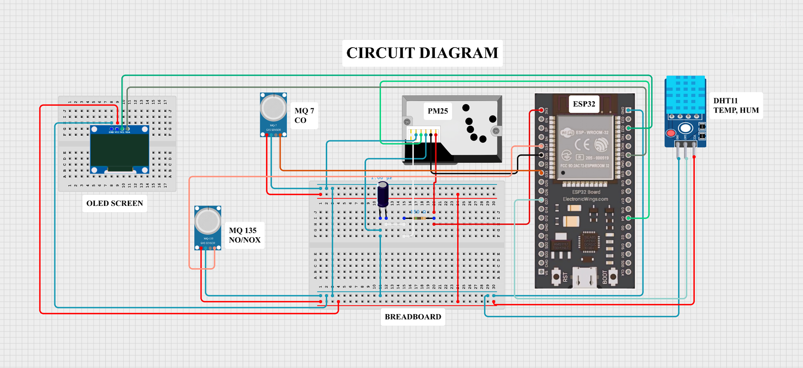

#  Aqi-ESP — Smart IoT AQI Monitoring System

A complete **end-to-end IoT air quality monitoring system** built using **ESP32, MicroPython, and Flask** to measure real-time AQI from multiple gas sensors and display it live on an OLED screen.


---

## Project Overview

This project collects real-time air quality data from multiple sensors connected to an **ESP32**, sends it to a **Flask backend** which calculates the **Air Quality Index (AQI)**, and displays the result live on an **SSD1306 OLED screen** along with temperature and humidity.

---

##  Features

-  Real-time AQI calculation from multiple gas sensors
-  Temperature & Humidity monitoring (DHT11)
-  Live OLED display (AQI, Status, Temp, Humidity)
-  Flask backend for AQI computation
-  WiFi-based HTTP communication (ESP32 → Server)
-  AQI Status: Good / Moderate / Unhealthy / Hazardous

---

##  Tech Stack

###  Hardware
- ESP32
- MQ-135 (NO / NOx)
- MQ-7 (CO)
- GP2Y1010AU0F (PM2.5 Dust Sensor)
- DHT11 (Temperature & Humidity)
- SSD1306 OLED Display (128x64, I2C)

###  Software
- MicroPython (ESP32)
- Python (Flask Backend)

---

##  How It Works

1. ESP32 reads sensor values from MQ-135, MQ-7, and PM2.5 sensor
2. Data is sent to Flask server via HTTP POST as JSON
3. Flask backend:
   - Converts raw ADC values to AQI-friendly units
   - Calculates overall AQI
   - Returns AQI value + status
4. ESP32 displays AQI, status, temperature & humidity on OLED

---

##  API

**Endpoint:** `POST /predict`

**Request:**
```json
{
  "no":   1024,
  "co":   860,
  "nox":  1024,
  "pm25": 0.85
}
```

**Response:**
```json
{
  "predicted_aqi": 104.5,
  "status": "Unhealthy"
}
```

---

##  ESP32 Pin Connections


| Sensor              | ESP32 Pin | Description              |
|---------------------|-----------|--------------------------|
| MQ-135 (AO)         | GPIO 34   | NO / NOx analog value    |
| MQ-7 (AO)           | GPIO 33   | CO analog value          |
| PM2.5 Analog Out    | GPIO 35   | Dust sensor analog       |
| PM2.5 LED Control   | GPIO 4    | Pulse LED for PM sensor  |
| DHT11 Data          | GPIO 27   | Temp & Humidity          |
| OLED SDA            | GPIO 21   | I2C Data                 |
| OLED SCL            | GPIO 22   | I2C Clock                |

---

##  Getting Started

### Flask Server
```bash
pip install flask
python app.py
```

### ESP32
- Flash MicroPython on ESP32
- Upload `main.py` and `ssd1306.py`
- Update `SSID`, `PASSWORD`, and `SERVER_URL` in `main.py`
- Reset the board

---

##  AQI Scale

| AQI Range | Status      |
|-----------|-------------|
| 0 – 50    |  Good      |
| 51 – 100  |  Moderate  |
| 101 – 200 |  Unhealthy |
| 201+      |  Hazardous |

---

##  Future Improvements

-  Cloud deployment (Firebase / AWS)
- Mobile dashboard
-  Alert notifications (Email / WhatsApp)
-  Data logging & graphs

---

##  Author

**Kritish Mohapatra**  
B.Tech Electrical Engineering (3rd Year)  
IoT | Embedded Systems | MicroPython | ESP32

---

## ⭐ Support

If you like this project, give it a ⭐ on GitHub and feel free to fork it!

Happy hacking 🚀