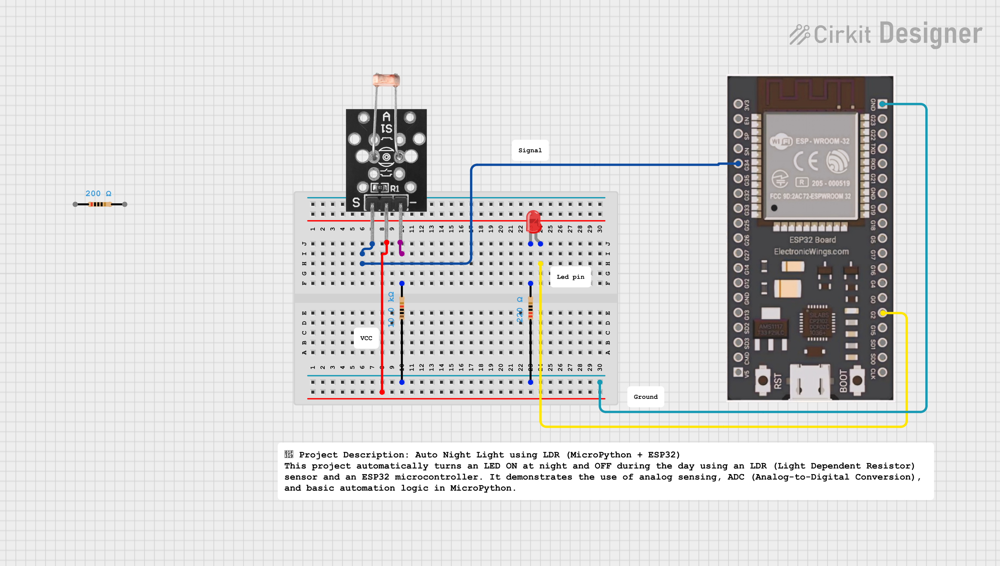

# Auto Night Light using LDR (ESP32 + MicroPython)

An automatic night light system built using an **ESP32**, **LDR sensor**, and **MicroPython**.  
The LED automatically turns **ON** when it gets dark and **OFF** in bright light — a simple yet powerful IoT automation project.

---

## Overview

This project uses a **Light Dependent Resistor (LDR)** to detect ambient light levels.  
The LDR and a fixed resistor form a **voltage divider**, and the ESP32’s **ADC (Analog to Digital Converter)** reads this voltage.  
Depending on the light intensity, the ESP32 decides whether to **turn the LED ON or OFF**.

---

##  Circuit Diagram


**Voltage Divider:**
```
3.3V --- [LDR] ---●--- [10kΩ] --- GND
                  |
                ADC Pin (GPIO34)
```

**LED Connection:**
```
GPIO2 --- [220Ω Resistor] --- LED --- GND
```

---

##  Components Required

| Component | Quantity | Description |
|------------|-----------|-------------|
| ESP32 | 1 | Main microcontroller |
| LDR sensor | 1 | Light intensity detector |
| 10kΩ resistor | 1 | For LDR voltage divider |
| LED | 1 | Indicator light |
| 220Ω resistor | 1 | Limits LED current |
| Breadboard & jumper wires | — | For connections |

---


##  How It Works

1. **LDR senses light intensity.**  
2. The **voltage divider** converts light intensity into an analog voltage.  
3. ESP32 reads this voltage through **ADC (pin 34)**.  
4. If the value is **below the threshold** → LED **turns ON** (dark).  
5. If the value is **above the threshold** → LED **turns OFF** (bright).

---


##  Calibration

1. Upload and run the code.  
2. Observe LDR values in **bright** and **dark** conditions (via serial monitor).  
3. Adjust `threshold` to a midpoint between those two values for best results.

---

##  Applications

- Automatic night lamps  
- Smart home lighting systems  
- Street light automation  
- IoT-based light control

---

##  Future Enhancements

- Add PWM for **smooth LED brightness control**  
- Add a **relay module** to control AC bulbs  
- Send data to a **web dashboard** using ESP32 Wi-Fi  
- Store readings using **LittleFS or cloud logging**

---

##  Example Output

```
LDR Value: 3200 → Bright → LED OFF
LDR Value: 300  → Dark   → LED ON
```

---

## 🧑‍💻 Author

**Kritish Mohapatra**  
Third Year B.Tech, Electrical Engineering  
 Focused on IoT, Embedded Systems, and MicroPython Projects  

---

⭐ If you like this project, give it a **star** on GitHub and follow for more IoT projects!
