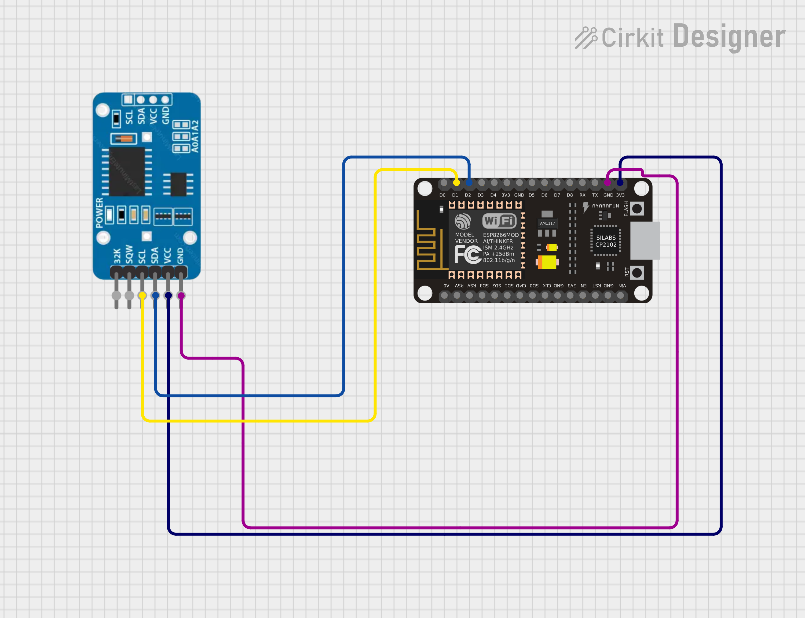

#  Basic RTC Clock (Serial Monitor Display)

This project demonstrates how to use the **DS3231 Real-Time Clock (RTC)** module with **ESP32 / ESP8266** using **MicroPython**.  
It reads **date, time, and temperature** from the RTC and displays it on the **Serial Monitor**.

---

##  Features
- Reads real-time date and time from DS3231  
- Displays internal temperature of the DS3231  
- Automatically syncs RTC with ESP’s local time at startup  
- Refreshes every second on the Serial Monitor  

---

##  Hardware Required
| Component | Quantity |
|------------|-----------|
| ESP32 / ESP8266 | 1 |
| DS3231 RTC Module | 1 |
| Jumper Wires | As needed |

---

##  Circuit Connections
| DS3231 Pin | ESP32 / ESP8266 Pin |
|-------------|--------------------|
| VCC | 3.3V |
| GND | GND |
| SDA | GPIO4 |
| SCL | GPIO5 |



*(You can change SDA and SCL pins in the code as per your board setup.)*

---

##  Code Explanation

### 1. Initialize I2C Communication  
The DS3231 communicates using the I²C protocol.  
```python
i2c = I2C(scl=Pin(5), sda=Pin(4))
rtc = urtc.DS3231(i2c)
```
### 2️. Synchronize Time

Synchronize the RTC’s internal clock with the ESP8266 system time:
```
rtc.datetime(urtc.seconds2tuple(time.mktime(time.localtime())))
```
Alternatively, you can set the time manually:

```
rtc.datetime((2025, 11, 2, 0, 22, 30, 0, 0))
```
### 3️. Display Data

The loop continuously prints the current date, time, and temperature to the Serial Monitor:
```
dt = rtc.datetime()
temp = rtc.get_temperature()
```

___

###  Working Principle
- 1️ ESP8266 communicates with DS3231 using the I2C protocol.
- 2️ The DS3231 keeps accurate real-time data even without power.
- 3️ The code reads the time, date, and internal temperature.
- 4️ The readings are displayed on the Serial Monitor every second.

###  Output Example
```
--------------------------------------------------
 Date & Time : Sunday, 2025-11-02  22:30:05
  Temperature : 27.25 °C
--------------------------------------------------
```

###  Libraries Used
```
import machine   # For I2C communication
import time      # For delay and time conversion
import urtc      # For DS3231 RTC module 
```
---
### Author 
-  Made by Kritish Mohapatra
- Day 9 - MicroPython Projects Series