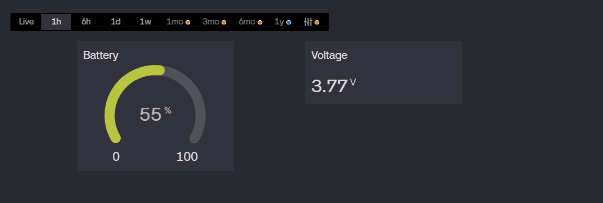
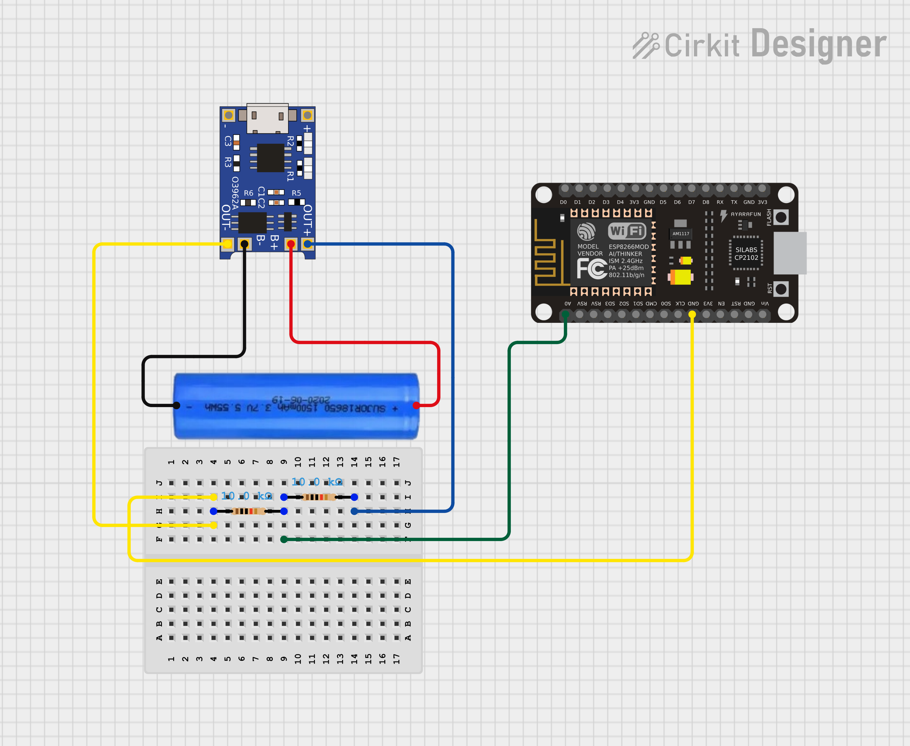

# Li-ion Battery Monitor with Blynk IoT

> Real-time battery voltage and percentage monitoring using ESP8266, TP4056, and Blynk IoT dashboard.


---

## Demo


| Blynk Dashboard | Serial Output |
|-----------------|---------------|
| Live Gauge + Label | `Voltage: 3.78V \| Battery: 56%` |

---

## Features

-  Live voltage pushed to Blynk IoT dashboard
-  Accurate battery % using real Li-ion discharge curve (lookup table)
-  20-sample ADC averaging for noise-free readings
-  Per-device RATIO calibration (accounts for resistor tolerance)
-  Updates every 30 seconds

---

##  Hardware Required

| Component | Quantity |
|-----------|----------|
| ESP8266 NodeMCU | 1 |
| TP4056 Module (with protection) | 1 |
| 18650 Li-ion Battery | 1 |
| 10kΩ Resistor | 2 |
| Jumper Wires | few |

---

## Circuit Diagram


```
18650 (+) ───────────────── TP4056 B+
18650 (-) ───────────────── TP4056 B-

TP4056 OUT+ ──── 10kΩ ──┬──── 10kΩ ──── OUT-
                        │
                   ESP8266 A0


```

---

##  How It Works

### 1️ Voltage Divider
Battery voltage (max 4.2V) exceeds ESP8266 ADC limit (3.3V).
Two 10kΩ resistors halve the voltage — safe for ADC input.

### 2️ RATIO Calibration
ESP8266 ADC + resistor tolerances cause inaccurate readings.
A calibration RATIO is calculated once using a multimeter:

```
RATIO = actual_voltage (multimeter) / raw_voltage (code)
RATIO = 3.78 / 4.38 = 0.863
```

### 3️ Non-Linear Battery Percentage
Linear map gives wrong results for Li-ion batteries.
A lookup table based on real discharge curve is used with interpolation:

```
4.20V → 100%
3.80V →  60%
3.70V →  45%   ← more accurate than linear
3.60V →  30%
3.40V →   5%
2.80V →   0%
```

---

##  Blynk Dashboard Setup

### Template Settings
- **Name:** Battery Monitor
- **Hardware:** ESP8266
- **Connection:** WiFi

### Datastreams

| Pin | Name | Type | Range |
|-----|------|------|-------|
| V0 | Voltage | Double | 0 – 5 |
| V1 | Battery % | Integer | 0 – 100 |

### Widgets

| Widget | Pin | Purpose |
|--------|-----|---------|
| Label | V0 | Show live voltage |
| Gauge | V1 | Show battery % |

---

##  Setup Guide

### Step 1 — Install BlynkLib
Download `BlynkLib.py` and upload to ESP8266 using Thonny.

### Step 2 — Calibrate RATIO
```python
# Set RATIO = 1.0 temporarily
# Run code → note raw voltage from serial
# Measure actual voltage with multimeter
# RATIO = multimeter_value / serial_value
RATIO = 0.863  # example — yours will differ
```

### Step 3 — Update Credentials
```python
WIFI_SSID = "your_wifi_name"
WIFI_PASS = "your_wifi_password"
AUTH      = "your_blynk_auth_token"
RATIO     = 0.863
```

### Step 4 — Flash & Run
Upload `main.py` to ESP8266 via Thonny → done! 

---


##  Key Learnings

- ESP8266 ADC is noisy — 20 sample averaging smooths readings significantly
- Li-ion discharge curve is non-linear — lookup table is far more accurate than `map()`
- Resistor tolerances affect voltage divider output — always calibrate per device
- `BlynkLib` works on ESP8266 MicroPython with `insecure=True` flag

---


## Author
**Kritish Mohapatra**  
B.Tech Electrical Engineering (3rd Year)  
IoT | Embedded Systems | MicroPython | ESP32  

---

## ⭐ Support

If you like this project, give it a ⭐ on GitHub and feel free to fork it!

Happy hacking 🚀
