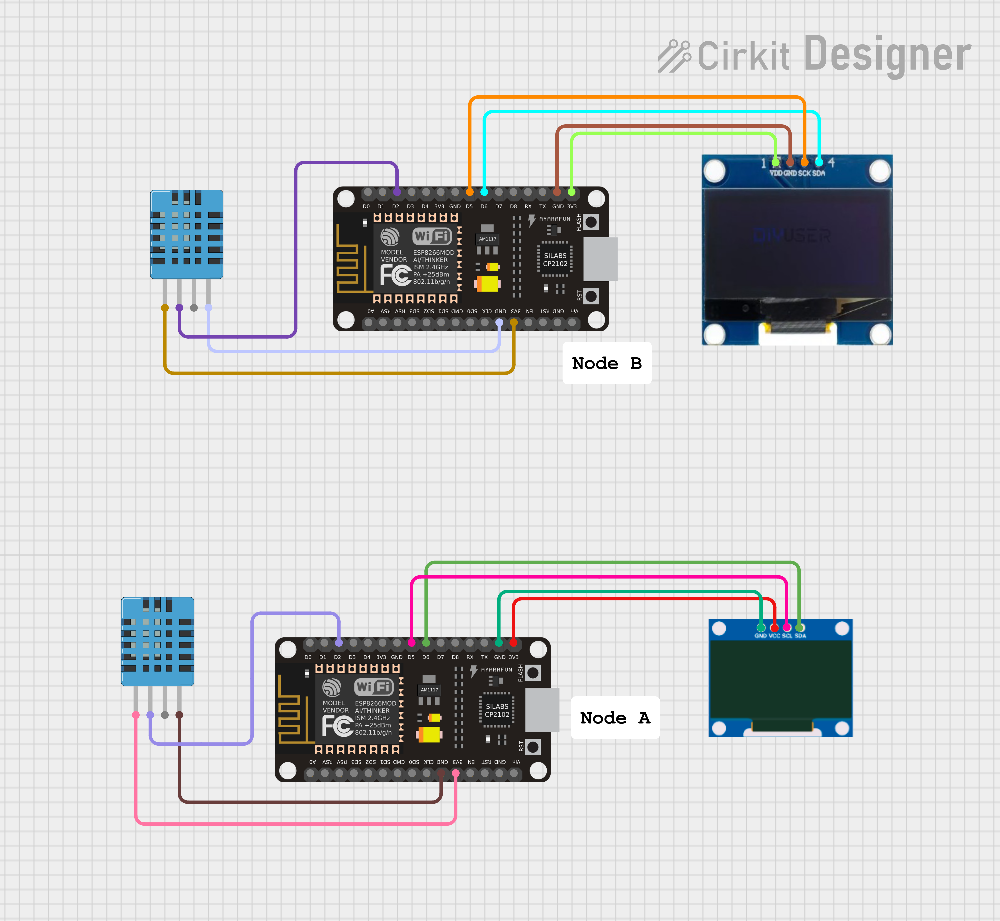

#  Bidirectional ESP-NOW Communication with Dual Sensor Nodes


A bidirectional ESP-NOW wireless communication system using two ESP8266 nodes. Each node reads local temperature and humidity data from a DHT11 sensor and simultaneously sends it to the peer while receiving and displaying the remote node's data — all without any Wi-Fi router or internet connection.

---

## Demo

```
Node A (SSD1306)          Node B (SH1106)
┌────────────────┐        ┌────────────────┐
│ Local:         │        │ Local:         │
│ 28C  65%       │◄──────►│ 31C  70%       │
│ Remote:        │        │ Remote:        │
│ 31C  70%       │        │ 28C  65%       │
└────────────────┘        └────────────────┘
```

---

## Hardware

| Component | Node A | Node B |
|-----------|--------|--------|
| Microcontroller | ESP8266 NodeMCU | ESP8266 NodeMCU |
| Sensor | DHT11 | DHT11 |
| Display | SSD1306 0.96" OLED | SH1106 1.3" OLED |

---

## Wiring

### Node A — ESP8266 + SSD1306

| Component | Pin | ESP8266 GPIO |
|-----------|-----|--------------|
| DHT11 DATA | D2 | GPIO4 |
| DHT11 VCC | 3.3V | — |
| DHT11 GND | GND | — |
| SSD1306 SCL | D5 | GPIO14 |
| SSD1306 SDA | D6 | GPIO12 |
| SSD1306 VCC | 3.3V | — |
| SSD1306 GND | GND | — |

### Node B — ESP8266 + SH1106

| Component | Pin | ESP8266 GPIO |
|-----------|-----|--------------|
| DHT11 DATA | D2 | GPIO4 |
| DHT11 VCC | 3.3V | — |
| DHT11 GND | GND | — |
| SH1106 SCL | D5 | GPIO14 |
| SH1106 SDA | D6 | GPIO12 |
| SH1106 VCC | 3.3V | — |
| SH1106 GND | GND | — |

> **Note:** Add a 10kΩ pull-up resistor between DHT11 DATA and 3.3V for reliable readings.

---

## Features

- True bidirectional ESP-NOW communication between two ESP8266 nodes
- Each node reads local DHT11 data and transmits to peer every 2 seconds
- Each node receives remote sensor data and displays both local and remote readings on OLED
- Mixed display setup: SSD1306 on Node A, SH1106 on Node B
- Polling-based ESP-NOW receive (fully compatible with ESP8266 MicroPython)
- SoftI2C used on both nodes for reliable OLED communication
- No Wi-Fi router required — pure peer-to-peer wireless protocol
- Graceful error handling for sensor read failures

---

## Getting Started

### 1. Find MAC Addresses

Run this on each ESP8266 to get its MAC address:

```python
import network
wlan = network.WLAN(network.STA_IF)
wlan.active(True)
print(wlan.config('mac').hex(':'))
```

Update the `peer` variable in each node's code with the opposite node's MAC address.

### 2. Install SH1106 Library (Node B only)

```python
import mip
mip.install('github:robert-hh/SH1106')
```

### 3. Flash the Code

- Flash `node_a.py` to Node A
- Flash `node_b.py` to Node B
- Power both nodes — they will start communicating automatically


---

## Tech Stack

- **MicroPython** v1.23
- **ESP-NOW** — connectionless peer-to-peer wireless protocol
- **DHT11** — temperature & humidity sensor
- **SSD1306** — 0.96" I2C OLED driver
- **SH1106** — 1.3" I2C OLED driver
- **SoftI2C** — software I2C for reliable display communication

---


## Author
**Kritish Mohapatra**  
B.Tech Electrical Engineering (3rd Year)  
IoT | Embedded Systems | MicroPython | ESP32  

---

## ⭐ Support

If you like this project, give it a ⭐ on GitHub and feel free to fork it!

Happy hacking 🚀
