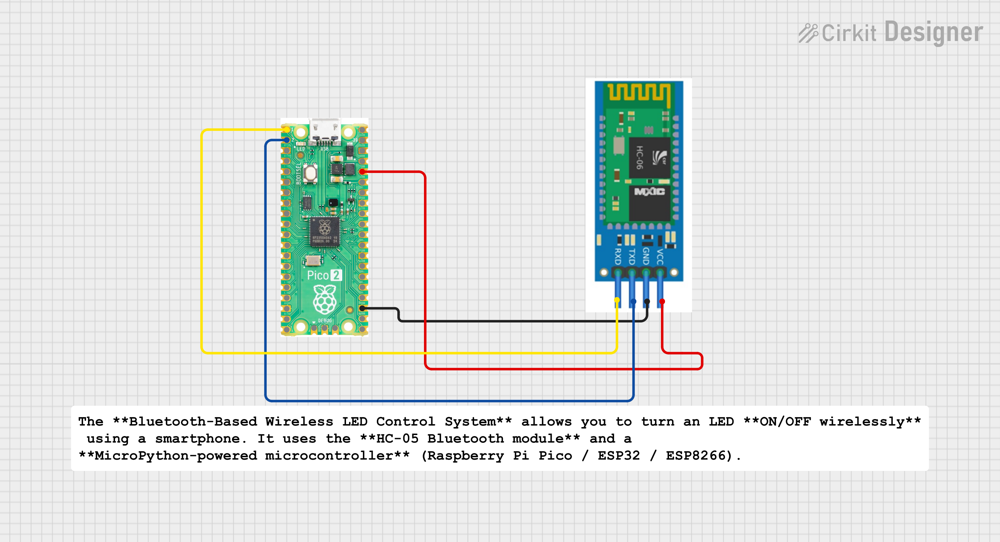

#  Bluetooth-Based Wireless LED Control System
*A simple yet powerful project to control an LED wirelessly using the HC-05 Bluetooth module and MicroPython.*

## Project Overview
The **Bluetooth-Based Wireless LED Control System** allows you to turn an LED **ON/OFF wirelessly** using a smartphone. It uses the **HC-05 Bluetooth module** and a **MicroPython-powered microcontroller** (Raspberry Pi Pico / ESP32 / ESP8266).

This project demonstrates:
- Wireless communication
- UART data handling
- Home automation basics
- MicroPython programming

Perfect for beginners and IoT learners.

---
## Features
- Control LED using any Bluetooth Terminal App
- Real-time ON/OFF response
- Works with Pico, ESP32, ESP8266
- Simple, stable and reliable code
- Fully open-source and customizable

---
## Components Required
| Component | Quantity |
|----------|----------|
| Raspberry Pi Pico / ESP32 / ESP8266 | 1 |
| HC-05 Bluetooth Module | 1 |
| LED (if no onboard LED) | 1 |
| 330Ω resistor (optional) | 1 |
| Jumper wires | As needed |

---
## Circuit Diagram (Connections)


### HC-05 → Microcontroller
| HC-05 Pin | Raspberry Pi Pico | ESP32 |
|-----------|-------------------|--------|
| VCC | 5V | 5V |
| GND | GND | GND |
| TX | GP1 (UART0 RX) | GPIO16 |
| RX | GP0 (UART0 TX) | GPIO17 |

LED → Onboard LED (`"LED"`) OR external LED on any GPIO pin.

---
## How It Works
1. HC-05 receives Bluetooth commands (`on` / `off`) from a smartphone.
2. Data goes to the microcontroller using UART.
3. MicroPython program reads the command.
4. If text contains `"on"` → LED turns ON.
5. If text contains `"off"` → LED turns OFF.
6. Status is printed and also sent back to the phone.

---

## How to Use
1. Download any **Bluetooth Terminal App** from Play Store
   - Bluetooth Terminal
   - Serial Bluetooth Terminal
   - Arduino Bluetooth Controller
2. Pair HC-05 (Password: **1234** or **0000**)
3. Connect to the HC-05
4. Type commands:
   ```
   on
   off
   ```
5. LED will respond immediately.

---
## Applications
- Home automation basics
- Remote switching
- Bluetooth-controlled appliances
- IoT/Bluetooth learning projects
- Wireless prototyping

---
## Future Improvements
- Control multiple LEDs
- Add buzzer or relay
- Add smartphone UI using MIT App Inventor
- Add password-protected access
- Add status indicator on OLED display


---
## Author
**Kritish Mohapatra**

Embedded Systems & IoT Enthusiast

MicroPython • ESP32 • Robotics • Electronics
