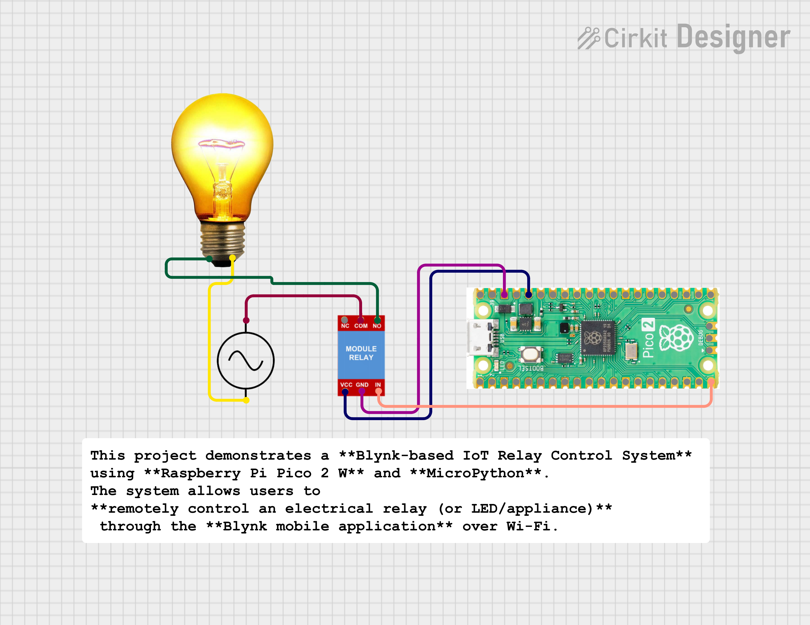

# 🔌 Blynk-Based IoT Relay Control using Raspberry Pi Pico 2 W (MicroPython)

## 📌 Project Overview
This project demonstrates a **Blynk-based IoT Relay Control System** using **Raspberry Pi Pico 2 W** and **MicroPython**.  
The system allows users to **remotely control an electrical relay (or LED/appliance)** through the **Blynk mobile application** over Wi-Fi.

This project is ideal for **IoT beginners**, **college mini-projects**, **GitHub portfolios**, and **resume building**.

---

## 🚀 Features
- 📱 Remote ON/OFF control using Blynk mobile app  
- 🌐 Wi-Fi based real-time IoT communication  
- ⚡ Supports relay / LED / low-power appliances  
- 🧠 Clean and simple MicroPython code  
- 🔒 Secure cloud-based control using Blynk  

---

## 🛠️ Hardware Requirements
- Raspberry Pi **Pico 2 W**
- 1-Channel Relay Module (5V)
- Jumper Wires
- USB Cable
- Wi-Fi Network

---

## 💻 Software Requirements
- MicroPython firmware (for Pico 2 W)
- Thonny IDE
- Blynk IoT Mobile App
- BlynkLib (MicroPython)

---

## 🔌 Circuit Connections

| Relay Module | Pico 2 W |
|-------------|----------|
| VCC | VBUS (5V) |
| GND | GND |
| IN  | GP15 |

> ⚠️ Most relay modules work on **Active LOW logic**

---

## 📱 Blynk App Configuration
1. Create a new **Template** in the Blynk app  
2. Select:
   - Hardware: **Raspberry Pi Pico W**
   - Connection Type: **WiFi**
3. Add a **Button Widget**
   - Virtual Pin: **V1**
   - Mode: **Switch**
4. Copy the **Auth Token**

---

## ✅ Working Logic
- Blynk Button **ON (1)** → Relay turns **ON**
- Blynk Button **OFF (0)** → Relay turns **OFF**
- Uses **Active LOW** relay logic

---

## 🧪 Testing Steps
1. Upload the code using **Thonny IDE**
2. Power the **Raspberry Pi Pico 2 W**
3. Open the **Blynk mobile app**
4. Toggle the button to control the relay

---

## 📸 Output
- Real-time relay control from mobile phone
- Stable Wi-Fi connection
- Instant response from Blynk cloud

---

## 🎯 Applications
- Smart Home Automation  
- Remote appliance control  
- IoT learning projects  
- College mini-project  
- Resume & GitHub portfolio  

## 🧑‍💻 Author

**Kritish Mohapatra**  
MicroPython | ESP32 | Embedded Systems | IoT Projects  
GitHub: [https://github.com/kritishmohapatra]
