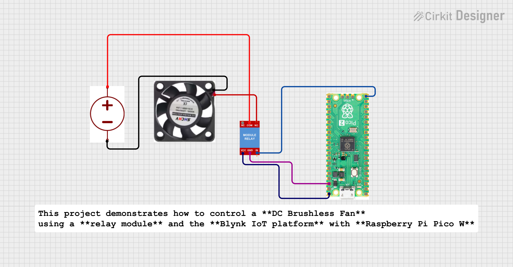
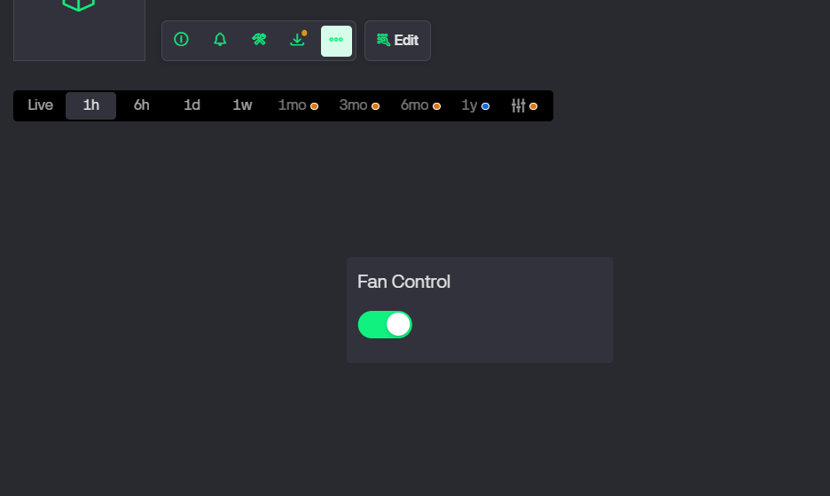

# 💨Blynk Controlled DC Brushless Fan  
**Using Raspberry Pi Pico W (MicroPython)**

This project demonstrates how to control a **DC Brushless Fan** using a **relay module** and the **Blynk IoT platform** with **Raspberry Pi Pico W**.

---

## 🧩 Components Required
- Raspberry Pi **Pico W / Pico 2 W**
- **1-Channel Relay Module (5V)**
- **DC Brushless Fan** (5V / 9V / 12V as per rating)
- External **DC Power Adapter**
- Jumper wires

---

## 🔗 Connection Table

### Pico W to Relay
| Pico W Pin | Relay Pin |
|-----------|-----------|
| GP15      | IN        |
| VBUS (5V) | VCC       |
| GND       | GND       |

### Relay to Fan
| Relay Terminal | Connection |
|---------------|------------|
| COM           | DC Adapter + |
| NO            | Fan + (Red)  |
| Fan −         | DC Adapter − |

---

## 📱 Blynk Configuration
- Widget: **Button**
- Mode: **Switch**
- Virtual Pin: **V1**
- ON value: `1`
- OFF value: `0`

---

## ⚠️ Important Notes
- Do **NOT** power the fan from Pico W 3.3V / 5V
- Always use a **separate DC adapter** for the fan
- Relay provides **ON/OFF control only**
- DC Brushless fan has an **internal driver**, extra flyback diode not required

---

## ✅ Working
- Blynk Button ON → Relay ON → Fan ON
- Blynk Button OFF → Relay OFF → Fan OFF

---
## 📤 Output

- Raspberry Pi Pico W successfully connects to the WiFi network.
- Relay module responds instantly to commands from the **Blynk mobile application**.
- When the Blynk button is turned **ON**, the relay gets activated and the **DC Brushless Fan turns ON**.
- When the Blynk button is turned **OFF**, the relay deactivates and the **fan turns OFF**.
- The system provides **real-time remote control** of the fan from anywhere using the internet.

---

## 📱 Output on Blynk Application

- A **Button widget** is used in **Switch mode**.
- Button state reflects the actual fan condition:
  - **ON (1)** → Fan Running
  - **OFF (0)** → Fan Stopped
- User can control the fan wirelessly using a smartphone.
- The response time between app command and fan action is very low, ensuring smooth operation.

---

## 🧪 Output Observation Table

| Blynk Button State | Relay State | Fan Status |
|-------------------|-------------|------------|
| ON (1)            | Activated   | ON         |
| OFF (0)           | Deactivated | OFF        |

---

## 🌍 Applications

- Smart Home Fan Control
- Remote Appliance Switching
- IoT-based Home Automation Systems
- Energy Saving by Remote ON/OFF Control
- Educational IoT and Embedded Systems Projects

---

## 🧑‍💻 Author

**Kritish Mohapatra**  
MicroPython | ESP32 | Embedded Systems | IoT Projects  
GitHub: [https://github.com/kritishmohapatra]

