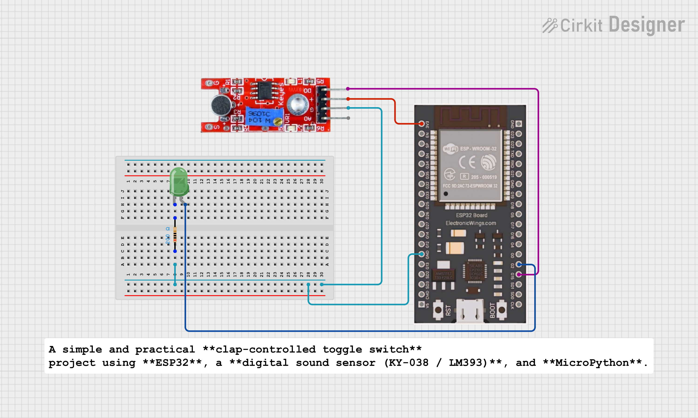

# 👏 Clap Toggle Switch using ESP32 & Digital Sound Sensor (MicroPython)

A simple and practical **clap-controlled toggle switch** project using **ESP32**, a **digital sound sensor (KY-038 / LM393)**, and **MicroPython**.

> **One clap → ON | Next clap → OFF** (Toggle behavior)

---

## 🔧 Components Required

- ESP32 (ESP8266 also supported with minor pin changes)
- Digital Sound Sensor (KY-038 / KY-037 / LM393)
- LED **or** Relay Module
- Resistor (220Ω for LED)
- Jumper wires
- Breadboard

---

## 🔌 Pin Connections

### Sound Sensor → ESP32

| Sound Sensor | ESP32 |
|-------------|-------|
| VCC | 3.3V (or 5V if module supports) |
| GND | GND |
| DO  | GPIO 15 |

### Output Device → ESP32

| Device | ESP32 |
|------|-------|
| LED / Relay IN | GPIO 2 |

> ⚠️ ESP32 works on **3.3V logic**. Make sure your sound sensor supports it.

---

## 🧠 Working Principle

- The sound sensor gives a **digital HIGH** when a clap is detected.
- ESP32 continuously monitors this signal.
- **Debounce logic** avoids multiple detections from a single clap.
- Every valid clap **toggles** the output state.

---

## ⏱️ What is Debounce?

A single clap creates multiple HIGH signals due to vibration and echo.

Without debounce:
- One clap → multiple toggles ❌

With debounce:
- One clap → one action ✅

This is implemented using a **minimum time gap** between two valid claps.

---

## 👏 Expected Output

| Clap Count | Output |
|-----------|--------|
| 1st Clap | ON |
| 2nd Clap | OFF |
| 3rd Clap | ON |
| 4th Clap | OFF |

---

## 🎛️ Sensitivity Adjustment

Adjust the **potentiometer** on the sound sensor:

- Clockwise → More sensitive  
- Anti-clockwise → Less sensitive  

Set it so that:
- Normal room noise is ignored  
- Clap sound is detected properly  

---

## 🚀 Applications

- Clap-controlled light  
- Home automation trigger  
- Sound-based alert system  
- Embedded systems mini project  
- College practical / demo project  

---

## 🔮 Future Enhancements

- Double clap → ON, Single clap → OFF  
- ESP32 Web Dashboard  
- MQTT / Blynk integration  
- Noise level monitoring  

---

## 🧑‍💻 Author

**Kritish Mohapatra**  
B.Tech Electrical Engineering (3rd Year)  
IoT | Embedded Systems | MicroPython | ESP32  

---

## ⭐ Support

If you like this project, give it a ⭐ on GitHub and feel free to fork it!

Happy hacking 🚀
