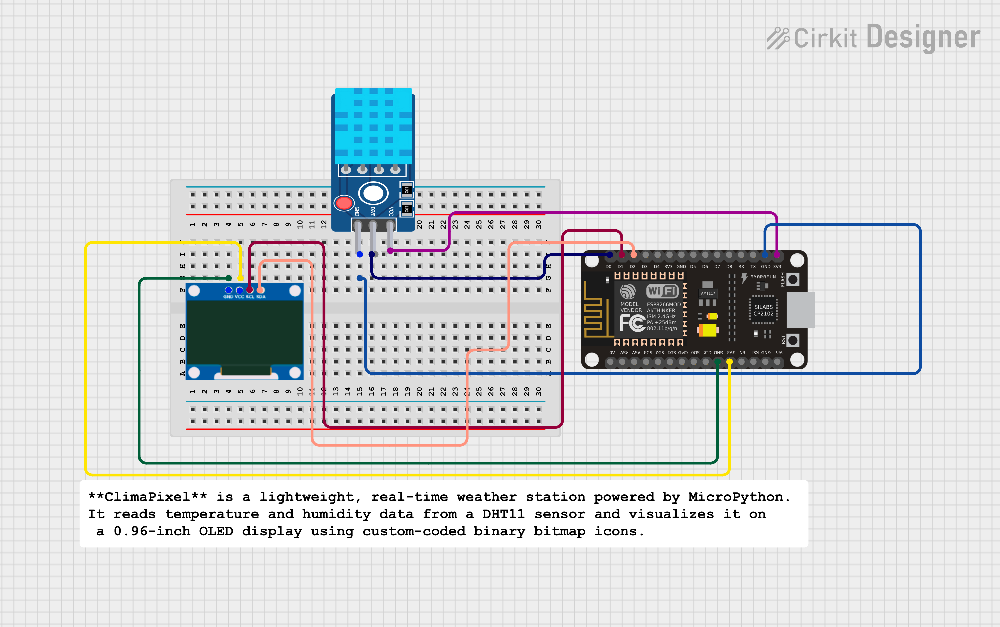

#  ClimaPixel — Mini Weather Display

**ClimaPixel** is a lightweight, real-time weather station powered by MicroPython. It reads temperature and humidity data from a DHT11 sensor and visualizes it on a 0.96-inch OLED display using custom-coded binary bitmap icons.

##  Features

* **Real-Time Monitoring:** continuously updates temperature and humidity.
* **Custom Graphics:** Features hand-coded binary bitmap icons for "Temperature" and "Humidity" (no external image libraries required).
* **Robust Error Handling:** Includes `try/except` blocks to prevent crashes if the sensor disconnects.
* **Efficient Code:** Uses bitwise operations to draw graphics, making it compatible with "Lite" versions of the SSD1306 library.

##  Hardware Required

1.  **Microcontroller:** ESP8266 (NodeMCU) or ESP32.
2.  **Display:** 0.96" I2C OLED (SSD1306 driver).
3.  **Sensor:** DHT11 Temperature & Humidity Sensor.
4.  **Connecting Wires:** Jumper cables.

##  Circuit Diagram & Pinout

Based on the code configuration (`main.py`), connect your components as follows:

| Component | Pin Label | Microcontroller Pin (GPIO) |
| :--- | :--- | :--- |
| **OLED** | SDA | GPIO 4 (D2 on NodeMCU) |
| **OLED** | SCL | GPIO 5 (D1 on NodeMCU) |
| **OLED** | VCC | 3.3V |
| **OLED** | GND | GND |
| **DHT11** | DATA | GPIO 16 (D0 on NodeMCU) |
| **DHT11** | VCC | 3.3V or 5V |
| **DHT11** | GND | GND |

> **Note:** If you are using an ESP32, check your specific board pinout. You may need to change `Pin(16)` to a different GPIO if Pin 16 is restricted on your board.

##  How It Works

ClimaPixel — Mini Weather Display is a compact weather monitoring device that uses an ESP32/ESP8266 and a DHT11 sensor to measure temperature and humidity.  
The collected data is displayed in real-time on an SSD1306 OLED screen along with graphical icons for better visual understanding.

### Working Process:
1. The **DHT11 sensor** measures ambient temperature and humidity.
2. The ESP32/ESP8266 reads the sensor output in digital format.
3. Data is processed and converted into **Celsius (°C)** and **Relative Humidity (%)**.
4. The OLED display continuously updates the readings on screen.
5. Small icons (Thermometer & Humidity Drop) enhance UI clarity and aesthetics.

The system runs in a loop , constantly refreshing and displaying the latest weather information.

---

##  Future Enhancements

This project can be upgraded into a more advanced smart weather node.  
Some recommended additions:

| Feature | Description |
|--------|-------------|
| Wi-Fi Dashboard | View sensor values live on a web server |
| MQTT IoT Integration | Connect to Home Assistant, Blynk, ThinkSpeak, etc. |
| Data Logging | Store readings in CSV/SD card for history/analysis |
| Fahrenheit Conversion | Optional unit switching feature |
| Auto Screen Brightness | Add LDR for dynamic brightness control |
| Battery Powered | Convert into a portable wireless weather gadget |
| Deep Sleep Optimization | Greatly improves battery life |
| Upgrade Sensor to DHT22 | High accuracy & faster response |
| Temperature/Humidity Alerts | Trigger buzzer/notification when limit crosses |

With these upgrades, ClimaPixel can evolve into a fully functional IoT smart environment node.

---

##  Applications

Real-world use cases for ClimaPixel include:

- Small home/room weather station  
- Desktop climate monitoring gadget  
- Greenhouse and smart agriculture monitoring  
- School/college IoT demonstration project  
- Server room humidity tracking  
- Air quality research and logging systems  
- Personal desk companion device  
- Pocket-sized portable environment tester  

This project is ideal for students, hobbyists, and IoT developers looking to build compact weather hardware.

---

##  Author

**Kritish Mohapatra**  
Third Year B.Tech, Electrical Engineering  
 Focused on IoT, Embedded Systems, and MicroPython Projects  

---

⭐ If you like this project, give it a **star** on GitHub and follow for more IoT projects!