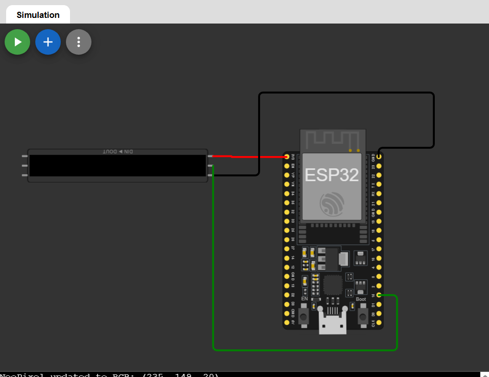
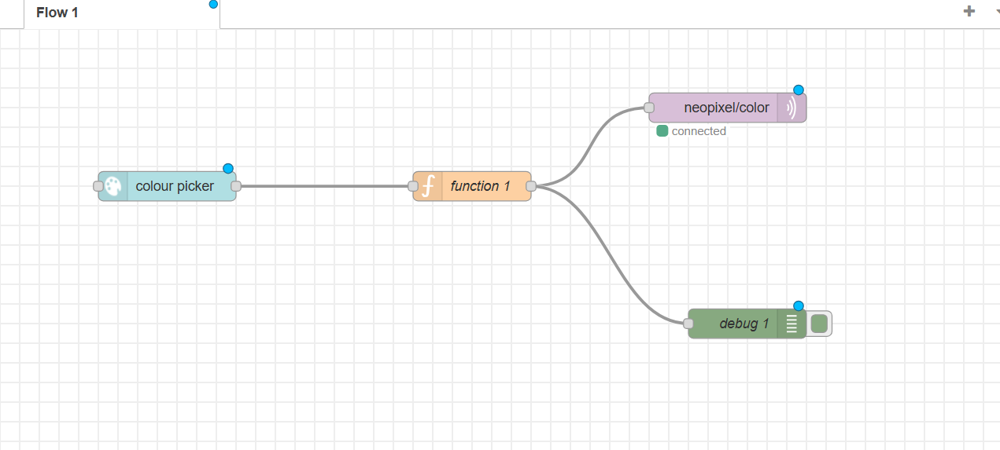
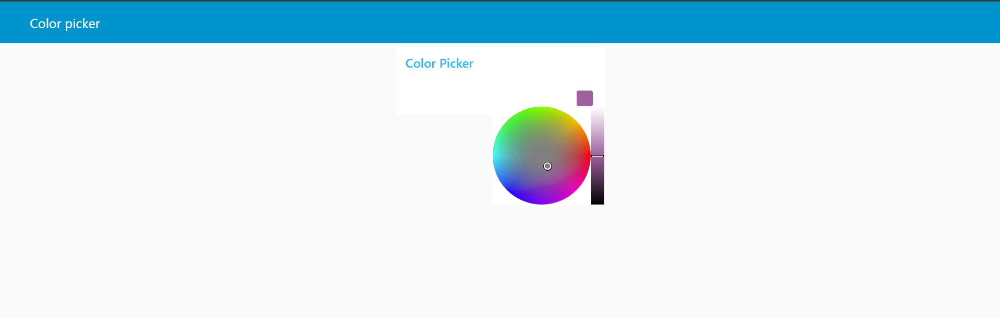

# Cloud NeoPixel Control via Node-RED and MQTT

Control a NeoPixel LED strip remotely using a Node-RED dashboard hosted on AWS EC2, with MQTT as the communication protocol and MicroPython running on an ESP32 simulated in Wokwi.

## Overview

This project demonstrates end-to-end IoT cloud integration. A color picker on the Node-RED dashboard sends color data through a Mosquitto MQTT broker running on AWS EC2. The ESP32 (simulated in Wokwi) receives the color data over MQTT and updates the NeoPixel strip in real time.


### Wiring



---

## Architecture

```
Node-RED Dashboard (Color Picker)
        |
        | publishes to topic: neopixel/color
        v
Mosquitto MQTT Broker (AWS EC2)
        |
        | subscribes
        v
ESP32 (Wokwi - MicroPython)
        |
        v
NeoPixel Strip (8 pixels)
```

## Hardware / Simulation

- ESP32 
- NeoPixel Strip (8 pixels, connected to GPIO 15)

## Tech Stack

- MicroPython (ESP32)
- Mosquitto MQTT Broker
- Node-RED with node-red-dashboard
- AWS EC2 (Ubuntu 22.04, t2.micro - Free Tier)

## AWS EC2 Setup

### 1. Launch EC2 Instance

- AMI: Ubuntu Server 22.04 LTS (Free Tier Eligible)
- Instance Type: t2.micro
- Storage: 8 GB (default)

### 2. Security Group - Inbound Rules

| Port | Protocol | Source    | Purpose         |
|------|----------|-----------|-----------------|
| 22   | TCP      | Your IP   | SSH             |
| 1880 | TCP      | 0.0.0.0/0 | Node-RED UI     |
| 1883 | TCP      | 0.0.0.0/0 | MQTT Broker     |

### 3. Connect via EC2 Instance Connect

Go to EC2 Console, select your instance, click Connect, and use the EC2 Instance Connect tab to open a browser-based terminal.

## Server Setup

Run the following commands in the EC2 terminal.

### Install Mosquitto

```bash
sudo apt update && sudo apt upgrade -y
sudo apt install mosquitto mosquitto-clients -y
```

Edit the Mosquitto config:

```bash
sudo nano /etc/mosquitto/mosquitto.conf
```

Add the following lines at the end:

```
listener 1883
allow_anonymous true
```

Start and enable Mosquitto:

```bash
sudo systemctl enable mosquitto
sudo systemctl restart mosquitto
sudo systemctl status mosquitto
```

### Install Node.js and Node-RED

```bash
curl -fsSL https://deb.nodesource.com/setup_18.x | sudo -E bash -
sudo apt install -y nodejs
sudo npm install -g --unsafe-perm node-red
```

### Run Node-RED with PM2

```bash
sudo npm install -g pm2
pm2 start node-red
pm2 startup
pm2 save
```

Node-RED will now be accessible at:

```
http://<EC2-PUBLIC-IP>:1880
```

## Node-RED Flow Setup

### Install Dashboard Plugin

1. Open Node-RED in the browser
2. Go to Menu (top right) -> Manage Palette -> Install
3. Search for `node-red-dashboard` and install it

### Build the Flow

Drag and drop the following nodes onto the canvas:

```
[ui_colour_picker] --> [function] --> [mqtt out]
```

**ui_colour_picker node settings:**
- Format: hex
- Output: object

**function node code:**

```javascript
const hex = msg.payload.replace('#', '');
const r = parseInt(hex.substring(0, 2), 16);
const g = parseInt(hex.substring(2, 4), 16);
const b = parseInt(hex.substring(4, 6), 16);
msg.payload = JSON.stringify({ r, g, b });
return msg;
```

**mqtt out node settings:**
- Topic: `neopixel/color`
- Broker: `localhost`, Port: `1883`

Click the red Deploy button to save and activate the flow.

Dashboard is available at:

```
http://<EC2-PUBLIC-IP>:1880/ui
```


### main.py

```python
import network
import time
from umqttsimple import MQTTClient
from neopixel import NeoPixel
from machine import Pin
import json

# NeoPixel setup
NUM_PIXELS = 8
PIN = 15
np = NeoPixel(Pin(PIN), NUM_PIXELS)

# WiFi connection
def connect_wifi():
    wlan = network.WLAN(network.STA_IF)
    wlan.active(True)
    wlan.connect("Wokwi-GUEST", "")
    while not wlan.isconnected():
        print(".", end="")
        time.sleep(0.5)
    print("\nWiFi connected:", wlan.ifconfig()[0])

# MQTT callback
def on_message(topic, msg):
    print(f"Received on {topic}: {msg}")
    try:
        data = json.loads(msg)
        r = data.get('r', 0)
        g = data.get('g', 0)
        b = data.get('b', 0)
        for i in range(NUM_PIXELS):
            np[i] = (r, g, b)
        np.write()
        print(f"NeoPixel updated to RGB: ({r}, {g}, {b})")
    except Exception as e:
        print("Error parsing JSON:", e)

# Main
connect_wifi()

client = MQTTClient("esp32-neo", "<EC2-PUBLIC-IP>", port=1883)
client.set_callback(on_message)
client.connect()
client.subscribe(b"neopixel/color")
print("MQTT connected and subscribed to neopixel/color!")

while True:
    client.check_msg()
    time.sleep(0.1)
```

Replace `<EC2-PUBLIC-IP>` with your actual EC2 instance public IP address.

## MQTT Topics

| Topic            | Direction         | Payload Example              |
|------------------|-------------------|------------------------------|
| neopixel/color   | Node-RED -> ESP32 | `{"r": 255, "g": 0, "b": 0}` |

## How It Works

1. Open the Node-RED dashboard in your browser
2. Pick a color using the color picker
3. Node-RED converts the hex color to an RGB JSON payload
4. The payload is published to the `neopixel/color` MQTT topic
5. Mosquitto broker (running on the same EC2 instance) routes the message
6. The ESP32 in Wokwi receives the message via its MQTT subscription
7. The NeoPixel strip updates to the selected color instantly

## Notes

- The ESP32 connects to `Wokwi-GUEST` WiFi which is available by default in Wokwi simulations
- If the MQTT connection fails with `OSError: -202` or `ECONNRESET`, restart Mosquitto on EC2 (`sudo systemctl restart mosquitto`) and try again
- Setting RGB to `(0, 0, 0)` effectively turns off the strip
- This project uses the AWS Free Tier and will not incur charges under normal usage within free tier limits

## Demo

### Flow



### UI



---


##  Author

**Kritish Mohapatra**  
B.Tech Electrical Engineering (3rd Year)  
IoT | Embedded Systems | MicroPython | ESP32  

---

## ⭐ Support

If you like this project, give it a ⭐ on GitHub and feel free to fork it!

Happy hacking 🚀

