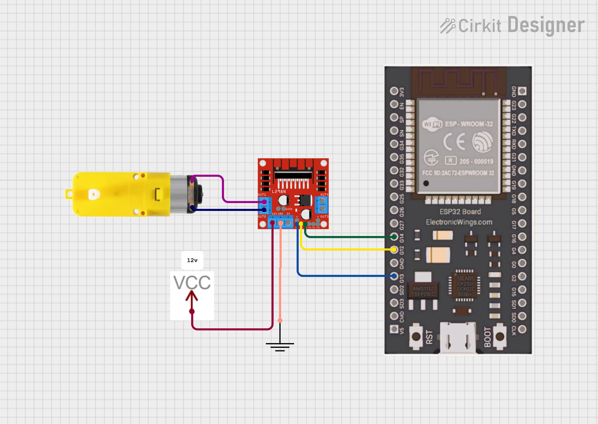

# 🌐 ESP32 DC Motor Speed Control (Web Slider)

A complete **IoT + Embedded Systems** project where a **DC motor is controlled from a web browser** using an **ESP32**, **MicroPython**, and **L298N motor driver**. Motor speed is adjusted in real time using a **slider-based web UI**.

---

## 🚀 Project Overview

* ESP32 hosts a **local web server**
* Browser-based **slider** controls motor speed
* **PWM (Pulse Width Modulation)** used for speed control
* Designed for **6V DC motor** with stability fixes
* No external app required (works on phone/laptop browser)

---

## 🧰 Hardware Requirements

* ESP32 Development Board
* L298N Motor Driver Module
* DC Motor (6V)
* External 6V Power Supply (for motor)
* Jumper Wires

⚠️ **Important:** ESP32 GND and L298N GND must be common.

---

## 🔌 Pin Configuration


| L298N Pin | ESP32 GPIO | Description       |
| --------- | ---------- | ----------------- |
| ENA       | GPIO 13    | PWM speed control |
| IN1       | GPIO 12    | Motor direction   |
| IN2       | GPIO 14    | Motor direction   |
| GND       | GND        | Common ground     |

---

## ⚙️ Working Principle

* ESP32 generates a PWM signal on **ENA** pin
* PWM duty cycle (0–1023) controls motor speed
* Web slider sends speed value via HTTP request
* ESP32 parses request and updates PWM duty

### 🔧 Kick-Start Logic (6V Fix)

At low PWM values, DC motors may not start due to:

* Static friction
* L298N voltage drop (~2V)

To solve this, a **brief full-duty kick-start** is applied before setting the requested speed.

---

## 🌐 Web Interface

* Simple HTML page hosted on ESP32
* Slider range: `0 – 1023`
* Uses JavaScript `fetch()` for live control
* No page reload required

---

## ▶️ How to Run

1. Flash **MicroPython** on ESP32
2. Upload `main.py` to ESP32
3. Update WiFi SSID and password in code
4. Open serial monitor to get ESP32 IP address
5. Open browser and visit:

```
http://<ESP32_IP_ADDRESS>
```

6. Move slider to control motor speed

---


## 🧠 Learning Outcomes

* PWM-based DC motor speed control
* ESP32 web server using MicroPython
* Real-time hardware control via browser
* Handling low-voltage motor startup issues
* End-to-end IoT system design

---

## 🔮 Future Enhancements

* Direction control (Forward/Reverse)
* RPM feedback using encoder
* PID-based closed-loop control
* Cloud dashboard (ThingsBoard / Adafruit IO)
* Mobile-optimized UI

---

## 🏷️ Tags

`ESP32` `MicroPython` `DC Motor` `PWM` `IoT` `Web Server` `Embedded Systems`

---

 
## ❤️Author
**Kritish Mohapatra**  
B.Tech Electrical Engineering (3rd Year)  
IoT | Embedded Systems | MicroPython | ESP32  

---

## ⭐ Support

If you like this project, give it a ⭐ on GitHub and feel free to fork it!

Happy hacking 🚀