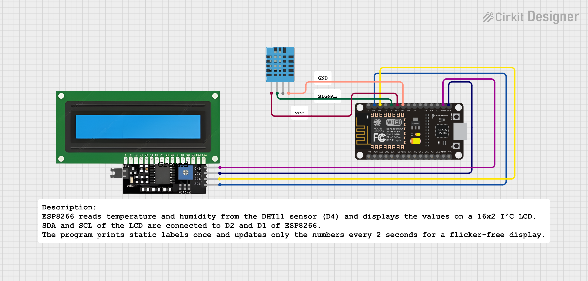

#  DHT11 Temperature & Humidity Display using ESP8266 + I2C LCD (MicroPython)

---

##  Overview
This project measures **temperature** and **humidity** using the **DHT11 sensor** and displays the readings on a **16x2 I2C LCD** connected to an **ESP8266** microcontroller programmed in **MicroPython**.  
It provides smooth, real-time updates every 2 seconds without screen flicker.

---

##  Circuit Diagram

Below is the circuit connection layout used in this project:

| Component | ESP8266 Pin | Description |
|------------|-------------|-------------|
| DHT11 Data | GPIO 2 (D4) | Sensor data pin |
| LCD SDA | GPIO 4 (D2) | I2C data line |
| LCD SCL | GPIO 5 (D1) | I2C clock line |
| VCC | 3.3V / 5V | Power supply |
| GND | GND | Ground connection |

>  **Note:** The I2C address (`0x27`) may vary depending on your LCD module. You can use an I2C scanner script to find the correct address.

---

##  Components Required
| Component | Quantity | Description |
|------------|-----------|-------------|
| ESP8266 (NodeMCU) | 1 | Microcontroller board running MicroPython |
| DHT11 Sensor | 1 | Measures temperature and humidity |
| 16x2 I2C LCD | 1 | Displays temperature and humidity values |
| Jumper Wires | - | For connections |
| Breadboard | 1 | For circuit assembly |

---

##  How It Works
1. The **DHT11 sensor** reads real-time temperature and humidity data.  
2. The **ESP8266** collects and processes this data using the `dht` module.  
3. The readings are displayed on the **16x2 I2C LCD**.  
4. Only numeric values are updated every 2 seconds — preventing flicker and keeping the display stable.

---

##  Applications

- Home environment monitoring  
- IoT-based weather station  
- Classroom or lab humidity tracker  
- Smart greenhouse control system  
- Industrial temperature logging  
- Room comfort monitoring system  
---

##  Future Enhancements

- Add °C/°F unit conversion
- Wi-Fi connectivity for live dashboard or Blynk app
- Buzzer alert for threshold crossing
- Data logging on cloud or SD card
- Replace LCD with OLED/TFT for better visuals

---

##  Author

**Kritish Mohapatra**  
Third Year B.Tech, Electrical Engineering  
 Focused on IoT, Embedded Systems, and MicroPython Projects  

---

⭐ If you like this project, give it a **star** on GitHub and follow for more IoT projects!