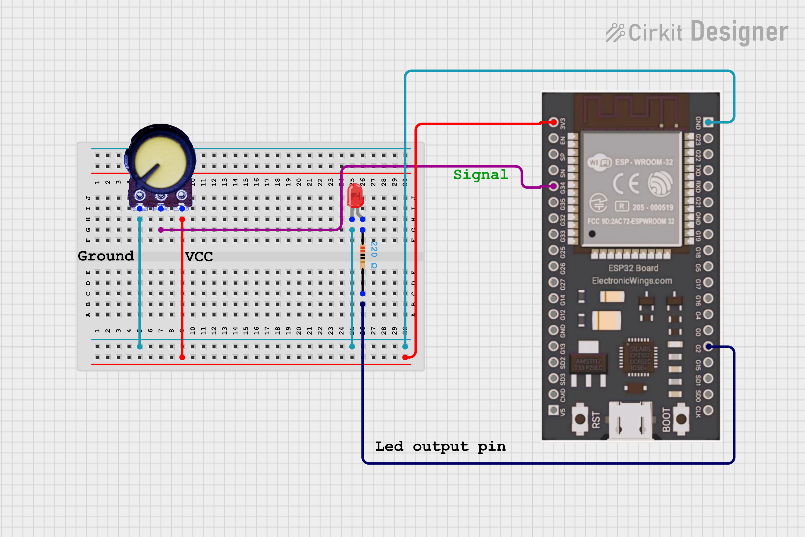

## 💡 Dimmer LED using Potentiometer (ESP32 + MicroPython)

An interactive LED dimmer system built with an **ESP32**, a **potentiometer**, and **MicroPython**.  
Control the brightness of an LED seamlessly by rotating a potentiometer, showcasing basic **PWM (Pulse Width Modulation)** control.

---

### 🧠 Overview

This project utilizes a **potentiometer** to adjust the brightness of an **LED**.  
The potentiometer acts as a variable resistor, forming a **voltage divider**.  
The **ESP32’s ADC (Analog to Digital Converter)** reads this analog voltage, which is then mapped to a **PWM duty cycle** to control the LED’s brightness.

---

### ⚙️ Circuit Diagram


---

**Potentiometer Connection:**

```
3.3V --- [Potentiometer] ---●------ GND
                  |
                ADC Pin (GPIO34)
```

**LED Connection:**
```
GPIO2 --- [220Ω Resistor] --- LED --- GND
```

---

### 🧩 Components Required

| Component | Quantity | Description |
|------------|-----------|-------------|
| ESP32 | 1 | Main microcontroller |
| Potentiometer (10kΩ) | 1 | Variable resistor for input |
| LED | 1 | Light source to be dimmed |
| 220Ω resistor | 1 | Limits LED current |
| Breadboard & jumper wires | — | For connections |

---


### 🔍 How It Works

1. Potentiometer varies resistance.  
2. This changes the analog voltage at the wiper arm.  
3. ESP32 reads this voltage through **ADC (pin 34)**.  
4. The analog value (0–4095) is mapped to a **PWM duty cycle (0–1023)**.  
5. ESP32’s **PWM output (GPIO2)** controls the LED brightness based on the duty cycle.

---


### ⚡ Calibration & Mapping

- The ESP32's **ADC** typically reads values from **0 to 4095**.  
- The **PWM duty cycle** in MicroPython on ESP32 typically ranges from **0 to 1023**.  
- You can use a **linear mapping** between ADC and PWM for smooth brightness control.
---

# Example mapping
adc_value = adc.read()  **Reads from 0 to 4095**

pwm_duty = int(adc_value / 4095 * 1023)  **Maps to 0–1023**

led_pwm.duty(pwm_duty)

## 🌟 Applications

- Desk lamp dimmers
- Ambient lighting control
- Interactive art installations
- Prototyping user input for IoT devices
- Industrial control panels
---

## 🚀 Future Enhancements

- Implement smooth transitions between brightness levels.
- Add a second LED and potentiometer for independent control.
- Integrate a web interface to control brightness wirelessly via Wi-Fi.
- Use a Rotary Encoder for more precise control.
- Control multiple LEDs or RGB LEDs with separate potentiometers.

---

## 📸 Example Output

```
| Potentiometer Value | PWM Duty | LED Brightness |
| ------------------- | -------- | -------------- |
| 200                 | 50       | Dim            |
| 2000                | 500      | Medium         |
| 4000                | 1000     | Full           |

```

---

## 🧑‍💻 Author

**Kritish Mohapatra**  
Third Year B.Tech, Electrical Engineering  
📡 Focused on IoT, Embedded Systems, and MicroPython Projects  

---

⭐ If you like this project, give it a **star** on GitHub and follow for more IoT projects!
