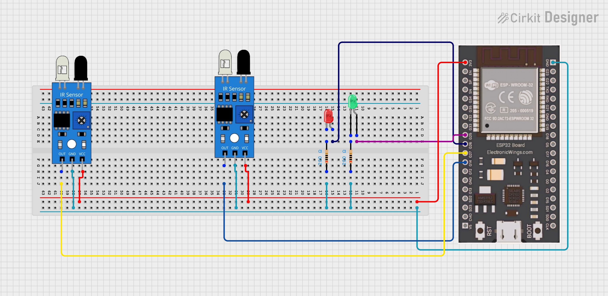

# Dual IR Entry/Exit Detector with Telegram Alerts 


## Overview

A dual IR sensor-based entry/exit detection system built on ESP32 using MicroPython. When an object enters, a red LED glows continuously and a Telegram alert is sent. When the object exits through the second IR sensor, the red LED turns off, green LED blinks for 2 seconds, and another Telegram alert is sent.

## Demo

| Event | LED | Telegram |
|-------|-----|----------|
| Object Entered |  Red ON (stays until exit) | "Object Entered!" |
| Object Gone |  Green ON (2 sec) | "Object Gone!" |

## Components

| Component | Quantity |
|-----------|----------|
| ESP32 | 1 |
| HW-201 IR Sensor | 2 |
| Red LED | 1 |
| Green LED | 1 |
| Resistor (220Ω) | 2 |
| Jumper Wires | — |
| Breadboard | 1 |

## Circuit Connections


| Component | ESP32 GPIO |
|-----------|------------|
| IR Sensor 1 (Entry) OUT | GPIO 14 |
| IR Sensor 2 (Exit) OUT | GPIO 27 |
| Red LED (+) | GPIO 26 |
| Green LED (+) | GPIO 25 |
| Both sensors VCC | 3.3V |
| Both sensors GND | GND |
| Both LEDs GND | GND |

## How It Works

1. IR Sensor 1 (Entry) detects object → Red LED turns ON + Telegram alert "Object Entered!"
2. Red LED stays ON as long as the object is inside
3. IR Sensor 2 (Exit) detects object → Red LED turns OFF, Green LED turns ON for 2 seconds + Telegram alert "Object Gone!"
4. System resets and is ready for next detection

> HW-201 outputs LOW (0) when object is detected, HIGH (1) when clear.

## Telegram Setup

1. Open Telegram → search `@BotFather`
2. Send `/newbot` → follow steps → copy **Bot Token**
3. Search `@userinfobot` → send any message → copy **Chat ID**
4. Fill in `BOT_TOKEN` and `CHAT_ID` in `main.py`

## Code

```python
BOT_TOKEN = "YOUR_BOT_TOKEN"
CHAT_ID   = YOUR_CHAT_ID  # int only, no quotes
```

## Requirements

- MicroPython firmware on ESP32
- `urequests` module (built-in with standard MicroPython firmware)
- WiFi connection
- Telegram Bot Token + Chat ID


## Tags

`micropython` `esp32` `ir-sensor` `telegram` `iot` `home-automation` `100DaysOfIoT`


## Author
**Kritish Mohapatra**  
B.Tech Electrical Engineering (3rd Year)  
IoT | Embedded Systems | MicroPython | ESP32  

---

## ⭐ Support

If you like this project, give it a ⭐ on GitHub and feel free to fork it!

Happy hacking 🚀
