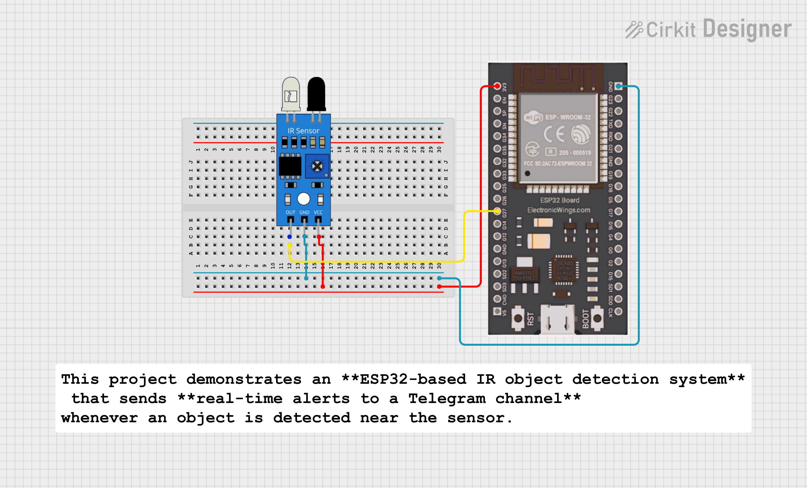

# 🚨 ESP32 IR Sensor Telegram Alert (MicroPython)

This project demonstrates an **ESP32-based IR object detection system** that sends **real-time alerts to a Telegram channel** whenever an object is detected near the sensor.

Built using **MicroPython**, this project is simple, lightweight, and perfect for IoT & embedded systems learners.

---

## 🛠️ Components Required

- ESP32 Development Board  
- IR Sensor Module  
- Jumper Wires  
- WiFi Connection  
- Telegram Bot & Channel  

---

## 🔌 Circuit Connections

| IR Sensor Pin | ESP32 Pin |
|--------------|----------|
| VCC          | 3.3V     |
| GND          | GND      |
| OUT          | GPIO 27  |

> You can change the GPIO pin from the code if required.

---

## ⚙️ Working Principle

1. ESP32 connects to the WiFi network.
2. IR sensor continuously monitors for object detection.
3. When an object is detected:
   - ESP32 sends a **Telegram alert message**.
4. A delay is applied to prevent repeated alerts.

---

## 📲 Telegram Setup

### Step 1: Create a Telegram Bot
- Open **@BotFather**
- Use `/start` → `/newbot`
- Save the **Bot Token**

### Step 2: Create a Telegram Channel
- Create a public or private channel
- Add your bot as **Admin**

### Step 3: Get Channel Chat ID
You can test using browser:

## 📲 Telegram Setup

### Send Test Message (Browser Method)

Replace `<BOT_TOKEN>` and `@your_channel` with your details:

https://api.telegram.org/bot<BOT_TOKEN>/sendMessage?chat_id=@your_channel&text=TEST

## 🧠 Software & Libraries

- MicroPython (ESP32)
- Telegram Bot API
- `urequests` module

---

## 🔐 Security Note

⚠️ Do not expose your **Telegram Bot Token** in public repositories.  
Use configuration files or environment variables whenever possible.

---

## 🚀 Future Enhancements

- Convert this project into a reusable **MicroPython library**
- Add **multiple sensor** support
- Include **timestamp** in Telegram alerts
- Integrate **camera module** for image-based alerts
- Add **cloud logging** (MQTT / Firebase)

---

## 🧑‍💻 Author

**Kritish Mohapatra**  
MicroPython | ESP32 | Embedded Systems | IoT Projects  
GitHub: [https://github.com/kritishmohapatra]

## ⭐ Support

If you like this project, give it a ⭐ on GitHub  
and feel free to fork or improve it!
