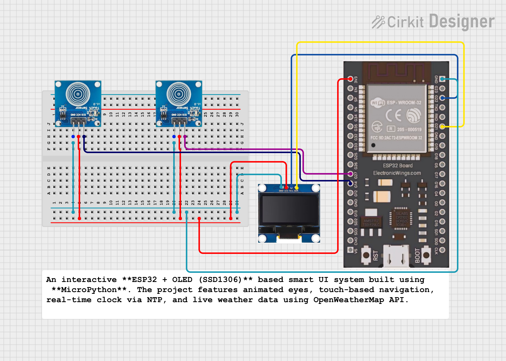

# 🧿 ESP32 OLED Smart UI – Eyes Animation, Time & Weather (MicroPython)

An interactive **ESP32 + OLED (SSD1306)** based smart UI system built using **MicroPython**.  
The project features animated eyes, touch-based navigation, real-time clock via NTP, and live weather data using OpenWeatherMap API.

---

## ✨ Features

- 👀 **Animated Eyes (Idle Screen)**
  - Blinking eyes with random eye movement
  - Runs continuously until user interaction

- 👋 **Welcome Screen**
  - Displays a custom welcome message on boot

- 👆 **Dual Touch Control**
  - **Touch NEXT** → Navigate menu / Sync time
  - **Touch SELECT** → Select option / Go back

- 🕒 **Live Date & Time (IST)**
  - NTP-based internet time sync
  - Manual sync using touch button
  - IST timezone offset applied

- ☁️ **Live Weather Info**
  - Fetches real-time weather using **OpenWeatherMap API**
  - Displays temperature, humidity, and condition
  - City configurable

- 🔁 **State-Based UI Flow**
    - Welcome → Eyes (Idle) → Menu → Time / Weather → Back


---

## 🛠 Hardware Required

| Component | Description |
|--------|------------|
| ESP32 | Any ESP32 development board |
| OLED Display | 128x64 SSD1306 (I2C) |
| Touch Sensors | 2x Digital Touch / TTP223 |
| Jumper Wires | As required |

---

## 🔌 Pin Configuration


### OLED (I2C)
| OLED Pin | ESP32 Pin |
|-------|-----------|
| SDA | GPIO 21 |
| SCL | GPIO 22 |

### Touch Sensors
| Function | ESP32 Pin |
|--------|-----------|
| NEXT | GPIO 14 |
| SELECT | GPIO 27 |

---

## 📡 Software & Libraries

- **MicroPython**
- `ssd1306`
- `urequests`
- `network`
- `ntptime`

---

## 🌐 WiFi & Weather Setup

Edit these values in the code:

```python
SSID = "YOUR_WIFI_NAME"
PASSWORD = "YOUR_WIFI_PASSWORD"

OWM_API_KEY = "YOUR_OPENWEATHER_API_KEY"
CITY = "YourCity"

```


👉 Get your free API key from:
https://openweathermap.org/api

## ⏱ Timezone Handling

- Uses **UTC time** obtained from NTP servers  
- **IST (Indian Standard Time)** offset manually applied

```python
UTC_OFFSET = 19800  # 5 hours 30 minutes (IST)
```
---
| Action        | Button                              |
| ------------- | ----------------------------------- |
| Open Menu     | Touch **SELECT** (from Eyes screen) |
| Navigate Menu | Touch **NEXT**                      |
| Select Option | Touch **SELECT**                    |
| Sync Time     | Touch **NEXT** (inside Time screen) |
| Exit Screen   | Touch **SELECT**                    |


## 🚀 Future Improvements
1. 🌡 Local Sensor Integration

   Add DHT11 / DHT22 / BME280 for real temperature & humidity

2. 🔋 Battery Status Indicator
Display battery percentage or voltage on OLED

3. 🌙 Night Mode / OLED Dimming
Reduce brightness during night hours to save power

4. 📦 Reusable UI Framework
Convert this project into a generic MicroPython OLED UI library


## 🧑‍💻 Author

**Kritish Mohapatra**  
B.Tech Electrical Engineering (3rd Year)  
IoT | Embedded Systems | MicroPython | ESP32  

---

## ⭐ Support

If you like this project, give it a ⭐ on GitHub and feel free to fork it!

Happy hacking 🚀

