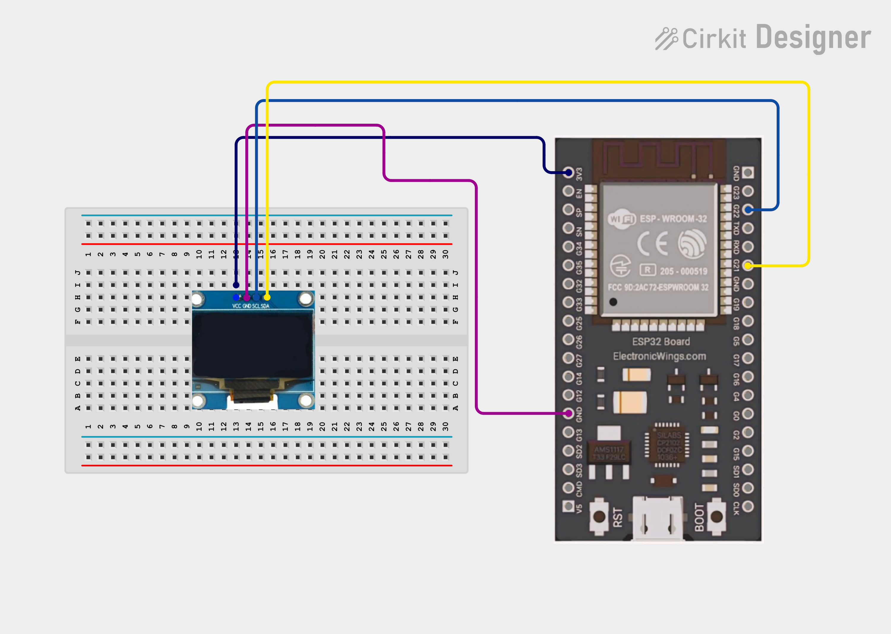
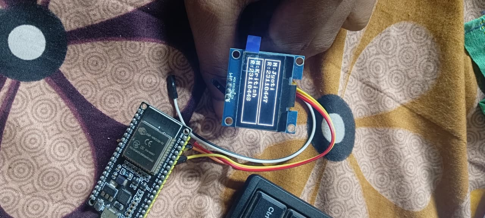
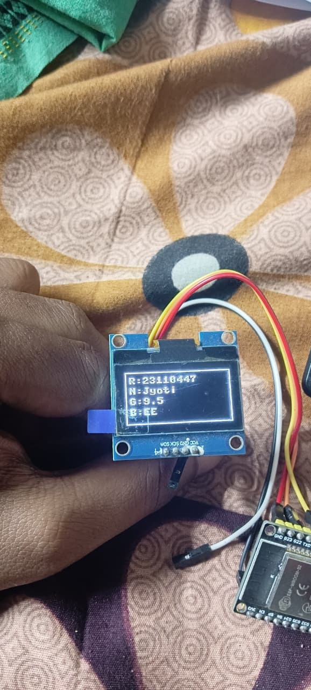

# ESP32 Student Management System

A lightweight student record management system built on the ESP32 microcontroller using MicroPython. The system provides a serial command interface for managing student records and renders live output on an SH1106 OLED display. All data is persisted to onboard flash memory in JSON format.

---

## Hardware Requirements

| Component       | Specification              |
|-----------------|---------------------------|
| Microcontroller | ESP32 (any dev board)      |
| Display         | SH1106 OLED, 128x64, I2C  |
| Connectivity    | 4 jumper wires             |

---

## Wiring Configuration

| OLED Pin | ESP32 Pin |
|----------|-----------|
| VCC      | 3.3V      |
| GND      | GND       |
| SDA      | GPIO 21   |
| SCL      | GPIO 22   |

---

## Project Structure

```
ESP32 Flash:
├── sh1106.py      — SH1106 OLED display driver
├── students.py    — Student data management (add, edit, save, load)
└── main.py        — Main application entry point (executes on boot)
```

Student records are persisted automatically to `/students.json` on the ESP32 flash filesystem. Data is retained across power cycles and reboots.

---

## Installation

### Step 1 — Flash MicroPython Firmware

```bash
pip install esptool

# Erase existing flash contents
esptool.py --port COM3 erase_flash

# Write MicroPython firmware
esptool.py --port COM3 --baud 460800 write_flash -z 0x1000 esp32-xxxx.bin
```

Latest MicroPython firmware: https://micropython.org/download/esp32/

### Step 2 — Upload Project Files

Using Thonny IDE:
1. Open Thonny and navigate to `Tools > Options > Interpreter`
2. Select `MicroPython (ESP32)` and choose the appropriate COM port
3. Upload `sh1106.py`, `students.py`, and `main.py` via `File > Save As > MicroPython Device`

Alternatively, using ampy:
```bash
pip install adafruit-ampy
ampy --port COM3 put sh1106.py
ampy --port COM3 put students.py
ampy --port COM3 put main.py
```

### Step 3 — Serial Monitor Configuration

| Setting      | Value        |
|--------------|-------------|
| Baud Rate    | 115200       |
| Line Ending  | Newline (\n) |

---

## Command Reference

### Add a Student

```
add <regdNo> <name> <gpa> <branch>
```

Example:
```
add S001 Jyoti 3.85 CSE
add S002 Bipul 3.90 ECE
add S003 Adarsh 3.75 CSE
add S004 Kritish 3.80 CSE
add S005 Bhuban 3.70 CSE
```

Note: Student names must not contain spaces. Use an underscore as a separator where required (e.g., `Jyoti_Sharma`).

---

### Edit a Student Record

```
edit <oldRegdNo> <newRegdNo> <newName> <newGPA> <newBranch>
```

Example:
```
edit S001 S001 Jyoti 3.90 CSE
```

---

### Display Navigation

| Command | Action                                      |
|---------|---------------------------------------------|
| `down`  | Advance to the next student in the list     |
| `up`    | Return to the previous student in the list  |
| `ok`    | Display full details of the selected student|
| `back`  | Return to the list view                     |

---

## Display Layout

### List View (Default)

```

+--------------------------+
| N: Jyoti                 |  <-- Selected student
| R: S001                  |
+--------------------------+
| N: Bipul                 |  <-- Next student
| R: S002                  |
+--------------------------+
```

### Detail View (triggered by `ok`)



```
+--------------------------+
| R: S001                  |
| N: Jyoti                 |
| G: 3.85                  |
| B: CSE                   |
+--------------------------+
```

---

## Troubleshooting

| Issue               | Resolution                                                  |
|---------------------|-------------------------------------------------------------|
| OLED not displaying | Verify I2C address via `i2c.scan()` — expected result: `[60]` |
| ImportError on boot | Confirm all three files are present on the ESP32 filesystem |
| JSON parse error    | Delete `/students.json` from flash and reboot the device    |
| Commands not recognised | Ensure line ending is set to `\n` in the serial monitor |

### I2C Address Verification

```python
from machine import Pin, SoftI2C
i2c = SoftI2C(scl=Pin(22), sda=Pin(21))
print(i2c.scan())  # Expected output: [60]  (0x3C)
```

---

## Technical Specifications

| Parameter        | Value                  |
|------------------|------------------------|
| Maximum Students | 1000 records           |
| File System      | LittleFS (automatic)   |
| Display          | 128x64 SH1106 OLED     |
| Interface        | USB Serial Monitor     |
| Runtime          | MicroPython on ESP32   |

---

## License

This project is open source and free to use for educational and personal purposes.
##  Author

**Kritish Mohapatra**  
B.Tech Electrical Engineering (3rd Year)  
IoT | Embedded Systems | MicroPython | ESP32

---

## ⭐ Support

If you like this project, give it a ⭐ on GitHub and feel free to fork it!

Happy hacking 🚀