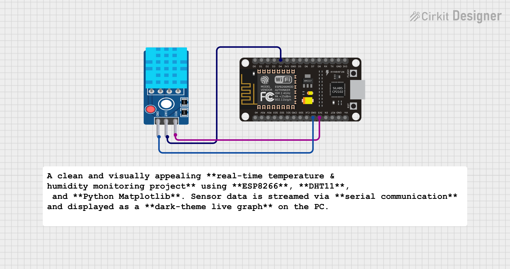

# 🌡️ ESP8266 DHT11 Live  Graph (MicroPython + Matplotlib)

A clean and visually appealing **real-time temperature & humidity monitoring project** using **ESP8266**, **DHT11**, and **Python Matplotlib**. Sensor data is streamed via **serial communication** and displayed as a **dark-theme  live graph** on the PC.

---

## 🚀 Project Overview

This project demonstrates how to:

* Read temperature and humidity data from a **DHT11 sensor** using **MicroPython** on ESP8266
* Transmit data continuously over **USB serial**
* Visualize the data in **real time** using **Matplotlib live animation**
* Create a **dark background -style graph** with clearly visible data points

---

## 🛠️ Hardware Requirements

* ESP8266 (NodeMCU recommended)
* DHT11 Temperature & Humidity Sensor
* USB Cable
* Jumper Wires

### 🔌 Wiring


| DHT11 Pin | ESP8266 Pin |
| --------- | ----------- |
| VCC       | 3.3V        |
| DATA      | D4 (GPIO2)  |
| GND       | GND         |

> ⚠️ Use a DHT11 module with an inbuilt pull-up resistor, or add a **10kΩ pull-up** manually.

---

## 💻 Software Requirements

### ESP8266 Side

* MicroPython firmware flashed on ESP8266
* Thonny / ampy / rshell for uploading code

### PC Side

* Python **3.8+** (tested on Windows)
* Required Python libraries:

```bash
pip install pyserial matplotlib
```


---

## 📟 ESP8266 MicroPython Code (`main.py`)

```python
import dht
import machine
import time

sensor = dht.DHT11(machine.Pin(2))  # D4 = GPIO2

while True:
    try:
        sensor.measure()
        temp = sensor.temperature()
        hum = sensor.humidity()

        # Send data to PC via USB serial
        print("{},{}".format(temp, hum))

    except:
        print("0,0")

    time.sleep(2)

```

> ℹ️ `main.py` runs automatically on ESP8266 boot.

---

## 📊 PC Side Python Code (`live_plot.py`)

```python
import serial
import time
import matplotlib.pyplot as plt
from matplotlib.animation import FuncAnimation

# -------- Serial --------
time.sleep(2)
ser = serial.Serial("COM4", 115200, timeout=1)

temps = []
hums = []
x_vals = []

# -------- Dark Theme --------
plt.style.use("dark_background")
fig, ax = plt.subplots()
fig.patch.set_facecolor("#0f0f0f")
ax.set_facecolor("#0f0f0f")

# -------- Animate --------
def animate(i):
    if ser.in_waiting:
        data = ser.readline().decode().strip()
        if "," in data:
            t, h = data.split(",")

            temps.append(int(t))
            hums.append(int(h))
            x_vals.append(len(temps))

            ax.clear()
            ax.set_facecolor("#0f0f0f")

            # ===== Temperature =====
            # Glow (behind)
            ax.plot(
                x_vals[-30:], temps[-30:],
                color="#ff3131", linewidth=8, alpha=0.2
            )
            # Line
            ax.plot(
                x_vals[-30:], temps[-30:],
                color="#ff3131", linewidth=2.5
            )
            # Points (TOP layer)
            ax.scatter(
                x_vals[-30:], temps[-30:],
                color="#ff6b6b", s=40, zorder=5, label="Temperature (°C)"
            )

            # ===== Humidity =====
            ax.plot(
                x_vals[-30:], hums[-30:],
                color="#00ffff", linewidth=8, alpha=0.2
            )
            ax.plot(
                x_vals[-30:], hums[-30:],
                color="#00ffff", linewidth=2.5
            )
            ax.scatter(
                x_vals[-30:], hums[-30:],
                color="#7ffcff", s=40, zorder=5, label="Humidity (%)"
            )

            ax.set_title("ESP8266 DHT11 Live Monitor", fontsize=14)
            ax.set_xlabel("Samples")
            ax.set_ylabel("Value")
            ax.legend()
            ax.grid(alpha=0.2)

# -------- Start --------
ani = FuncAnimation(fig, animate, interval=1000)
plt.show()

```

---

## 🎨 Features

* 🖤 Dark background UI
* 🌈  temperature & humidity lines
* ✨ Glow effect for better visibility
* 🔵 Clearly visible live data points
* 📈 Smooth real-time animation

---

## 🧠 Key Concepts Used

* MicroPython sensor interfacing
* Serial communication (ESP8266 → PC)
* Python list slicing for sliding window visualization
* Matplotlib `FuncAnimation` for real-time plotting

---

## 📌 Applications

* IoT sensor monitoring
* Embedded systems demos
* Internship / academic projects
* Real-time data visualization

---

## 🔮 Future Improvements

* CSV data logging
* Threshold-based alerts
* Wi-Fi based data streaming (Flask)
* Web dashboard version

---


## 🧑‍💻 Author

**Kritish Mohapatra**  
B.Tech Electrical Engineering (3rd Year)  
IoT | Embedded Systems | MicroPython | ESP32  

---

## ⭐ Support

If you like this project, give it a ⭐ on GitHub and feel free to fork it!

Happy hacking 🚀

