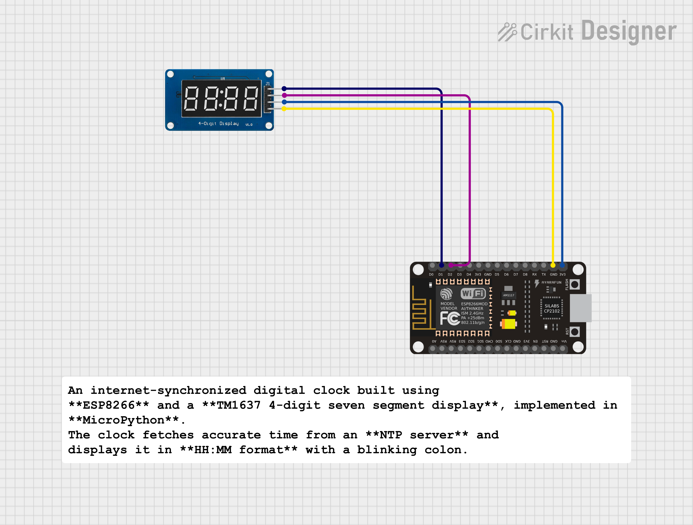

#  ESP8266 NTP Digital Clock (MicroPython)

An internet-synchronized digital clock built using **ESP8266** and a **TM1637 4-digit seven segment display**, implemented in **MicroPython**.  
The clock fetches accurate time from an **NTP server** and displays it in **HH:MM format** with a blinking colon.

---

##  Features
- Real-time clock using **NTP (Network Time Protocol)**
- No RTC module required
- Accurate internet-synced time
- Blinking colon effect
- Custom segment mapping for correct digit display
- Built using **MicroPython**
- Compact and low-cost design

---

##  Components Used
- ESP8266 (NodeMCU)
- TM1637 4-Digit Seven Segment Display
- Wi-Fi Network
- Jumper Wires
- Breadboard

---
##  Pin Connections

| TM1637 Pin | ESP8266 GPIO | NodeMCU Pin |
|-----------|--------------|-------------|
| CLK       | GPIO5        | D1          |
| DIO       | GPIO4        | D2          |
| VCC       | 3.3V         | 3.3V       |
| GND       | GND          | GND        |

---

##  How It Works
1. ESP8266 connects to the configured Wi-Fi network.
2. Time is fetched from an NTP server in UTC.
3. UTC time is converted to IST (UTC + 5:30).
4. Time is displayed on the TM1637 display in HH:MM format.
5. The colon blinks every second to indicate real-time updates.

---

##  Software & Libraries
- **MicroPython**
- `network` – Wi-Fi connection
- `ntptime` – NTP time synchronization
- `tm1637` – Seven segment display control

---

##  Setup Instructions
1. Flash MicroPython firmware on ESP8266.
2. Upload `tm1637.py` and `main.py` to the board.
3. Update Wi-Fi SSID and password in `main.py`.
4. Reset the ESP8266.
5. The clock will sync time and start displaying it automatically.

---

##  Custom Segment Mapping
Due to non-standard TM1637 module segment wiring, custom segment byte mapping is used to ensure correct digit rendering instead of relying on default library functions.

---

##  Applications
- Digital wall clock
- IoT dashboards
- Learning project for NTP & MicroPython
- Embedded systems mini project

---

##  Key Learnings
- NTP time synchronization
- Wi-Fi handling in MicroPython
- Seven segment display control
- Debugging hardware-library mismatches

---

##  License
This project is open-source and free to use for learning and educational purposes.

---

##  Author

**Kritish Mohapatra**  
Third Year B.Tech, Electrical Engineering  
📡 Focused on IoT, Embedded Systems, and MicroPython Projects  

---

⭐ If you like this project, give it a **star** on GitHub and follow for more IoT projects!
