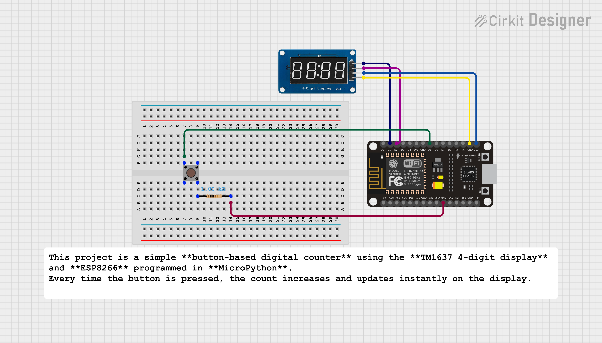

# TM1637 Button-Press Counter (ESP8266 + MicroPython)

This project is a simple **button-based digital counter** using the **TM1637 4-digit display** and **ESP8266** programmed in **MicroPython**.  
Every time the button is pressed, the count increases and updates instantly on the display.

---

##  Features
- Increment counter using a single push button  
- TM1637 4-digit 7-segment display  
- No flicker, smooth updates  
- Built-in software debounce  
- Accurate segment-byte mapping  
- Count range: **0000 → 9999**

---

##  Components Required
| Component | Quantity |
|----------|----------|
| ESP32 / ESP8266 | 1 |
| TM1637 4-digit display | 1 |
| Push Button | 1 |
| Jumper wires | As required |

---

##  Wiring Connections

### **TM1637 → ESP8266**

| TM1637 Pin | ESP8266 Pin |
|------------|-----------|
| CLK | GPIO 5 |
| DIO | GPIO 4 |
| VCC | 3.3V |
| GND | GND |

### **Button → ESP8266**
| Button Pin | ESP8266 Pin |
|------------|-----------|
| One side | GPIO 14 |
| Other side | GND |

(Using internal pull-up, so no external resistor needed)

---
##  Why We Use a `show_number()` Function

We created a separate `show_number()` function instead of writing display code directly inside the loop.  
Here’s why:

###  1. Cleaner & More Readable Code  
By writing the number-display logic inside a function, the main loop stays simple and easy to understand.

###  2. Automatic 4-Digit Formatting  
The function always formats the value as **4 digits**:  
- 7 → 0007  
- 45 → 0045  
- 123 → 0123  

Without this, the TM1637 would show random leftover digits.

###  3. Converts Digits → Segment Bytes  
The TM1637 cannot display numbers directly.  
It needs **segment bytes** like:  
- 0 → `0x3F`  
- 1 → `0x06`  
- 2 → `0x5B`  

The function automatically converts the number into the correct 7-segment pattern.

###  4. Reusable for Any Future Features  
If later you add:  
- Reset button  
- Auto-counter  
- Timer  
You can still call `show_number(count)` without rewriting display logic.

###  5. Easy Debugging & Maintenance  
If the display ever shows wrong digits, you only fix the function — not the entire code.

##  How It Works

- Button uses **PULL-UP**, so pressing it pulls the input **LOW**  
- Built-in **debounce logic** prevents accidental multiple increments  
- Display always shows **4 digits** with leading zeros (0001, 0054, etc.)  
- When count reaches **9999**, it automatically resets back to **0000**

---

##  Possible Upgrades

- Add a **reset button**  
- Add **auto-counting mode** using a timer  
- Store the count value in **EEPROM / Flash**  
- Use two buttons (**Increment + Decrement**) for full control  

##  Author

**Kritish Mohapatra**  
MicroPython | ESP32 | Embedded Systems | IoT Projects  
GitHub: [https://github.com/kritishmohapatra]

