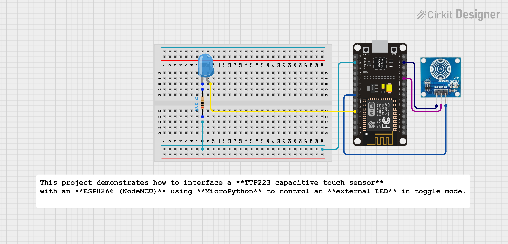

# ESP8266 Touch Sensor LED Control (MicroPython)

This project demonstrates how to interface a **TTP223 capacitive touch sensor** with an **ESP8266 (NodeMCU)** using **MicroPython** to control an **external LED** in toggle mode.

---

## 📌 Features
- Capacitive touch-based control
- Toggle mode (one touch = ON, next touch = OFF)
- Uses MicroPython
- Simple hardware and clean logic
- Suitable for beginners in IoT & Embedded Systems

---

## 🧰 Components Required
- ESP8266 (NodeMCU)
- TTP223 Touch Sensor Module
- External LED
- 220Ω Resistor
- Jumper wires
- Breadboard (optional)

---

## 🔌 Circuit Connections

### TTP223 → ESP8266

| TTP223 Pin | ESP8266 Pin |
|-----------|------------|
| VCC | 3.3V |
| GND | GND |
| OUT | D5 (GPIO14) |

### External LED
- LED Anode (+) → D4 (GPIO2)
- LED Cathode (−) → GND (via 220Ω resistor)

> ℹ️ External LED works in **active-HIGH mode**  
> (`HIGH = ON`, `LOW = OFF`)

---

## 🧠 Working Principle
- Touch sensor outputs **HIGH (1)** when touched
- ESP8266 detects the **rising edge**
- LED toggles its state on every valid touch
- Software debounce prevents false triggering

---

## ⚠️ Important Notes

- ESP8266 operates on **3.3V logic**
- Avoid pulling **boot pins LOW** during startup
- Recommended GPIO pins for stable operation:
  - **D1 (GPIO5)**
  - **D2 (GPIO4)**
  - **D5 (GPIO14)**
  - **D6 (GPIO12)**
  - **D7 (GPIO13)**
- Touch sensitivity can be increased by connecting a **small metal pad or wire** to the TTP223 touch plate

---

## 🚀 Applications

- Touch-based light switch
- Smart home control panel
- Touch-controlled relay module
- IoT automation projects
- ESP8266 + WiFi dashboard trigger

---

## 📂 Future Improvements

- Replace LED with a **relay module**
- Integrate with a **web server (Flask / HTML)**
- Add **MQTT-based control**
- Create a reusable **MicroPython library for TTP223**
---

## 🧑‍💻 Author

**Kritish Mohapatra**  
MicroPython | ESP32 | Embedded Systems | IoT Projects  
GitHub: [https://github.com/kritishmohapatra]

## ⭐ Support

If you like this project, give it a ⭐ on GitHub  
and feel free to fork or improve it!