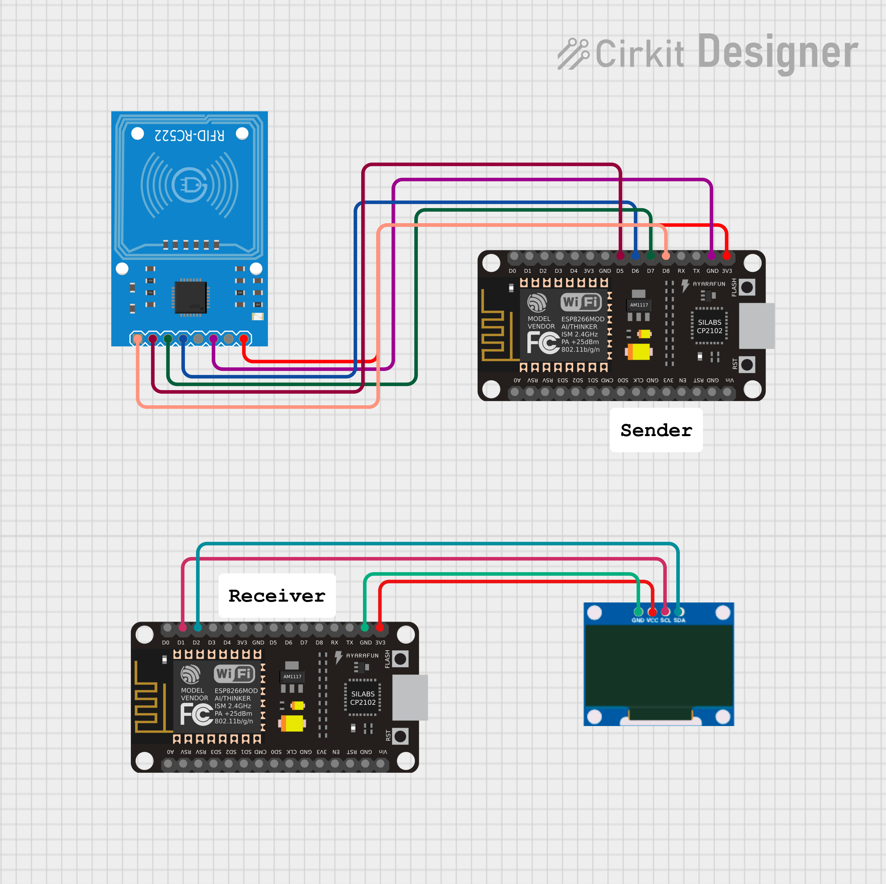

# ESP-NOW RFID Display


An ESP-NOW based wireless RFID system. One ESP8266 scans an RFID card and sends the UID wirelessly to a second ESP8266 which displays it on an OLED screen. No WiFi router needed.

---

## Hardware

| Component       | Model                      |
|-----------------|----------------------------|
| Microcontroller | ESP8266 NodeMCU x2         |
| RFID Reader     | MFRC522 (SPI, 3.3V)        |
| Display         | SSD1306 0.96 inch OLED I2C |

---

## Wiring

### Sender (RFID)

| ESP8266 Pin  | MFRC522 Pin |
|--------------|-------------|
| 3V3          | 3.3V        |
| GND          | GND         |
| D5 (GPIO14)  | SCK         |
| D6 (GPIO12)  | MISO        |
| D7 (GPIO13)  | MOSI        |
| D8 (GPIO15)  | SDA/SS      |

### Receiver (OLED)

| ESP8266 Pin  | OLED Pin |
|--------------|----------|
| 3V3          | VCC      |
| GND          | GND      |
| D1 (GPIO5)   | SCL      |
| D2 (GPIO4)   | SDA      |

---


## Get MAC Address

Run this on each ESP8266 before setting up ESP-NOW to get the MAC address:

```python
import network
wlan = network.WLAN(network.STA_IF)
wlan.active(True)
print(wlan.config('mac').hex(':'))
```

Paste the receiver MAC address into sender.py:

```python
RECEIVER_MAC = b'\xd8\xbf\xc0\x0e\x64\xe9'
```

---

## Setup

1. Run the MAC address script on receiver ESP8266 and copy the output
2. Paste receiver MAC into sender.py
3. Flash receiver.py to receiver ESP8266
4. Flash sender.py to sender ESP8266
5. Power both boards
6. Scan any RFID card on sender — UID appears on OLED

---

## How It Works

- Sender scans card via MFRC522 over SPI
- UID converted to hex string and sent via ESP-NOW to receiver MAC
- Receiver gets the message and renders it on OLED
- No WiFi router needed, direct peer to peer communication
- Debounce 2000ms on sender prevents repeat sends

---

## Serial Output

### Sender
```
Day 75 - ESP-NOW RFID Sender
Hold card near reader...
Sending UID: 9A:DB:8A:04:CF
```

### Receiver
```
Day 75 - ESP-NOW RFID Receiver
Waiting for data...
Received UID: 9A:DB:8A:04:CF
```

---

## Learning Outcomes

- How ESP-NOW works as a connectionless peer to peer protocol on ESP8266
- How to register peers using MAC address in MicroPython espnow module
- How MFRC522 reads RFID UID over SPI and how to parse the raw bytes
- How to render dynamic text on SSD1306 OLED using MicroPython
- Difference between ESP-NOW and WiFi based communication in terms of latency and setup complexity

---

## Future Improvements

- Add access control logic on receiver side — grant or deny based on UID
- Show student name instead of raw UID by maintaining a lookup table on receiver
- Add buzzer on receiver for audio feedback on card scan
- Broadcast to multiple receivers simultaneously using ESP-NOW broadcast MAC
- Log received UIDs to a file on receiver for offline attendance tracking
- Add RSSI based proximity detection to trigger only when card is close enough

---


## Author
**Kritish Mohapatra**  
B.Tech Electrical Engineering (3rd Year)  
IoT | Embedded Systems | MicroPython | ESP32  

---

## ⭐ Support

If you like this project, give it a ⭐ on GitHub and feel free to fork it!

Happy hacking 🚀
