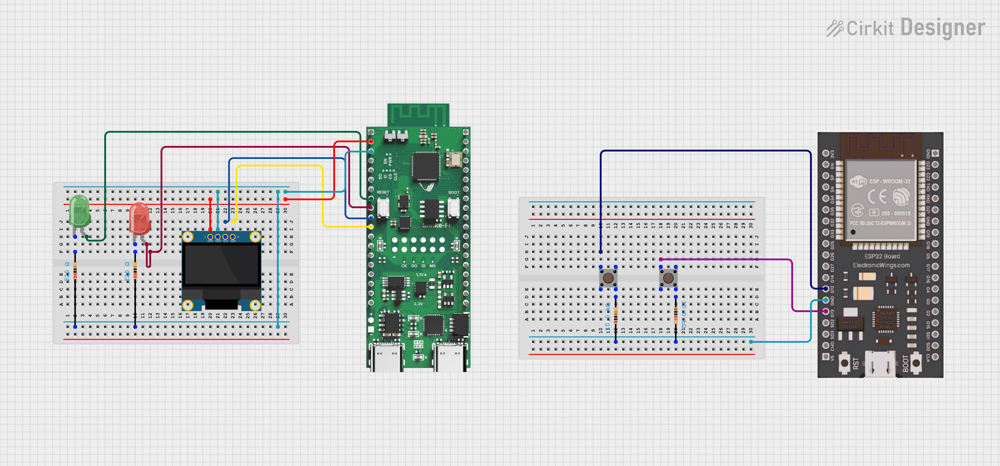

# ESP-NOW Wireless LED Control with ShrikeFi

A wireless LED control system using ESP-NOW protocol, where button presses on an ESP32 DevKit toggle LEDs on a Vicharak ShrikeFi board with real-time status displayed on an OLED screen.

## Overview

This project demonstrates ESP-NOW based communication between two ESP32 devices. Pressing a button on the sender ESP32 toggles the corresponding LED on the ShrikeFi receiver. An SSD1306 OLED display on the receiver shows the current state of each LED in real time.

This is Day 100 of the 100 Days 100 IoT Projects challenge, built on the Vicharak ShrikeFi — a hybrid development board combining an ESP32-S3 microcontroller with a Renesas ForgeFPGA.

## Hardware Used

- Vicharak ShrikeFi (ESP32-S3 + Renesas ForgeFPGA)
- ESP32 DevKit v1 (sender)
- SSD1306 OLED Display (128x64, I2C)
- 2x Push Buttons
- 2x LEDs
- 2x 220 ohm Resistors (for LEDs)
- 2x 10k ohm Resistors (for Buttons)
- Jumper Wires
- Breadboard

## Pin Configuration

###  Circuit Diagram

### Sender (ESP32 DevKit v1)

| Component | GPIO |
|-----------|------|
| Button 1  | 12   |
| Button 2  | 13   |

### Receiver (ShrikeFi - ESP32-S3)

| Component | GPIO |
|-----------|------|
| LED 1     | 4    |
| LED 2     | 5    |
| OLED SCL  | 6    |
| OLED SDA  | 7    |

## Working

- Pressing Button 1 on the sender toggles LED 1 on the ShrikeFi
- Pressing Button 2 on the sender toggles LED 2 on the ShrikeFi
- The OLED display shows the current state: LED1 ON/OFF or LED2 ON/OFF
- ESP-NOW is used for fast, connectionless wireless communication without any router or Wi-Fi network
- Debounce logic is implemented on the sender side to avoid false triggers

## Software

- MicroPython v1.27.0
- Vicharak custom MicroPython firmware for ShrikeFi
- ssd1306 MicroPython library

## How to Run

1. Flash Vicharak's custom MicroPython firmware on the ShrikeFi from the [Shrike GitHub releases](https://github.com/vicharak-in/shrike/releases/)
2. Flash standard MicroPython firmware on the ESP32 DevKit
3. Install the ssd1306 library via Thonny (Tools > Manage Packages)
4. Get the MAC address of the ShrikeFi and update it in `sender.py`
5. Upload `receiver.py` as `main.py` on the ShrikeFi
6. Upload `sender.py` as `main.py` on the ESP32 DevKit
7. Press buttons on the sender and observe LEDs and OLED on the ShrikeFi
---

## Notes

- Both devices must be on the same ESP-NOW channel (channel 1 by default)
- ShrikeFi uses GPIO6 and GPIO7 for I2C (Qwiic connector)
- The ShrikeFi MCU user LED is on GPIO21
- This project uses only the ESP32-S3 side of the ShrikeFi; FPGA integration is planned as a future extension
##  Author

**Kritish Mohapatra**  
B.Tech Electrical Engineering (3rd Year)  
IoT | Embedded Systems | MicroPython | ESP32  

---

## ⭐ Support

If you like this project, give it a ⭐ on GitHub and feel free to fork it!

Happy hacking 🚀

