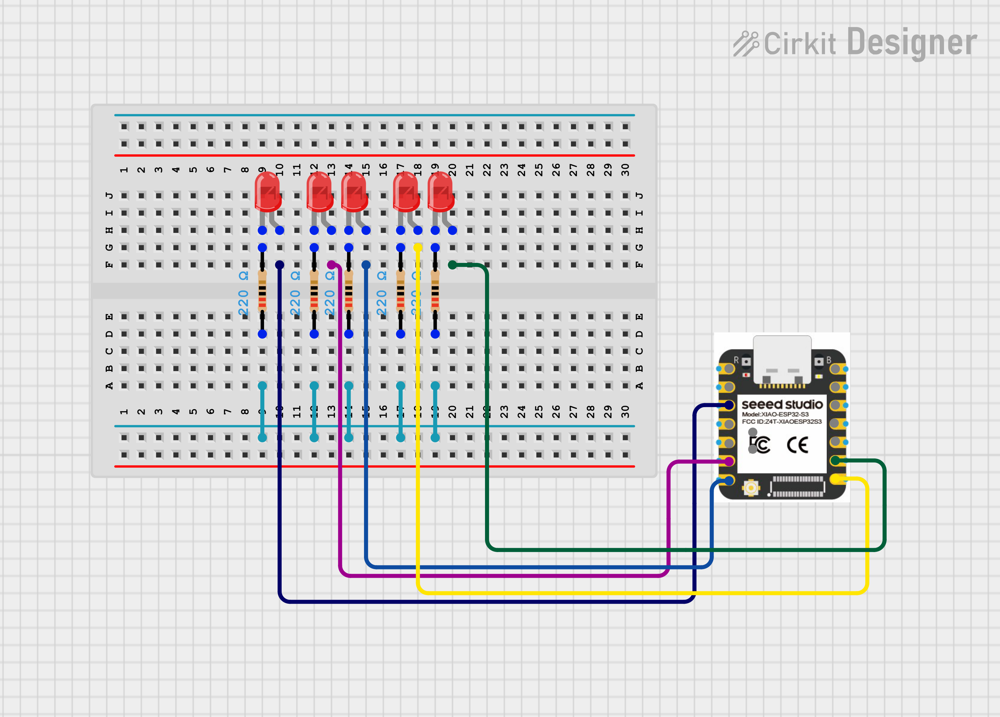

# Finger Gesture Controlled LEDs 

Control 5 LEDs using hand gestures via OpenCV + MediaPipe on PC and MicroPython on Xiao ESP32-S3.

---

##  Project Overview

This project uses a webcam to detect how many fingers are raised, then sends that count over USB Serial to a Xiao ESP32-S3, which turns on the corresponding number of LEDs in real time.

- **1 finger up** → LED 1 ON
- **2 fingers up** → LED 1 & 2 ON
- **5 fingers up** → All 5 LEDs ON
- **Fist (0 fingers)** → All LEDs OFF

---

##  Hardware Used

| Component | Quantity |
|-----------|----------|
| Seeed Xiao ESP32-S3 | 1 |
| LED | 5 |
| 220Ω Resistor | 5 |
| Breadboard | 1 |
| Jumper Wires | As needed |
| USB Cable | 1 |

---

##  Wiring

| LED | Xiao ESP32-S3 GPIO |
|-----|-------------------|
| LED 1 | GPIO 2 |
| LED 2 | GPIO 5 |
| LED 3 | GPIO 6 |
| LED 4 | GPIO 7 |
| LED 5 | GPIO 8 |

Each LED: **Anode (+)** → GPIO → **220Ω Resistor** → **GND**



---

##  Tech Stack

| Side | Technology |
|------|-----------|
| PC | Python, OpenCV, cvzone, pyserial |
| Microcontroller | MicroPython |
| Communication | USB Serial (115200 baud) |

---

##  Installation (PC)

```bash
# Create fresh conda environment (recommended)
conda create -n cv_env python=3.10 -y
conda activate cv_env

# Install dependencies
pip install numpy==1.26.4 opencv-python mediapipe==0.10.14 cvzone pyserial
```

---


##  PC Code — `finger_led.py`

```python
import cv2
from cvzone.HandTrackingModule import HandDetector
import serial
import time

ser = serial.Serial('COM14', 115200, timeout=1)  # Change COM port as needed
time.sleep(2)

detector = HandDetector(maxHands=1)
cap = cv2.VideoCapture(0)

last_count = -1

def set_leds(count):
    for i in range(1, 6):
        cmd = f"LED{i}:{'ON' if i <= count else 'OFF'}\n"
        ser.write(cmd.encode())
        time.sleep(0.05)

while True:
    ret, frame = cap.read()
    if not ret:
        break

    frame = cv2.flip(frame, 1)
    hands, frame = detector.findHands(frame)

    finger_count = 0
    hand_type = ""

    if hands:
        hand = hands[0]
        fingers = detector.fingersUp(hand)
        finger_count = sum(fingers)

        if hand["type"] == "Left":
            hand_type = "Right"
        else:
            hand_type = "Left"

    cv2.putText(frame, f'Fingers: {finger_count}', (10, 50),
                cv2.FONT_HERSHEY_SIMPLEX, 1.5, (0, 255, 0), 3)
    cv2.putText(frame, f'Hand: {hand_type}', (10, 100),
                cv2.FONT_HERSHEY_SIMPLEX, 1.2, (255, 0, 0), 2)

    cv2.imshow("Finger LED Control", frame)

    if finger_count != last_count:
        set_leds(finger_count)
        last_count = finger_count

    if cv2.waitKey(1) & 0xFF == ord('q'):
        break

cap.release()
cv2.destroyAllWindows()
ser.close()
```

---

##  ESP32 Code — `main.py`

```python
from machine import Pin
import sys
import time

leds = {
    "LED1": Pin(2, Pin.OUT),
    "LED2": Pin(5, Pin.OUT),
    "LED3": Pin(6, Pin.OUT),
    "LED4": Pin(7, Pin.OUT),
    "LED5": Pin(8, Pin.OUT),
}

for led in leds.values():
    led.value(0)

print("ESP READY")

while True:
    cmd = sys.stdin.readline()
    if not cmd:
        continue
    cmd = cmd.strip().upper()
    if ":" in cmd:
        name, action = cmd.split(":", 1)
        if name in leds:
            if action == "ON":
                leds[name].value(1)
            elif action == "OFF":
                leds[name].value(0)
    time.sleep(0.05)
```

---

##  How to Run

1. Flash `main.py` to Xiao ESP32-S3 using Thonny
2. Close Thonny (free the COM port)
3. Run PC script:
```bash
python finger_led.py
```
4. Show hand to webcam — LEDs will respond to finger count
5. Press `q` to quit

---

##  How It Works

```
Webcam → cvzone HandDetector → fingersUp() → sum → Serial → ESP32 → LEDs
```

- `fingersUp()` returns a list like `[1,0,1,1,0]` — `1` = finger up, `0` = finger down
- `sum([1,0,1,1,0])` = `3` → 3 LEDs ON
- PC sends commands like `LED1:ON`, `LED2:ON`, `LED3:ON`, `LED4:OFF`, `LED5:OFF`
- ESP32 reads via `sys.stdin.readline()` and sets GPIO accordingly

---


##  Author

**Kritish Mohapatra**  
B.Tech Electrical Engineering (3rd Year)  
IoT | Embedded Systems | MicroPython | ESP32  

---

## ⭐ Support

If you like this project, give it a ⭐ on GitHub and feel free to fork it!

Happy hacking 🚀