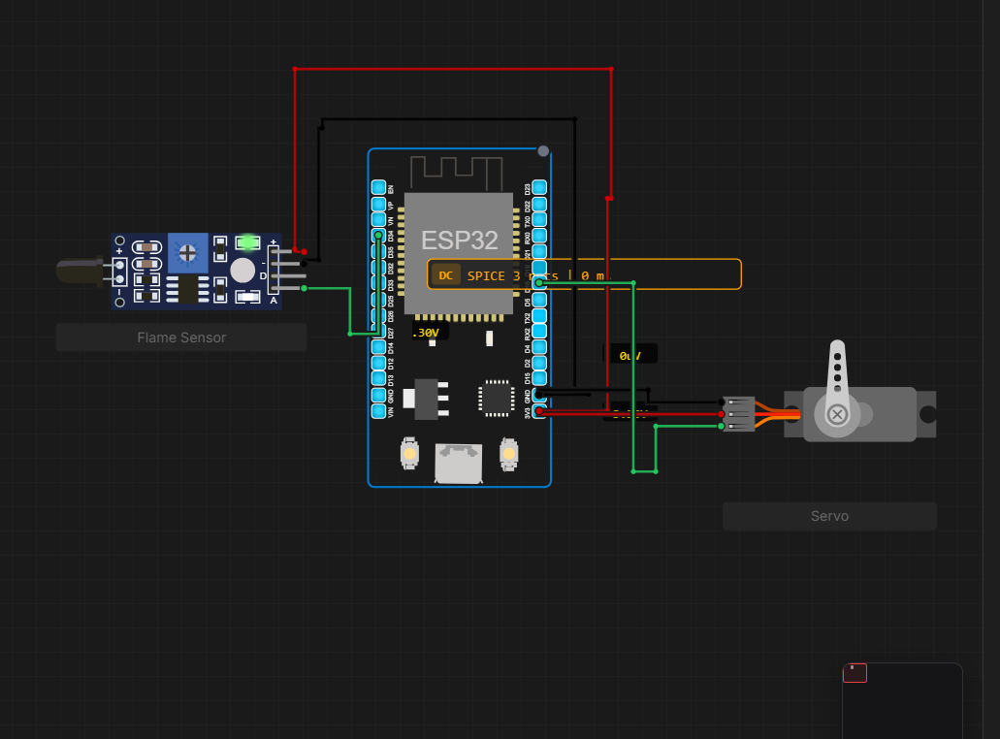

# Flame Sensor Servo Alert System

A MicroPython project on ESP32 that detects flame using an analog flame sensor and triggers a servo motor sweep from 0° to 180° as an alert response.
## Live on Velxio
[Live simulation](https://velxio.dev/project/7b19c0db-5eab-4d4c-90f9-39abf1440af7)

## Hardware Required

- ESP32 DevKit
- Flame sensor module (with AO pin)
- SG90 servo motor
- Jumper wires

## Wiring

| Component | Pin | ESP32 |
|-----------|-----|-------|
| Flame sensor AO | Analog out | GPIO 34 |
| Flame sensor VCC | Power | 3.3V |
| Flame sensor GND | Ground | GND |
| Servo signal | PWM | GPIO 18 |
| Servo VCC | Power | 5V (VIN/VUSB) |
| Servo GND | Ground | GND |

> Servo must be connected to 5V, not 3.3V.

## Circuit Diagram
 


## How It Works

The flame sensor outputs a lower ADC value when flame is detected (active-low behavior). When the reading drops below the threshold, the servo sweeps from 0° to 180° as an alert. When flame is gone, the servo resets to 0°.

PWM duty cycle formula for SG90:
```
duty = int((angle / 180) * 77 + 26)
```
Maps 0°–180° to duty values 26–103 on ESP32's 0–1023 scale.

## Code

```python
from machine import Pin, ADC, PWM
import time

FLAME_PIN = 34
SERVO_PIN = 18
THRESHOLD = 1000

flame = ADC(Pin(FLAME_PIN))
flame.atten(ADC.ATTN_11DB)

servo = PWM(Pin(SERVO_PIN), freq=50)

def set_angle(angle):
    duty = int((angle / 180) * 77 + 26)
    servo.duty(duty)

def sweep_0_to_180():
    for angle in range(0, 181, 5):
        set_angle(angle)
        time.sleep_ms(15)

def reset_to_0():
    set_angle(0)
    time.sleep_ms(500)

print("Flame detection system started")
set_angle(0)
time.sleep(1)

flame_active = False

while True:
    raw = flame.read()

    if raw < THRESHOLD and not flame_active:
        print(f"Flame detected! ADC: {raw}")
        flame_active = True
        sweep_0_to_180()

    elif raw >= THRESHOLD and flame_active:
        print("Flame gone, resetting")
        flame_active = False
        reset_to_0()

    time.sleep_ms(100)
```

## Threshold Calibration

Run this snippet first to find the right threshold for your sensor:

```python
from machine import Pin, ADC
import time

flame = ADC(Pin(34))
flame.atten(ADC.ATTN_11DB)

while True:
    print(flame.read())
    time.sleep_ms(200)
```

Note the ADC value with and without flame, then set `THRESHOLD` between those two values.

---

## Author
**Kritish Mohapatra**  
B.Tech Electrical Engineering (3rd Year)  
IoT | Embedded Systems | MicroPython | ESP32  

---

## ⭐ Support

If you like this project, give it a ⭐ on GitHub and feel free to fork it!

Happy hacking 🚀
