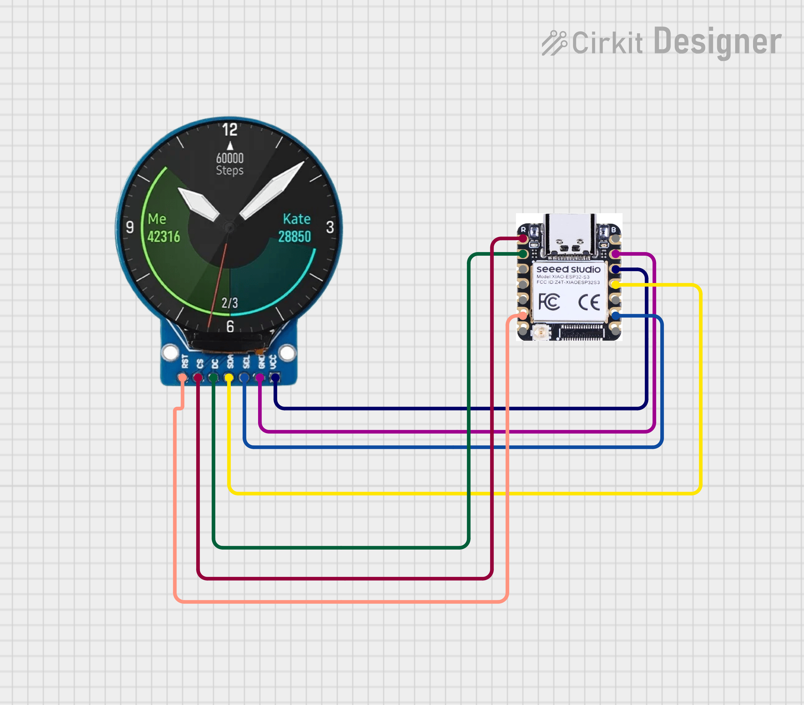

# GC9A01 Round Display Smartwatch


A cyberpunk-style smartwatch face on a **1.28" round GC9A01 display** powered by ESP32. Features a robot eyes boot animation, typing effect, live weather, and real-time NTP-synced clock.

---

##  Demo

> Robot Eyes Boot → KRITISH Typing → WiFi Connect → Live Clock + Weather

---

##  Features

-  **Robot Eyes Animation** — rectangular eyes with pupils that shift left/right on blink
-  **Typing Effect** — "KRITISH" appears letter by letter
-  **Real-time Clock** — NTP synced, IST (UTC+5:30)
-  **Live Weather** — temperature + condition via OpenWeatherMap API
-  **WiFi Icon** — connection indicator
-  **Weather Icon** — pixel art sun icon
-  **Flicker-free updates** — row-by-row rendering, no screen tearing

---

##  Hardware

| Component | Details |
|-----------|---------|
| Microcontroller | ESP32 DevKit V1 / Xiao ESP32-S3 |
| Display | GC9A01 1.28" Round TFT 240x240 |
| Protocol | SPI |

---

##  Wiring

### ESP32 DevKit V1
| GC9A01 | ESP32 |
|--------|-------|
| VCC | 3.3V |
| GND | GND |
| SCL | GPIO 18 |
| SDA | GPIO 23 |
| DC | GPIO 2 |
| CS | GPIO 5 |
| RST | GPIO 4 |

### Xiao ESP32-S3
| GC9A01 | Xiao ESP32-S3 |
|--------|---------------|
| VCC | 3.3V |
| GND | GND |
| SCL | GPIO 7 |
| SDA | GPIO 9 |
| DC | GPIO 2 |
| CS | GPIO 1 |
| RST | GPIO 6 |

---

##  Dependencies

Upload these files to your ESP32:
- `gc9a01.py` — [russhughes/gc9a01py](https://github.com/russhughes/gc9a01py)
- `vga1_8x16.py` — bitmap font

---

##  Configuration

Edit these lines in `main.py`:

```python
WIFI_SSID = "YOUR_WIFI_SSID"
WIFI_PASS = "YOUR_WIFI_PASSWORD"
API_KEY   = "YOUR_OPENWEATHERMAP_API_KEY"
CITY      = "Bhubaneswar"
```

Get free API key at [openweathermap.org](https://openweathermap.org/api)

---

##  Setup

1. Flash MicroPython on ESP32
2. Upload `gc9a01.py`, `vga1_8x16.py`, `main.py` via Thonny
3. Edit WiFi + API config
4. Reset board — enjoy! 

---


##  Boot Sequence
    Power ON
    └─► Robot Eyes Animation (blink left → right → center)
    └─► "KRITISH" Typing Effect
    └─► WiFi Connecting...
    └─► NTP Time Sync
    └─► Weather Fetch
    └─► Clock Running 

---
##  Author

**Kritish Mohapatra**
B.Tech Electrical Engineering (3rd Year)
IoT | Embedded Systems | MicroPython | ESP32

---

## ⭐ Support

If you like this project, give it a ⭐ on GitHub and feel free to fork it!