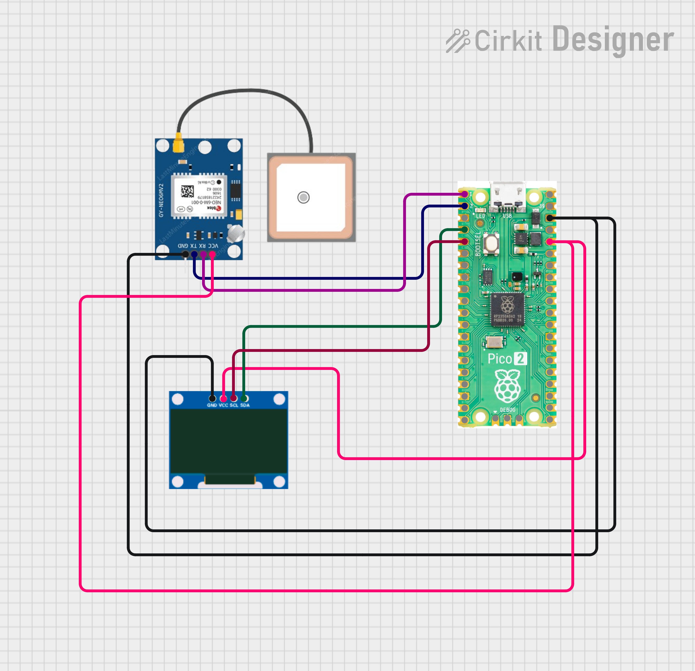

# GPS Clock and Location Display (NEO-6M + OLED)

A satellite-synced clock and live location display built with a NEO-6M GPS module and an SSD1306 OLED, running on MicroPython.

## Overview

This project reads NMEA sentences from a NEO-6M GPS module over UART, parses them to extract time, coordinates, speed, satellite count, and altitude, and displays the data in real time on a 128x64 OLED screen. Time is converted from UTC to IST (UTC + 5:30) directly from the GPS signal, so no internet or RTC module is needed.

## Hardware Required

- Raspberry Pi Pico W (or Pico 2 W)
- NEO-6M GPS Module
- SSD1306 OLED Display (128x64, I2C)
- Jumper wires, breadboard


## Wiring

| Module  | Pin | Pico W |
|---------|-----|--------|
| NEO-6M  | TX  | GP1 (UART0 RX) |
| NEO-6M  | RX  | GP0 (UART0 TX) |
| NEO-6M  | VCC | 3.3V |
| NEO-6M  | GND | GND |
| OLED    | SDA | GP2 (I2C1) |
| OLED    | SCL | GP3 (I2C1) |
| OLED    | VCC | 3.3V |
| OLED    | GND | GND |



## How It Works

1. The NEO-6M continuously transmits NMEA sentences (GPRMC, GPGGA, GPGSV, etc.) over UART at 9600 baud once it has a satellite fix.
2. The Pico W reads raw bytes from UART and buffers them until a complete line is received.
3. Each line's checksum is verified before parsing, to discard corrupted sentences.
4. GPRMC sentences provide UTC time, latitude, longitude, and speed. Latitude/longitude are converted from DDMM.mmmm format to decimal degrees, and time is converted from UTC to IST.
5. GPGGA sentences provide satellite count and altitude.
6. The OLED shows a "Searching..." screen until the first valid fix is received, then continuously updates with time, coordinates, speed, satellite count, and altitude.
---
## Notes

- A clear view of the sky is required for the GPS module to acquire a fix. Indoor environments often fail to get a lock.
- First fix after power-on can take 1-5 minutes (cold start).
- If the OLED is not detected on I2C scan or throws timeout errors during write, add 4.7k ohm pull-up resistors from SDA and SCL to 3.3V.
- `bytes.decode()` in MicroPython does not accept keyword arguments such as `errors=`; use `decode('ascii')` only.

## Demo Output (Serial)

```
$GPRMC,192338.00,A,2219.35650,N,08718.47165,E,0.352,,150626,,,A*7A
Parsed -> time: 00:53:38 IST, lat: 22.32261, lon: 87.30786, speed: 0.65 km/h
```
##  Author

**Kritish Mohapatra**  
B.Tech Electrical Engineering (3rd Year)  
IoT | Embedded Systems | MicroPython | ESP32  

---

## ⭐ Support

If you like this project, give it a ⭐ on GitHub and feel free to fork it!

Happy hacking 🚀

