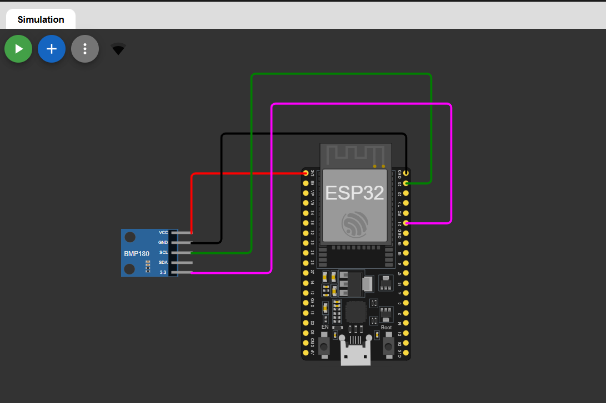
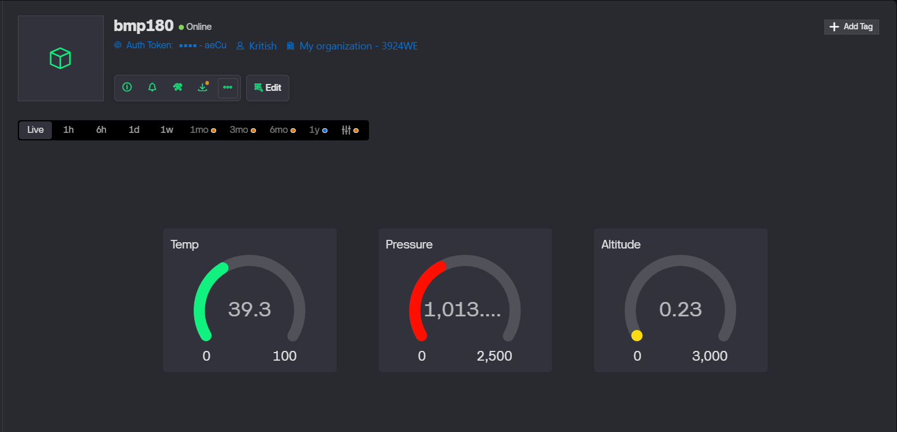

# 🌦️ IoT Atmospheric Monitoring System using ESP32, BMP180 & Blynk


## 📌 Project Overview

This project demonstrates an **IoT-based Atmospheric Monitoring System** using the **ESP32 microcontroller** and **BMP180 pressure sensor**.  
The system measures:

- 🌡 Temperature  
- 🌬 Atmospheric Pressure  
- 🏔 Altitude  

The data is transmitted in real-time to the **Blynk IoT Cloud platform** using Wi-Fi and MicroPython.

---


## 🔗 Online Simulation (Wokwi)

You can run and test this project online using the Wokwi simulator:

👉 **Wokwi Simulation Link:**  
https://wokwi.com/projects/455284507555137537

> Note: Click the link and press the **Run ▶️** button to start the simulation.

---

## 🔧 Hardware Components

- ESP32 Development Board  
- BMP180 Pressure & Temperature Sensor  
- Jumper Wires  
- Wi-Fi Network  

---

## 💻 Software & Tools

- MicroPython Firmware  
- Blynk IoT Platform  
- Wokwi Simulator / Real ESP32 Board  
- Thonny / uPyCraft IDE  

---

## 🔌 Circuit Connections


| BMP180 Pin | ESP32 Pin |
|------------|------------|
| VCC | 3.3V |
| GND | GND |
| SDA | GPIO 21 |
| SCL | GPIO 22 |

---

## 📡 Blynk Virtual Pins

| Parameter | Virtual Pin |
|------------|--------------|
| Temperature | V0 |
| Pressure | V1 |
| Altitude | V2 |

---

## 🧠 Working Principle

1. ESP32 reads temperature, pressure, and altitude from BMP180 via I2C communication.  
2. The measured pressure is converted from Pascals (Pa) to hectopascals (hPa).  
3. Data is transmitted to the Blynk IoT Cloud using Wi-Fi.  
4. Users can monitor real-time environmental data on the Blynk mobile application dashboard.

---

## 🧪 MicroPython Code

```python
'''Copyright (c) 2026 Kritish Mohapatra'''

import network
from machine import SoftI2C, Pin
import BlynkLib
from time import sleep
from bmp180 import BMP180

# WiFi
wifissid = "Wokwi-GUEST"
wifipass = ""

# Blynk Token
auth = "YOUR_BLYNK_AUTH_TOKEN"

# Connect WiFi
sta_if = network.WLAN(network.STA_IF)
sta_if.active(True)
sta_if.connect(wifissid, wifipass)

while not sta_if.isconnected():
    pass

print("Connected to Wi-Fi:", sta_if.ifconfig())

# Start Blynk
blynk = BlynkLib.Blynk(auth, insecure=True)

# BMP180 I2C
i2c = SoftI2C(scl=Pin(22), sda=Pin(21))
bmp = BMP180(i2c)
bmp.oversample = 2
bmp.sealevel = 101325

# Main Loop
while True:
    blynk.run()

    temp = bmp.temperature
    pressure = bmp.pressure / 100
    altitude = bmp.altitude

    print("Temp:", temp, "C")
    print("Pressure:", pressure, "hPa")
    print("Altitude:", altitude, "m")

    blynk.virtual_write(0, temp)
    blynk.virtual_write(1, pressure)
    blynk.virtual_write(2, altitude)

    sleep(2)
```
---
## 📊 Results
- The system successfully displays:
- Real-time temperature values
- Atmospheric pressure in hPa
- Altitude estimation in meters
- All parameters are visualized on the Blynk mobile dashboard.

## 🚀 Future Enhancements

- Add OLED Display for local monitoring
- Store data in cloud database (Firebase / Google Sheets)
- Add DHT11/DHT22 for humidity sensing
- Create a web dashboard using ESP32 Web Server
- Implement alert notifications for abnormal conditions

## ❤️Author
**Kritish Mohapatra**  
B.Tech Electrical Engineering (3rd Year)  
IoT | Embedded Systems | MicroPython | ESP32  

---

## ⭐ Support

If you like this project, give it a ⭐ on GitHub and feel free to fork it!

Happy hacking 🚀

