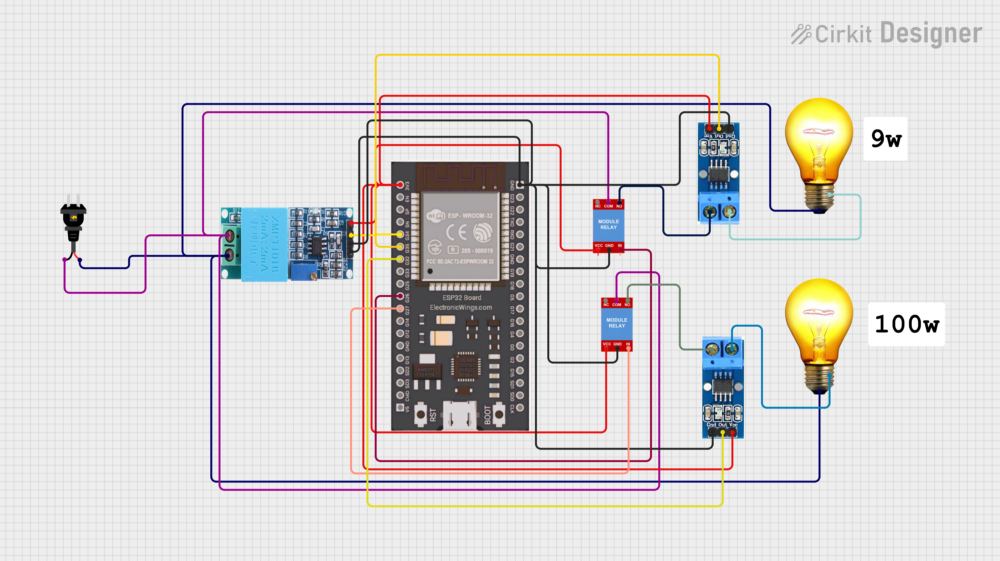
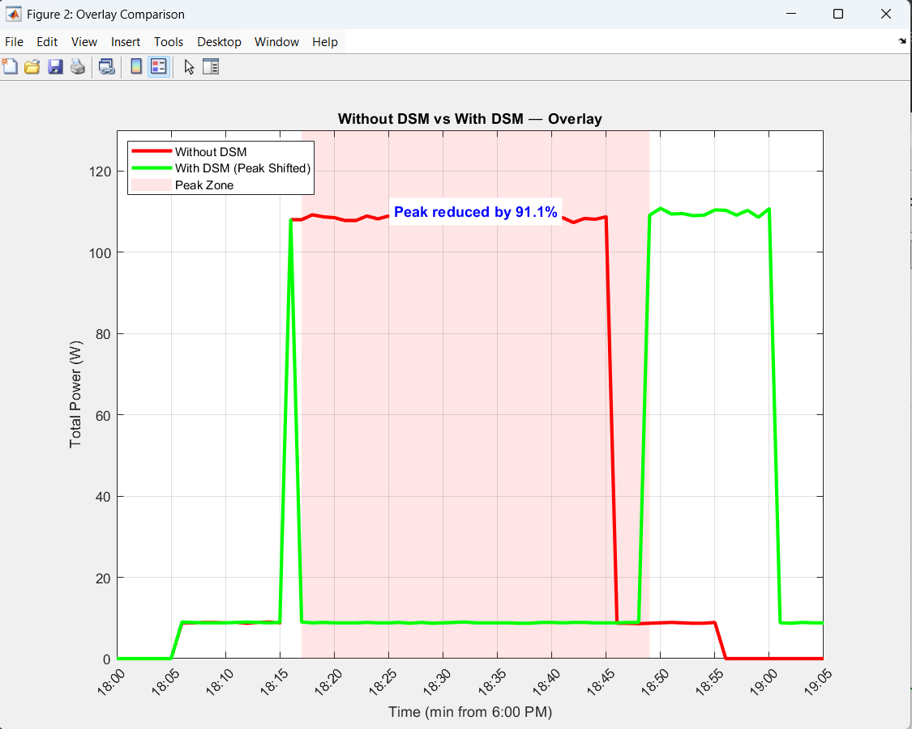
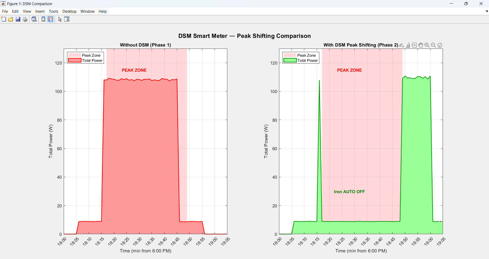
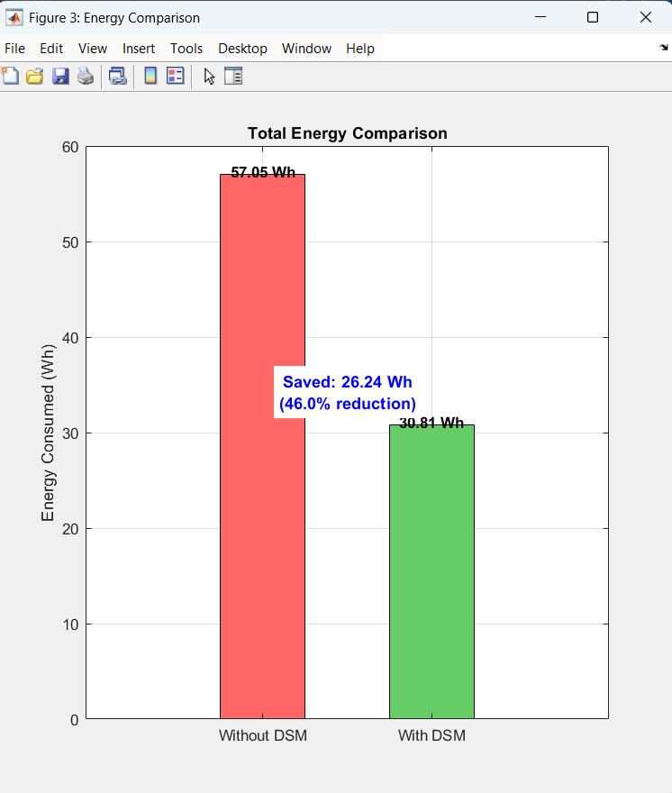

# IoT-Based DSM Smart Metering Prototype


> An IoT-based Demand Side Management (DSM) smart metering prototype using ESP32, MicroPython, Blynk IoT, and MATLAB for real-time power monitoring and automatic peak load shifting.

---

## Overview

This project implements a **Demand Side Management (DSM)** system that:
- Monitors real-time voltage, current, and power consumption
- Detects peak hours automatically
- Shifts non-critical loads (heavy load) away from peak hours
- Logs data to cloud (Blynk IoT) for remote monitoring
- Demonstrates energy savings through before/after comparison graphs

### What is DSM?
Demand Side Management is a strategy used by utility companies to reduce electricity consumption during peak hours by controlling non-critical loads. This prototype simulates that concept on a small scale using two loads:
- **Light Load** (Fan / 9W bulb) → Critical, never cut
- **Heavy Load** (Iron / 100W bulb) → Shiftable, auto OFF during peak

---

## System Architecture

```
┌─────────────────────────────────────────────────────┐
│                    ESP32 (Controller)               │
│                                                     │
│  ZMPT101B ──► GPIO34    GPIO26 ──► Relay 1 (Fan)    │
│  ACS712 #1 ──► GPIO35   GPIO27 ──► Relay 2 (Iron)   │
│  ACS712 #2 ──► GPIO32   GPIO2  ──► LED Alert        │
└─────────────────────────────────────────────────────┘
         │                        │
         ▼                        ▼
   Blynk IoT Cloud          Serial Monitor
   (Live Dashboard)         (CSV Data)
         │
         ▼
   MATLAB Analysis
   (Comparison Graphs)
```

---

## Hardware Components

| Component | Specification | Purpose |
|-----------|--------------|---------|
| ESP32 | WROOM-32 | Main controller / WiFi |
| ZMPT101B | 250V AC | Voltage measurement |
| ACS712 | 20A variant | Current measurement (×2) |
| 2-Channel Relay | 5V active LOW | Load control |
| 9W LED Bulb | - | Light load (Fan simulation) |
| 100W Bulb | - | Heavy load (Iron simulation) |

---

## Pin Connections

| Module | ESP32 Pin |
|--------|-----------|
| ZMPT101B OUT | GPIO34 (ADC) |
| ACS712 #1 OUT (Fan) | GPIO35 (ADC) |
| ACS712 #2 OUT (Iron) | GPIO32 (ADC) |
| Relay 1 IN (Fan) | GPIO26 |
| Relay 2 IN (Iron) | GPIO27 |
| LED Alert | GPIO2 (built-in) |




---

## Project Structure

```
IoT_Based_DSM_Smart_Metering_Prototype/
│
├── code/
│   ├── dsm_code1_csv.py        # Phase 1: Data collection (without DSM)
│   ├── dsm_code2_peakshift.py  # Phase 2: Peak shifting (with DSM)
│   
│
├── data/
│   ├── data_code1.csv          # Collected data (without DSM)
│   └── data_code2.csv          # Collected data (with DSM)
│
├── matlab/
│   └── dsm_comparison_plot.m   # MATLAB comparison plots
│
├── circuit/
│   └── circuit_diagram.png     # Circuit schematic
│
└── README.md
```

---

## Calibration Values

These values are hardware-specific — recalibrate for your setup:

```python
ZMPT_SENSITIVITY   = 133.8      # Adjust until voltage matches multimeter
ACS_ZERO_FAN       = 0.8736     # GPIO35 zero offset (no load)
ACS_ZERO_IRON      = 0.8746     # GPIO32 zero offset (no load)
CURR_FACTOR_FAN    = 0.005      # Correction factor for light load
CURR_FACTOR_IRON   = 0.055      # Correction factor for heavy load
CURRENT_THRESHOLD  = 0.01       # Below this → show 0.00A
```

### How to Calibrate

**Step 1 — Voltage (ZMPT101B):**
```python
import machine, math
adc_v = machine.ADC(machine.Pin(34))
adc_v.atten(machine.ADC.ATTN_11DB)
s = 0.0
for _ in range(500):
    r = adc_v.read()
    v = (r/4095)*3.3 - 1.65
    s += v*v
print(math.sqrt(s/500))
# New Sensitivity = Old × (Actual_V / Reading_V)
```

**Step 2 — Current Zero (ACS712, no load):**
```python
import machine, time
adc1 = machine.ADC(machine.Pin(35))
adc2 = machine.ADC(machine.Pin(32))
adc1.atten(machine.ADC.ATTN_11DB)
adc2.atten(machine.ADC.ATTN_11DB)
t1 = t2 = 0.0
for _ in range(1000):
    t1 += (adc1.read() / 4095) * 3.3
    t2 += (adc2.read() / 4095) * 3.3
    time.sleep_ms(1)
print("GPIO35 zero:", t1/1000)
print("GPIO32 zero:", t2/1000)
```

---

## Setup Instructions

### 1. Flash MicroPython on ESP32
Download firmware from [micropython.org](https://micropython.org/download/ESP32_GENERIC/)

### 2. Install Required Libraries
Upload `BlynkLib.py` to ESP32 using Thonny IDE

### 3. Configure Blynk IoT
Create account at [blynk.cloud](https://blynk.cloud) and add datastreams:

| Virtual Pin | Type | Widget | Purpose |
|-------------|------|--------|---------|
| V0 | Double | Gauge | Voltage |
| V1 | Double | Gauge | Fan Power |
| V2 | Double | Gauge | Iron Power |
| V3 | Integer | Switch | Fan ON/OFF |
| V4 | Integer | Switch | Iron ON/OFF |
| V5 | Double | SuperChart | Power Graph |
| V6 | Double | Gauge | Total Power |

### 4. Update Credentials
```python
WIFI_SSID = "YOUR_SSID"
WIFI_PASS = "YOUR_PASSWORD"
AUTH      = "YOUR_BLYNK_AUTH_TOKEN"
```

### 5. Run Phase 1 (Data Collection)
```
Run dsm_code1_csv.py
→ Control loads manually via Blynk
→ Copy CSV output from Thonny serial monitor
→ Save as data_code1.csv
```

### 6. Run Phase 2 (Peak Shifting)
```
Run dsm_code2_peakshift.py
→ Turn ON iron via Blynk during peak window
→ DSM automatically cuts iron!
→ Save output as data_code2.csv
```

### 7. MATLAB Analysis
```matlab
% Place data_code1.csv and data_code2.csv in same folder
% Run dsm_comparison_plot.m
% 3 graphs will be generated
```

---

## Results

| Metric | Without DSM | With DSM |
|--------|-------------|----------|
| Peak Power | ~108W | ~9W |
| Peak Reduction | - | ~91% |
| Heavy Load during peak | ON (~99W) | OFF (DSM cut) |
| Light Load during peak | ON (~9W) | ON (~9W) |

---

## DSM Logic Flow

```
Every reading cycle:
  ├── Read Voltage + Current → Calculate Power
  ├── Check fake IST time
  │
  ├── IF peak hour (18:17 – 18:49):
  │   └── Iron requested ON?
  │       └── YES → AUTO OFF iron + Blynk alert
  │
  └── IF peak hour over:
      └── DSM was active?
          └── YES → AUTO RESTORE iron
```

---
## MATLAB GRAPH



## Tech Stack

- **Firmware** — MicroPython v1.27
- **Hardware** — ESP32 WROOM-32
- **IoT Platform** — Blynk IoT (new)
- **Sensors** — ZMPT101B, ACS712
- **Analysis** — MATLAB
- **IDE** — Thonny

---

##  Author

**Kritish Mohapatra**
B.Tech Electrical Engineering (3rd Year)
IoT | Embedded Systems | MicroPython | ESP32

---

## ⭐ Support

If you like this project, give it a ⭐ on GitHub and feel free to fork it!


Happy hacking 🚀