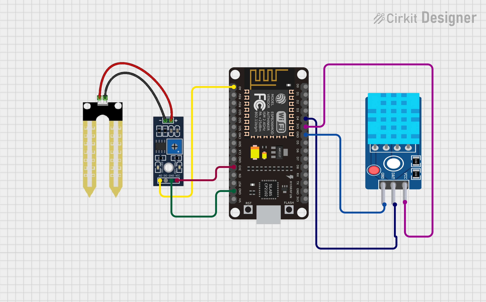
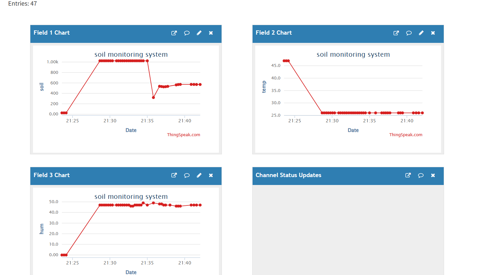

#  IoT Based Soil & Weather Monitoring using ESP8266 and ThingSpeak

This project demonstrates an **IoT-based Soil Moisture and Weather Monitoring System** using **ESP8266 (NodeMCU)** programmed with **MicroPython**.  
The system reads **soil moisture**, **temperature**, and **humidity** data and uploads it to the **ThingSpeak cloud platform** for real-time visualization.

---

##  Features

-  WiFi-enabled data transmission (ESP8266)
-  Soil moisture monitoring (analog sensor)
-  Temperature &  Humidity monitoring (DHT11)
-  Live cloud dashboard using ThingSpeak
-  Real-time graphical visualization
-  Beginner-friendly MicroPython code

---

##  Hardware Requirements

- ESP8266 (NodeMCU / ESP-12)
- Soil Moisture Sensor (Analog)
- DHT11 / DHT22 Sensor
- Jumper Wires
- Breadboard
- WiFi (2.4 GHz)

---

## 🔌 Pin Connections

###  Soil Moisture Sensor
| Sensor Pin | ESP8266 |
|----------|--------|
| VCC | 3.3V |
| GND | GND |
| AO  | A0 |

###  DHT11 Sensor
| Sensor Pin | ESP8266 |
|-----------|--------|
| VCC | 3.3V |
| DATA | D4 (GPIO2) |
| GND | GND |

---

##  ThingSpeak Setup

1. Create an account at **https://thingspeak.com**
2. Create a **New Channel**
3. Add fields:
   - Field 1 → Soil Moisture
   - Field 2 → Temperature
   - Field 3 → Humidity
4. Save the channel
5. Copy the **Write API Key**

---

##  Software Requirements

- MicroPython firmware for ESP8266
- Thonny IDE / uPyCraft
- Required libraries:
  - `network`
  - `urequests`
  - `dht`
  - `machine`

---

##  How It Works

1. ESP8266 connects to the WiFi network
2. Reads:
   - Soil moisture from ADC (A0)
   - Temperature & humidity from DHT11
3. Sends data to ThingSpeak using HTTP GET request
4. ThingSpeak displays data as live graphs

---
##  Output

-  Live soil moisture graph  
-  Temperature graph  
-  Humidity graph  

All data is visualized on the **ThingSpeak dashboard**.

---

##  Applications

-  Smart Agriculture  
-  Plant Health Monitoring  
-  Home Gardening Automation  
-  Academic Mini / Major Projects  
-  IoT Learning & Practice  

---

##  Future Enhancements

- Convert soil value to **percentage**
- Automatic water pump control using **relay**
- Mobile alerts (**Telegram / Email**)
- Weather API integration
- Data analytics & prediction
- Web dashboard using **Flask**

## Author
**Kritish Mohapatra**  
B.Tech Electrical Engineering (3rd Year)  
IoT | Embedded Systems | MicroPython | ESP32  

---

## ⭐ Support

If you like this project, give it a ⭐ on GitHub and feel free to fork it!

Happy hacking 🚀

