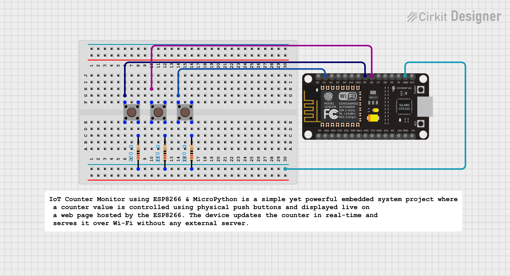

#  IoT Button Counter using ESP8266 & MicroPython

##  Project Overview

The **IoT Button Counter** is a smart embedded system that uses **physical push buttons** connected to an **ESP8266 board** to **increment**, **decrement**, and **reset** a counter value.  
The counter is displayed **live** on a web page hosted directly by the ESP8266, and it updates dynamically every **0.5 seconds** using **AJAX (JavaScript + HTTP)** — without refreshing the page.

This project beautifully combines **hardware control** with **real-time web interfacing** using **MicroPython**.

---

##  Features

 Physical buttons to control counter (Increment / Decrement / Reset)  
 Live counter display on webpage (auto-updates every 0.5s)  
 Clean and responsive web UI  
 Runs entirely on ESP8266 — no external server needed  
 Non-blocking socket for smooth multitasking  
 Wi-Fi-based access from any smartphone or laptop  

---

##  Hardware Requirements

| Component | Quantity | Description |
|------------|-----------|-------------|
| ESP8266 NodeMCU | 1 | Wi-Fi-enabled microcontroller |
| Push Buttons | 3 | Increment / Decrement / Reset |
| Breadboard & Jumper Wires | 1 set | For connections |
| Power Supply | 1 | USB or 5V |

---

##  Circuit Connections

| Function | ESP8266 Pin | Connection |
|-----------|-------------|-------------|
| Increment Button | D5 (GPIO14) | One side to GND |
| Decrement Button | D6 (GPIO12) | One side to GND |
| Reset Button | D1 (GPIO5) | One side to GND |

 Each button uses the ESP8266’s **internal pull-up resistor**.  
When pressed → logic goes **LOW (0)**, triggering the action.

---

##  Software Requirements

- MicroPython firmware installed on ESP8266  
- Thonny IDE or uPyCraft for uploading code  
- Wi-Fi connection (Hotspot or Router)  

---

##  How It Works

1. ESP8266 connects to the Wi-Fi network using SSID & password.  
2. The device starts a lightweight **HTTP web server** on port 80.  
3. Physical button presses update the counter in real-time.  
4. The webpage uses **AJAX (XMLHttpRequest)** to fetch the latest counter value every 0.5 seconds from the `/count` endpoint.  
5. The counter value updates instantly in the browser — **without refreshing the page**.

---

##  **Explanation:**
1. **Push Buttons** — Act as user inputs for increment, decrement, and reset.  
2. **ESP8266 Logic** — Reads button states, updates the counter, and hosts the web server.  
3. **Local Web Server** — Serves the HTML and handles AJAX `/count` requests.  
4. **Dynamic Dashboard** — Displays live counter value, updating automatically every 0.5 seconds.

---

##  Usage Steps

1. Flash this code to ESP8266 as **main.py**  
2. Open Thonny’s Serial Monitor → wait for IP (e.g., `10.16.96.63`)  
3. On your phone/laptop → connect to the same Wi-Fi  
4. Open browser → visit `http://10.16.96.63`  
5. Press buttons on the breadboard → see **live counter updates instantly **

---

##  Future Enhancements

 Store counter in flash memory (LittleFS) to retain value after reboot  
 Add WebSocket-based instant update (no polling delay)  
 Add mobile-friendly responsive UI  
 Integrate MQTT or Blynk for cloud-based monitoring  

---

##  Author

**Kritish Mohapatra**  
MicroPython | ESP32 | Embedded Systems | IoT Projects  
GitHub: [https://github.com/kritishmohapatra]
