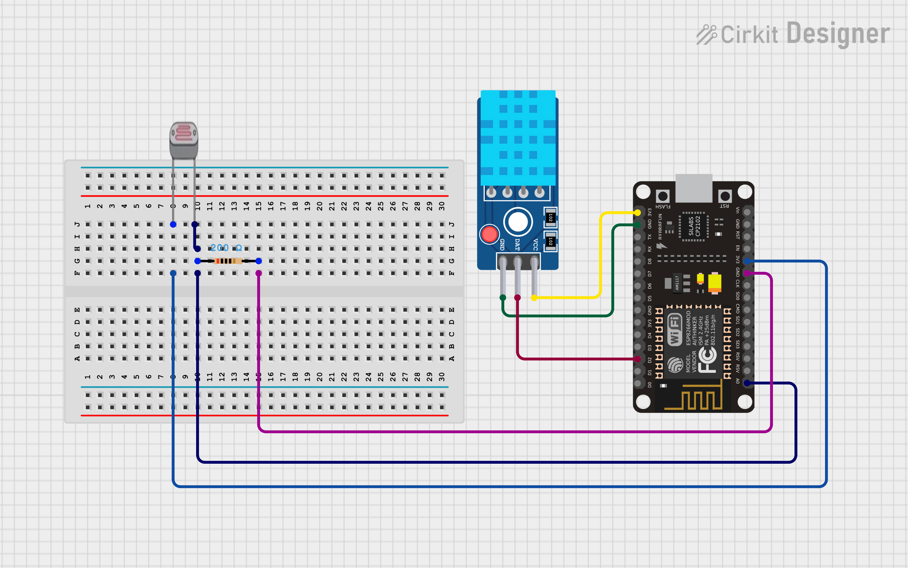
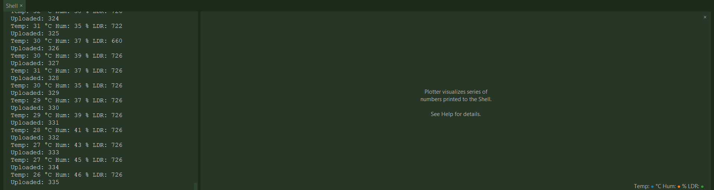
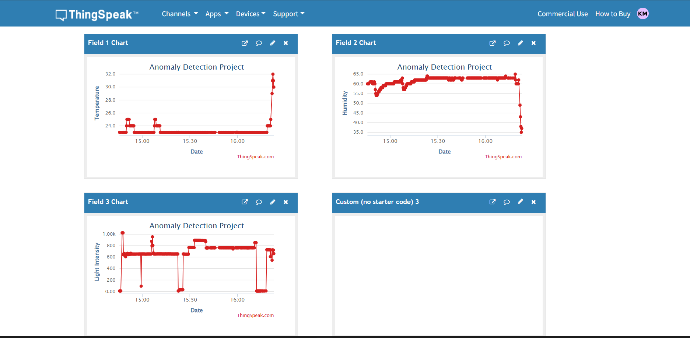
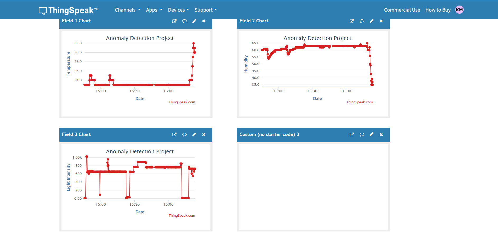
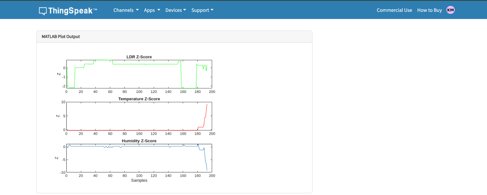
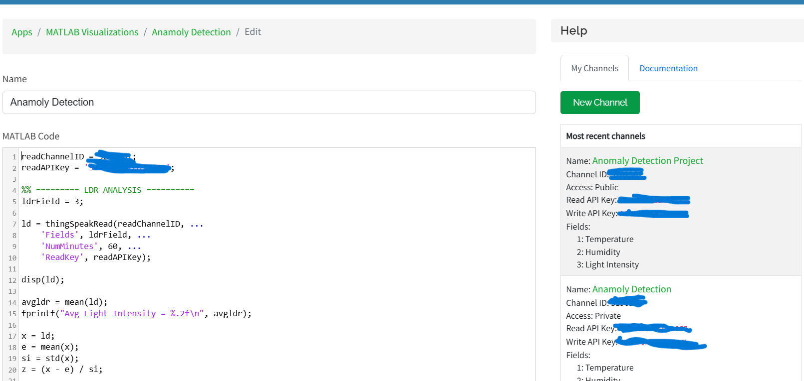

# 📡 IoT Sensor Anomaly Detection using ESP8266, ThingSpeak & MATLAB

This project implements **real-time IoT sensing**, **cloud data logging**, and **statistical anomaly detection** using:

- **ESP8266 (NodeMCU)**
- **DHT11 Sensor** (Temperature & Humidity)
- **LDR Sensor** (Light Intensity)
- **ThingSpeak Cloud**
- **MATLAB Z-Score Analysis**

The system uploads live sensor values to ThingSpeak, and a MATLAB script performs anomaly detection on the last 60 minutes of data.

---

## 🚀 Features

### ✔ Real-time IoT Cloud Upload  
The ESP8266 collects:
- Temperature (°C)  
- Humidity (%)  
- Light Intensity (LDR value)

And uploads them to ThingSpeak using an API key.

### ✔ Statistical Anomaly Detection  
The MATLAB script analyzes:
- **LDR**
- **Temperature**
- **Humidity**

Using **Z-score-based anomaly detection**, with thresholds:

| Sensor        | Threshold (±Z-score) |
|---------------|-----------------------|
| LDR           | **1.4**               |
| Temperature   | **2.5**               |
| Humidity      | **2.5**               |

### ✔ Visualization  
A single figure is generated showing:
- LDR Z-score graph  
- Temperature Z-score graph  
- Humidity Z-score graph  

### ✔ Outlier Classification  
The script prints:
- Normal data points  
- Anomalous data points  
- Total number of anomalies per sensor  

---

## 🔧 Hardware Required

- ESP8266 NodeMCU  
- DHT11 Sensor  
- LDR + 10kΩ resistor  
- Jumper wires  
- USB cable  

---
## 🔌 Circuit Connections

| Component | Pin on Sensor | ESP8266 (NodeMCU) Pin | Description |
|---------|--------------|----------------------|-------------|
| **DHT11** | VCC | 3V3 | Power supply |
| | GND | GND | Ground |
| | DATA | D4 (GPIO2) | Temperature & Humidity data |
| **LDR** | One end | A0 | Analog light intensity input |
| | Other end | 3V3 | Voltage divider |
| **10kΩ Resistor** | One end | A0 | Forms voltage divider |
| | Other end | GND | Ground |
| **ESP8266** | VIN / USB | USB | Power supply |
| | GND | GND | Common ground |

### LDR Voltage Divider
The LDR is connected in a voltage divider configuration with a 10kΩ resistor.

3.3V ── LDR ── A0 ── 10kΩ ── GND

- Bright light → Low resistance → Higher ADC value
- Low light → High resistance → Lower ADC value

## 🧪 MATLAB Script Overview

The MATLAB script performs:

1. Fetch last 60 minutes of sensor data from ThingSpeak  
2. Calculate mean & standard deviation  
3. Compute Z-score  
4. Classify:
   - Normal values  
   - Outlier/anomalies  
5. Print summary  
6. Generate graphs  

---

## 🧠 Why Z-Score for Anomaly Detection?

Z-score helps detect sudden abnormal deviations by comparing how far a value lies from the statistical mean:

Values outside the threshold → **anomalies**

---

## 📊 Output Example

- LDR Anomaly Count: **6**
- Temperature Anomaly Count: **2**
- Humidity Anomaly Count: **4**

Graphs include:
- LDR Z-score plot  
- Temperature Z-score plot  
- Humidity Z-score plot  

---

## 🛠 MicroPython Code (ESP8266)

Includes:
- WiFi connection  
- Read DHT11 sensor  
- Read LDR through ADC  
- Upload to ThingSpeak every 20 seconds  

---

## 📌 Future Enhancements

- Email/SMS alert when anomaly detected  
- Live dashboard (React / Node.js)  
- Automated ML model for forecasting  
- Multi-sensor fusion anomaly detection  

---

## ❤️Author
**Kritish Mohapatra**  
B.Tech Electrical Engineering (3rd Year)  
IoT | Embedded Systems | MicroPython | ESP32  

---

## ⭐ Support

If you like this project, give it a ⭐ on GitHub and feel free to fork it!

Happy hacking 🚀

