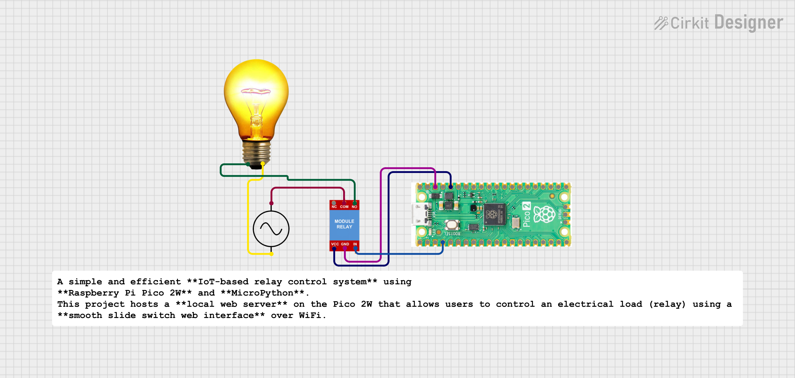

#  IoT Relay Control Web Server (Raspberry Pi Pico 2W)

A simple and efficient **IoT-based relay control system** using **Raspberry Pi Pico 2W** and **MicroPython**.  
This project hosts a **local web server** on the Pico 2W that allows users to control an electrical load (relay) using a **smooth slide switch web interface** over WiFi.

---

##  Project Overview

The **IoT Relay Control Web Server** enables wireless control of a relay through a browser-based interface.  
The relay can be switched **ON / OFF** using a **modern slide switch**, and the current status is displayed in real time on the webpage.

This project demonstrates:
- Embedded Web Server
- WiFi connectivity using Pico 2W
- GPIO relay control
- HTML, CSS, and JavaScript integration with MicroPython

---

##  Features

-  Local web server hosted on Raspberry Pi Pico 2W  
-  Smooth **slide switch UI** (no button toggles)  
-  Real-time relay ON/OFF control  
-  Live status indication on webpage  
-  Active-LOW relay support  
-  Mobile & desktop browser compatible  
-  Fast response with minimal lag  

---

##  Hardware Requirements

- Raspberry Pi Pico 2W  
- 1-Channel Relay Module  
- External Load (Bulb / LED / Appliance)  
- Jumper Wires  
- WiFi Network  

---

##  Pin Configuration

| Component | Pico 2W Pin |
|---------|-------------|
| Relay IN | GP2 |
| Relay VCC | 5V |
| Relay GND | GND |

>  Relay is **Active LOW** (LOW = ON, HIGH = OFF)

---

##  Software Requirements

- MicroPython firmware for Raspberry Pi Pico 2W  
- Thonny IDE  
- Web Browser (Chrome / Edge / Mobile Browser)

---

##  How It Works

1. Pico 2W connects to the configured WiFi network.
2. A socket-based web server starts on port **80**.
3. When the user accesses the IP address in a browser, a control webpage is loaded.
4. Sliding the switch sends `/on` or `/off` requests.
5. The relay GPIO pin is updated instantly.
6. Webpage status updates without refreshing.

---

##  Web Interface Preview

- Dark theme UI  
- Green = Relay ON  
- Red = Relay OFF  
- Slide switch with smooth animation  

---

##  Applications

- Smart Home Automation  
- Wireless Appliance Control  
- IoT Learning Projects  
- Embedded Systems Demonstration  
- College Mini Projects  

---

##  Future Improvements

- Multiple relay control  
- Login authentication page  
- MQTT / Blynk / Firebase integration  
- ESP-NOW based control  
- Mobile app interface  

---

##  Author

**Kritish Mohapatra**  
B.Tech Electrical Engineering  
Embedded Systems & IoT Enthusiast  

---

##  License

This project is open-source and free to use for **educational and learning purposes**.

---

⭐ If you like this project, don't forget to **star the repository**!

