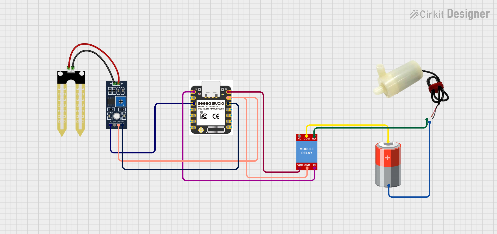
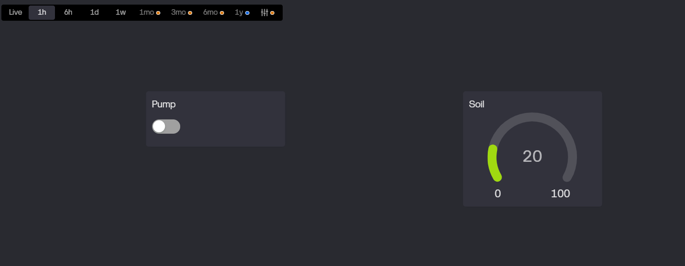

# 🌱 IoT Smart Irrigation System  
## (Seeed Studio XIAO ESP32-S3 + Blynk)

A **Smart Irrigation System** built using **Seeed Studio XIAO ESP32-S3**,  
**Soil Moisture Sensor**, **Relay Module**, and **Blynk IoT**.

This project enables **real-time soil moisture monitoring** and **manual pump control** from anywhere using the **Blynk mobile app**.

---

## 🚀 Features

- ✅ Real-time soil moisture monitoring  
- ✅ Live soil data on Blynk dashboard  
- ✅ Manual pump ON/OFF control  
- ✅ WiFi-based remote access  
- ✅ Compact & low-power XIAO ESP32-S3  
- ❌ Automatic mode removed (manual only for stability)

---

## 🧰 Components Required

| Component | Quantity |
|---------|----------|
| Seeed Studio XIAO ESP32-S3 | 1 |
| Soil Moisture Sensor (Analog) | 1 |
| Relay Module (5V) | 1 |
| Water Pump / Load | 1 |
| Jumper Wires | As needed |
| External Power Supply | 1 |

---

## 🔌 Pin Configuration (XIAO ESP32-S3)


| XIAO ESP32-S3 Pin | Component |
|------------------|----------|
| GPIO 3 (ADC) | Soil Moisture Sensor |
| GPIO 1 | Relay Module |
| 3V3 / 5V | Sensor / Relay |
| GND | Common Ground |

> ⚠️ Relay module used is **Active LOW**

---

## 📲 Blynk Configuration

1. Create a new device in **Blynk IoT**
2. Select **ESP32** as the device type
3. Copy the **Blynk Auth Token**
4. Add widgets in the Blynk app:

### Widgets Used
- **Button Widget**
  - Virtual Pin: `V1`
  - Mode: `Switch`
  - Function: Pump ON / OFF
- **Gauge / Label Widget**
  - Virtual Pin: `V5`
  - Range: `0 – 100`
  - Function: Soil Moisture (%)

---

## 📡 Working Principle

- Soil sensor outputs analog value `(0–4095)`
- XIAO ESP32-S3 reads ADC data
- Moisture percentage is calculated
- Data is sent to **Blynk (V5)**
- Pump is manually controlled via **Blynk button (V1)**

---

## 🧠 Software Details

- Platform: **MicroPython**
- Board: **Seeed Studio XIAO ESP32-S3**
- Communication: **WiFi**
- IoT Platform: **Blynk Cloud**

---

## 🛠 How to Run the Project

1. Flash **MicroPython** on XIAO ESP32-S3  
2. Upload required files:
   - `main.py`
   - `BlynkLib.py`
3. Update credentials in code:
   ```python
   BLYNK_AUTH = "YOUR_BLYNK_AUTH_TOKEN"
   WIFI_SSID  = "YOUR_WIFI_NAME"
   WIFI_PASS  = "YOUR_WIFI_PASSWORD"
   ```
4. Power the board and reset

5. Open the Blynk app and start monitoring 🌱

## 📊 DashBoard



---
## 📚 Applications

1. 🌾 Smart Irrigation System

1. 🌱 Home Gardening Automation

3. 🚜 Agriculture IoT Monitoring

4. 🎓 College Mini & Major Projects

5. ⚡ ESP32-S3 & MicroPython Learning Projects

## ❤️Author
**Kritish Mohapatra**  
B.Tech Electrical Engineering (3rd Year)  
IoT | Embedded Systems | MicroPython | ESP32  

---

## ⭐ Support

If you like this project, give it a ⭐ on GitHub and feel free to fork it!

Happy hacking 🚀

