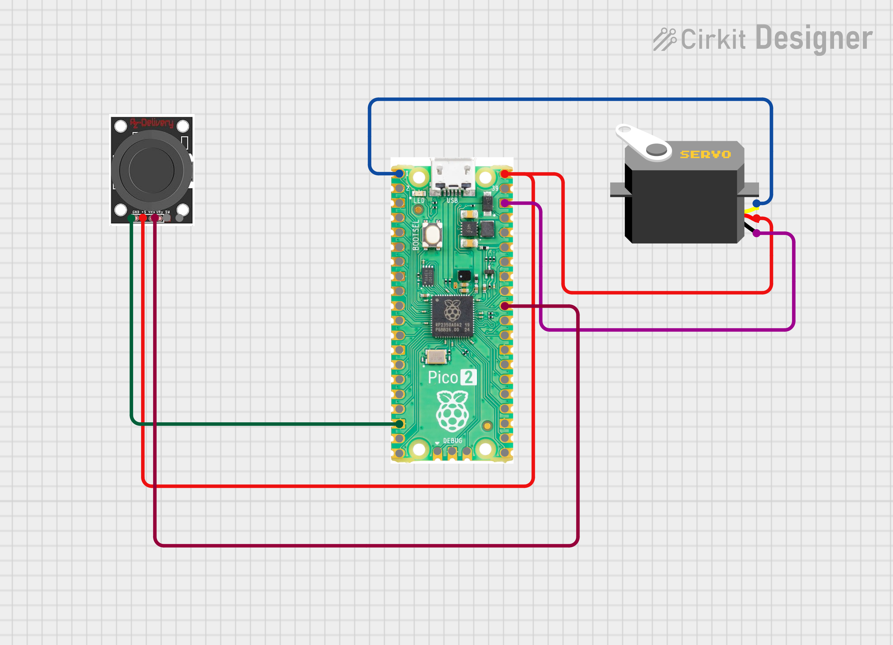

# Joystick Controlled Servo 

Part of the [100 Days 100 IoT Projects](https://github.com/kritishmohapatra/100_Days_100_IoT_Projects) challenge.

##  Overview

Control an SG90 servo motor using a joystick module with Raspberry Pi Pico 2W and MicroPython. Moving the joystick along the X axis smoothly rotates the servo from 0° to 180°.

##  Components

| Component | Quantity |
|-----------|----------|
| Raspberry Pi Pico 2W | 1 |
| SG90 Servo Motor | 1 |
| Joystick Module | 1 |
| Jumper Wires | Few |

##  Wiring


### SG90 Servo
| Servo Wire | Pico 2W Pin |
|------------|-------------|
| Red (VCC) | VBUS (Pin 40) — 5V |
| Brown (GND) | GND |
| Orange (Signal) | GP0 (Pin 1) |

### Joystick Module
| Joystick Pin | Pico 2W Pin |
|--------------|-------------|
| VCC | 3.3V (Pin 36) |
| GND | GND |
| VRx (X axis) | GP26 (Pin 31) |

##  Code

```python
import machine
import time

# Hardware setup
vrx = machine.ADC(machine.Pin(26))  # Joystick X axis
servo = machine.PWM(machine.Pin(0))
servo.freq(50)  # SG90 = 50Hz

def set_angle(angle):
    # 0° = 1000us, 90° = 1500us, 180° = 2000us
    us = int(1000 + (angle / 180) * 1000)
    duty = int(us * 65535 / 20000)
    servo.duty_u16(duty)

def map_val(x, in_min, in_max, out_min, out_max):
    return int((x - in_min) * (out_max - out_min) / (in_max - in_min) + out_min)

print("Joystick Servo Control ready!")

while True:
    # Average 5 samples for smooth reading
    x_raw = sum(vrx.read_u16() for _ in range(5)) // 5
    
    # Map joystick (0-65535) to angle (0-180)
    angle = map_val(x_raw, 0, 65535, 0, 180)
    
    set_angle(angle)
    print(f"Raw: {x_raw}  Angle: {angle}°")
    
    time.sleep(0.05)
```

##  How It Works

- Joystick X axis gives analog values from **0 to 65535** via ADC
- **5 samples are averaged** to eliminate noise and get smooth readings
- Values are mapped to servo angle range **(0° to 180°)**
- SG90 servo is controlled via **PWM at 50Hz** — standard for RC servos
- Pulse width: 1000µs = 0°, 1500µs = 90°, 2000µs = 180°

##  Dependencies

- MicroPython (standard firmware)
- No external libraries needed

##  Getting Started

1. Wire up components as per the wiring table above
2. Flash MicroPython firmware on Pico 2W
3. Open `main.py` in Thonny IDE
4. Run the script — move joystick to control servo!

---


## Author
**Kritish Mohapatra**  
B.Tech Electrical Engineering (3rd Year)  
IoT | Embedded Systems | MicroPython | ESP32  

---

## ⭐ Support

If you like this project, give it a ⭐ on GitHub and feel free to fork it!

Happy hacking 🚀
