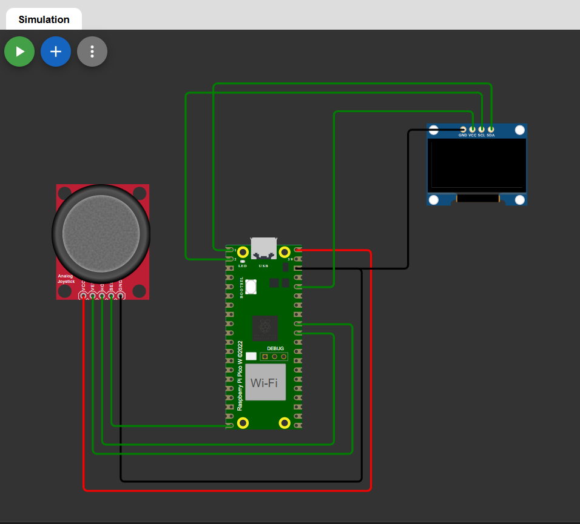

# Joystick Direction Display with OLED

A MicroPython project for Raspberry Pi Pico 2 that reads analog joystick input and displays the direction in real time on an SSD1306 OLED display. Built and tested using the Wokwi simulator.

---

## Hardware Required

- Raspberry Pi Pico 2
- KY-023 Analog Joystick Module
- SSD1306 OLED Display (0.96 inch, 128x64, I2C)
- Jumper wires

---

## Wiring

### Joystick to Pico 2


| KY-023 Pin | Pico 2 Pin |
|------------|------------|
| VCC        | 3V3 (Pin 36) |
| GND        | GND (Pin 38) |
| VRX        | GP26 (ADC0)  |
| VRY        | GP27 (ADC1)  |
| SW         | GP15         |

### OLED to Pico 2

| OLED Pin | Pico 2 Pin |
|----------|------------|
| VCC      | 3V3 (Pin 36) |
| GND      | GND          |
| SDA      | GP0          |
| SCL      | GP1          |

---

## Simulate on Wokwi

1. Open [wokwi.com](https://wokwi.com) and create a new Raspberry Pi Pico 2 project.
2. Replace the contents of `diagram.json` with the file provided in this repository.
3. Paste `main.py` into the editor.
4. Press the Play button and interact with the joystick in the simulator.
5. Link- https://wokwi.com/projects/458670922600513537

---

## How It Works

The joystick outputs two analog voltages — one for the X axis and one for the Y axis. The Pico 2 reads these through its ADC pins using `read_u16()`, which returns a 16-bit value (0 to 65535). This is right-shifted by 4 bits to get a 12-bit range (0 to 4095), with 2047 representing center.

Direction thresholds used:

| Condition       | Direction |
|-----------------|-----------|
| X > 3000        | RIGHT     |
| X < 1000        | LEFT      |
| Y > 3000        | DOWN      |
| Y < 1000        | UP        |
| SW == 0 (LOW)   | PRESSED   |
| Otherwise       | CENTER    |

The OLED displays the current direction as a text symbol and label in the center of the screen, with raw ADC values shown at the bottom for reference.

---


## Serial Monitor Output

```
Pico 2 Joystick + OLED Ready!
X=2047  Y=2047  SW=1  -> CENTER
X=4095  Y=2047  SW=1  -> RIGHT
X=2047  Y=   0  SW=1  -> UP
X=2047  Y=4095  SW=1  -> DOWN
X=   0  Y=2047  SW=1  -> LEFT
X=4095  Y=   0  SW=0  -> PRESSED
```

---

## Notes

- The `ssd1306` library must be present on the Pico. In Wokwi it is included automatically. For real hardware, download it from the MicroPython driver repository and upload it to the board.
- Pico ADC does not support `atten()` — that method is ESP32 specific. Always use `read_u16()` on Pico.
- The push button on the joystick is active LOW due to the internal pull-up on GP15.

---

## Part of 100 Days of IoT

This project is Day 69 of the [100 Days of IoT](https://github.com/kritishmohapatra/100_Days_100_IoT_Projects) challenge.

## Author
**Kritish Mohapatra**  
B.Tech Electrical Engineering (3rd Year)  
IoT | Embedded Systems | MicroPython | ESP32  

---

## ⭐ Support

If you like this project, give it a ⭐ on GitHub and feel free to fork it!

Happy hacking 


