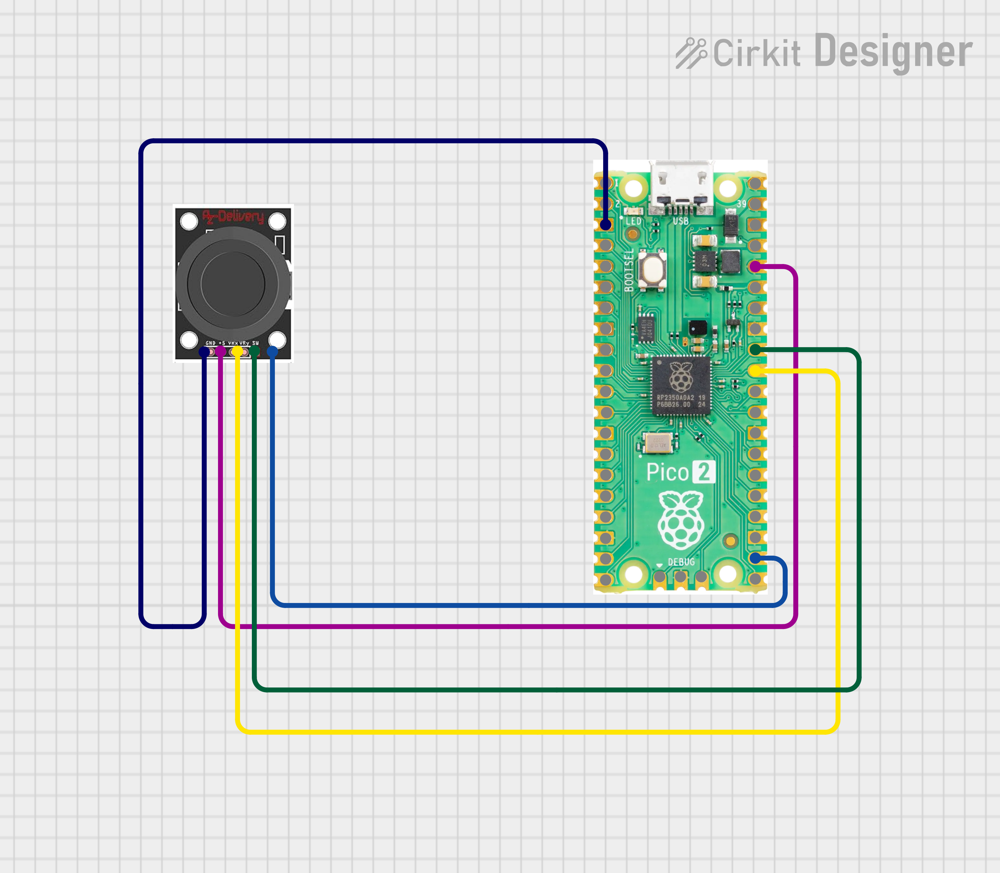
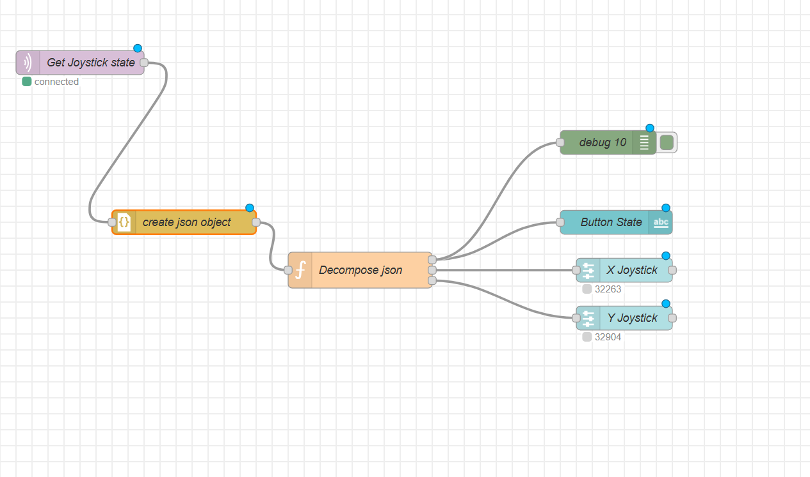
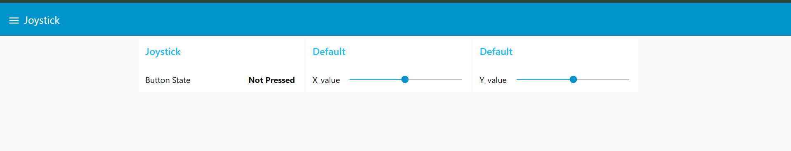

# Joystick MQTT Controller with Node-RED Dashboard


##  Overview

This project reads analog joystick data (X-axis, Y-axis, and button state) from a **Raspberry Pi Pico 2W** using MicroPython and publishes it to an **MQTT broker** as a JSON payload. A **Node-RED** flow subscribes to the topic, parses the JSON, and routes each value to a dedicated dashboard widget for real time visualization.

---

##  Hardware Required

| Component | Quantity |
|---|---|
| Raspberry Pi Pico 2W | 1 |
| Analog Joystick Module (KY-023 or similar) | 1 |
| Jumper Wires | As needed |

### Wiring


| Joystick Pin | Pico 2W Pin |
|---|---|
| VRx | GP26 (ADC0) |
| VRy | GP27 (ADC1) |
| SW (Button) | GP17 |
| VCC | 3.3V |
| GND | GND |

---

##  Software & Dependencies

- **MicroPython** on Raspberry Pi Pico 2W
- [`umqttsimple`](https://github.com/micropython/micropython-lib/tree/master/micropython/umqtt.simple) — MQTT client library for MicroPython
- **Mosquitto** MQTT Broker (running on Docker/VirtualBox/Ubuntu or local machine)
- **Node-RED** for flow-based dashboard

---

##  How It Works

1. Pico 2W connects to Wi-Fi on boot.
2. Establishes an MQTT connection to the broker.
3. Every second, reads X/Y ADC values and button state, packages them as JSON, and publishes to the `joystick` topic.
4. Node-RED subscribes to `joystick`, parses the JSON, and splits the payload into three streams  button state, X value, and Y value , each displayed on its own dashboard widget.

### Published JSON Format

```json
{
  "x_value": 32279,
  "y_value": 32920,
  "button_value": "Not Pressed"
}
```

---

##  Node-RED Flow

```
[MQTT In: joystick]
        │
        ▼
[create json object]  ──►  [debug]
        │
        ▼
[Decompose json (Function)]
   │         │         │
   ▼         ▼         ▼
[Button   [X Joystick  [Y Joystick
 State]    Gauge]       Gauge]
```

### Function Node — Decompose JSON

```javascript
var button  = { payload: msg.payload.button_value };
var x_value = { payload: parseInt(msg.payload.x_value) };
var y_value = { payload: parseInt(msg.payload.y_value) };

return [button, x_value, y_value];
```

---

##  Configuration

Before flashing, update these values in `main.py`:

```python
SSID     = 'your_wifi_ssid'
PASSWORD = 'your_wifi_password'

SERVER   = '192.168.x.x'    # MQTT broker IP
USER     = b'mqtt_user'
PASSWORD = b'your_mqtt_password'
```

---

##  Getting Started

1. Flash MicroPython on your Pico 2W.
2. Copy `umqttsimple.py` to the Pico.
3. Update Wi-Fi and MQTT credentials in `main.py`, then copy it to the Pico.
4. Start your Mosquitto broker.
5. Import the Node-RED flow and deploy.
6. Open the Node-RED dashboard to see live joystick data.

---
## Demo
### Flows

### Ui


---


##  Author

**Kritish Mohapatra**  
B.Tech Electrical Engineering (3rd Year)  
IoT | Embedded Systems | MicroPython | ESP32  

---

## ⭐ Support

If you like this project, give it a ⭐ on GitHub and feel free to fork it!

Happy hacking 🚀

