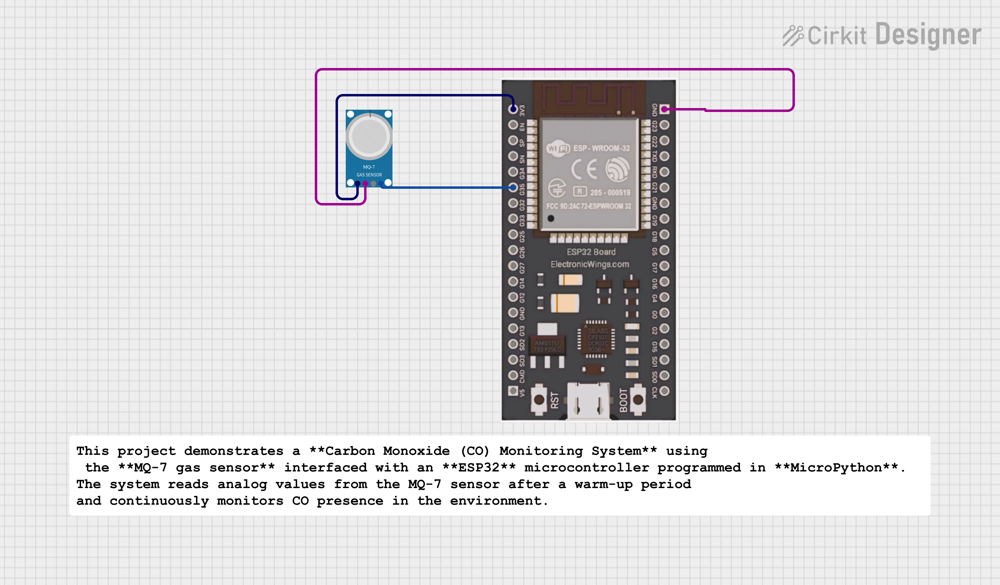

# MQ-7 Based Carbon Monoxide Monitoring System using ESP32 (MicroPython)

## 📌 Project Overview
This project demonstrates a **Carbon Monoxide (CO) Monitoring System** using the **MQ-7 gas sensor** interfaced with an **ESP32** microcontroller programmed in **MicroPython**.  
The system reads analog values from the MQ-7 sensor after a warm-up period and continuously monitors CO presence in the environment.

---

## 🎯 Objectives
- Interface MQ-7 CO sensor with ESP32  
- Read and process analog sensor data using ESP32 ADC  
- Monitor real-time CO level variations  
- Understand gas sensor warm-up and averaging concepts  

---

## 🔧 Components Required
- ESP32 Development Board  
- MQ-7 Carbon Monoxide Gas Sensor Module  
- Breadboard  
- Jumper Wires  
- USB Cable  

---

## 🔌 Circuit Connections

| MQ-7 Sensor Pin | ESP32 Pin |
|---------------|-----------|
| AOUT          | GPIO 35   |
| VCC           | 5V        |
| GND           | GND       |

---

## ⚙️ Working Principle
- MQ-7 sensor changes its output voltage in the presence of Carbon Monoxide.
- ESP32 reads this voltage using its built-in **12-bit ADC**.
- A **60-second warm-up** is provided before measurements.
- Multiple ADC readings are averaged to reduce noise.
- The averaged value is displayed via the Serial Monitor.

---

## 🧪 Technical Specifications
- ADC Resolution: **12-bit (0–4095)**  
- ADC Attenuation: **11 dB (0–3.3 V range)**  
- Sampling Method: **Averaging of 10 readings**  
- Programming Language: **MicroPython**  

---
## 📊 Output
- Displays real-time **averaged ADC values** of the MQ-7 sensor.
- Increase in ADC value indicates **higher CO concentration** near the sensor.

---

## 🎓 Learning Outcomes
- ESP32 ADC configuration using **MicroPython**
- Interfacing **gas sensors** with microcontrollers
- Handling **sensor warm-up** requirements
- **Noise reduction** using averaging techniques

---

## 🚀 Future Scope
- Add **LED/Buzzer alerts** for high CO levels
- Convert ADC readings to **CO concentration (PPM)**
- **WiFi-based monitoring** using ESP32
- Integration into a complete **Air Quality Monitoring System**

## 🧑‍💻 Author

**Kritish Mohapatra**  
MicroPython | ESP32 | Embedded Systems | IoT Projects  
GitHub: [https://github.com/kritishmohapatra]

## ⭐ Support

If you like this project, give it a ⭐ on GitHub  
and feel free to fork or improve it!

