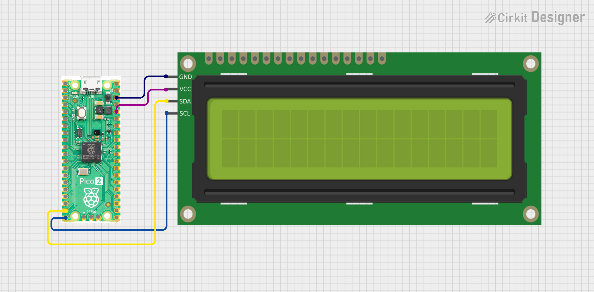
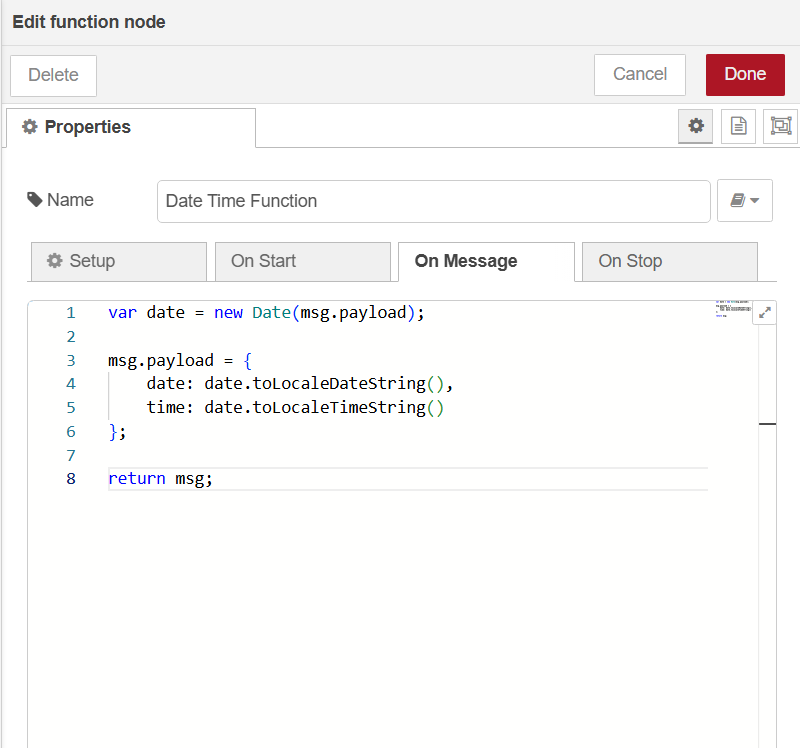
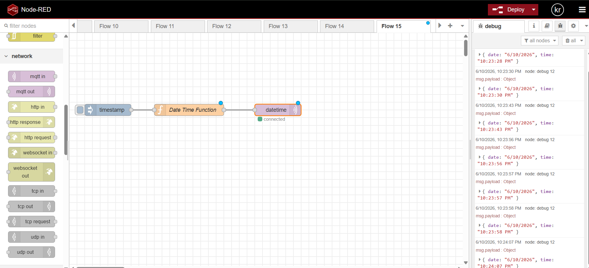

# MQTT DateTime Display on LCD  Raspberry Pi Pico W

Displays real time date and time on a **16x2 I2C LCD** by subscribing to an MQTT topic. Built with MicroPython for the Raspberry Pi Pico W.

---

##  Hardware Required

| Component | Details |
|---|---|
| Raspberry Pi Pico W | With Wi-Fi capability |
| 16x2 I2C LCD Module | PCF8574-based backpack |
| Jumper Wires | — |

### Wiring

| LCD Pin | Pico W Pin |
|---|---|
| SDA | GP14 |
| SCL | GP15 |
| VCC | 3.3V or 5V |
| GND | GND |

---

### Wiring



---


##  Configuration

Edit these variables in the script before flashing:

```python
# Wi-Fi
SSID     = 'your_wifi_ssid'
PASSWORD = 'your_wifi_password'

# MQTT Broker
SERVER    = '192.168.x.x'   # Your broker's IP
USER      = b'user'
PASSWORD  = b'your_password'
```

---

##  MQTT Message Format

The device subscribes to the `datetime` topic and expects a JSON payload:

```json
{
  "date": "2025-06-10",
  "time": "14:35:22"
}
```

> **Note:** The date string should be ≤16 characters to fit the LCD display.

**Function**

---

##  Usage

1. Copy `main.py`, `i2c_lcd.py`, and `umqttsimple.py` to the Pico W.
2. Update Wi-Fi and MQTT credentials.
3. Power the Pico W — it will connect to Wi-Fi, connect to the MQTT broker, and start displaying messages on the LCD.

---

## Demo

### Flow




---

##  Notes

- The `keepalive=3600` parameter keeps the MQTT connection alive for 1 hour without messages.
- `client.wait_msg()` is blocking — it waits for the next MQTT message before continuing. Swap with `client.check_msg()` if you need non-blocking behavior.
- I2C address is auto-detected via `i2c.scan()[0]`. If you have multiple I2C devices, hardcode the address (commonly `0x27` or `0x3F`).

##  Author

**Kritish Mohapatra**  
B.Tech Electrical Engineering (3rd Year)  
IoT | Embedded Systems | MicroPython | ESP32  

---

## ⭐ Support

If you like this project, give it a ⭐ on GitHub and feel free to fork it!

Happy hacking 🚀

