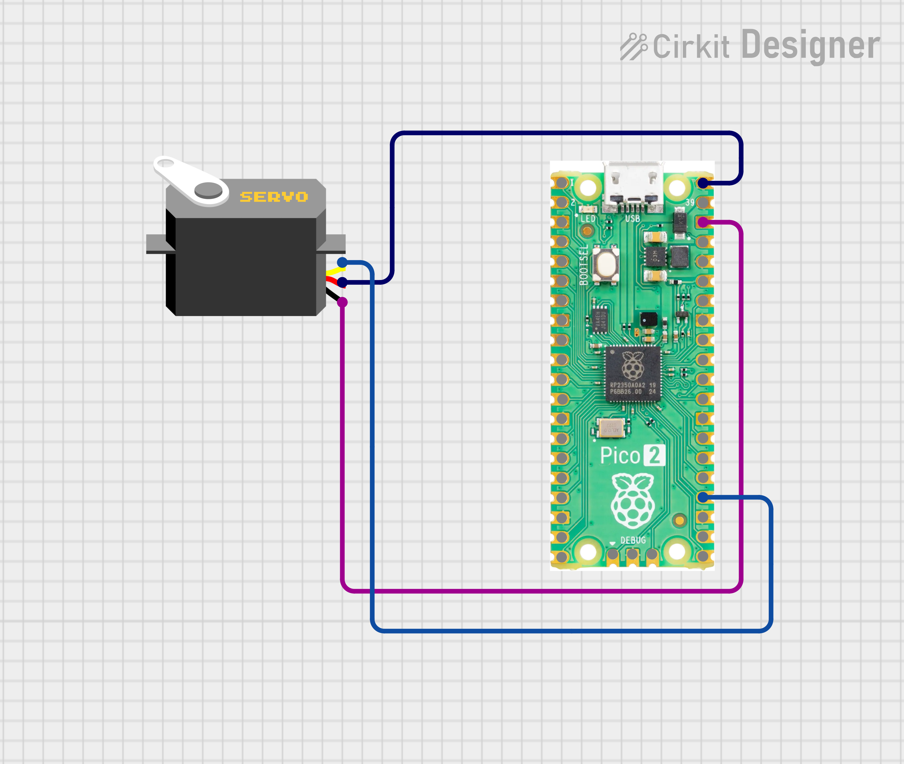
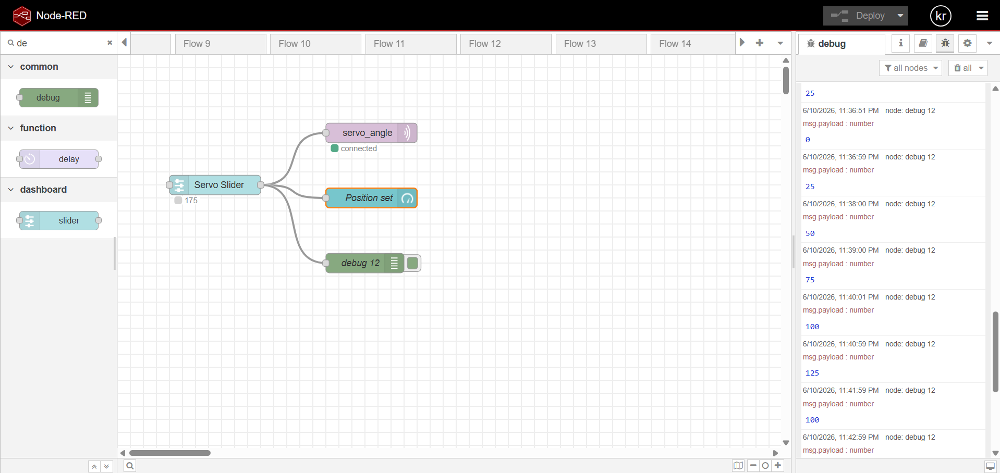

# MQTT Servo Controller

Control a servo motor over Wi-Fi using MQTT. Built for Raspberry Pi Pico W with MicroPython.

## How It Works

The Pico connects to your Wi-Fi network and subscribes to an MQTT topic. When a message containing an angle value (0–180) is published to that topic, the servo moves to that position via PWM on GPIO 18.

## Hardware

- Raspberry Pi Pico W
- Servo motor (standard 50 Hz PWM)
- Power supply appropriate for your servo

**Wiring:**




---

| Servo Wire | Pico Pin  |
|------------|-----------|
| Signal     | GPIO 18   |
| VCC        | VBUS / 5V |
| GND        | GND       |

## Dependencies

- MicroPython (with `network` and `machine` modules — built-in)
- `umqttsimple` — copy [`umqttsimple.py`]() to the Pico's filesystem

## Configuration

Open the script and update the following constants before flashing:

```python
SSID     = 'your_wifi_ssid'
PASSWORD = 'your_wifi_password'

SERVER    = '192.168.x.x'   # IP of your MQTT broker
CLIENT_ID = b'PICO'
TOPIC     = b'servo_angle'
USER      = b'your_mqtt_username'
PASSWORD  = b'your_mqtt_password'
```

## Usage

1. Flash MicroPython to the Pico W if not already done.
2. Copy `umqttsimple.py` and this script (`main.py`) to the Pico.
3. The script runs automatically on boot and subscribes to the configured topic.
4. Publish an integer between `0` and `180` to the topic to move the servo.

Example using Mosquitto CLI:

```bash
mosquitto_pub -h 192.168.x.x -u your_user -P your_pass -t servo_angle -m 90
```

## PWM Details

| Angle | Duty Cycle |
|-------|------------|
| 0     | 2.5%       |
| 90    | 7.5%       |
| 180   | 12.5%      |

Frequency is set to 50 Hz, standard for most hobby servos.

## Demo

### Flow



### UI


---

## Notes

- If the MQTT connection drops, the Pico resets automatically via `machine.reset()`.
- `keepalive` is set to 3600 seconds; reduce if your broker aggressively disconnects idle clients.
- The `check_msg()` polling interval is 1 second. Lower it for more responsive control.
##  Author

**Kritish Mohapatra**  
B.Tech Electrical Engineering (3rd Year)  
IoT | Embedded Systems | MicroPython | ESP32  

---

## ⭐ Support

If you like this project, give it a ⭐ on GitHub and feel free to fork it!

Happy hacking 🚀

