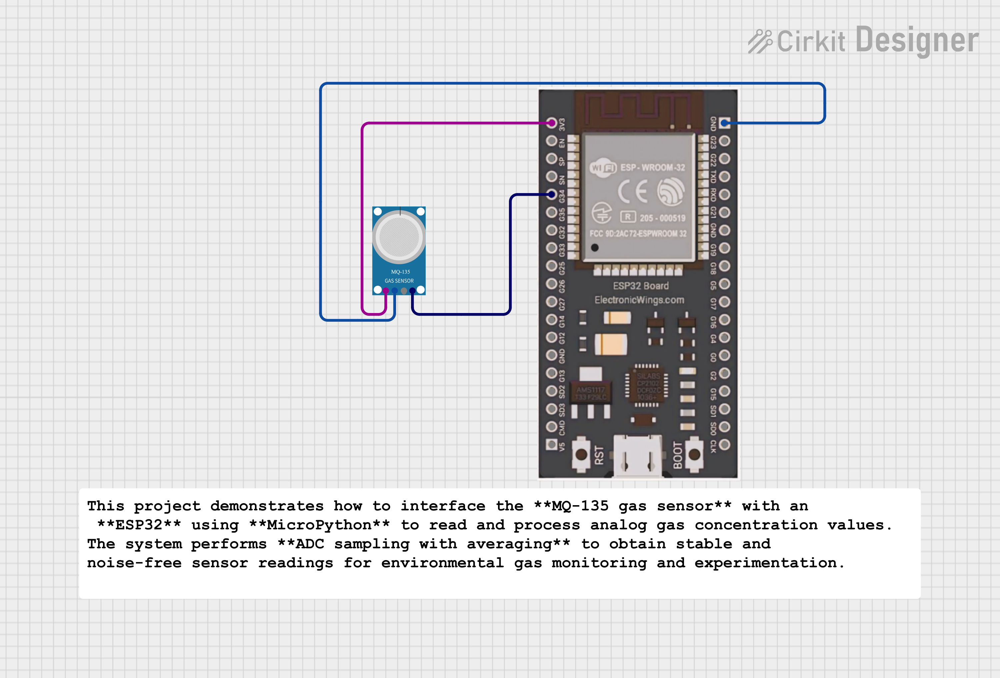

# 🌫️ MQ-135 Gas Sensor with ESP32 (MicroPython)

## 📌 Overview
This project demonstrates how to interface the **MQ-135 gas sensor** with an **ESP32** using **MicroPython** to read and process analog gas concentration values.  
The system performs **ADC sampling with averaging** to obtain stable and noise-free sensor readings for environmental gas monitoring and experimentation.

---

## 🎯 Objective
- To read analog output from MQ-135 gas sensor  
- To process sensor data using ESP32 ADC  
- To reduce noise using averaging technique  
- To display stable gas-level readings on Serial Monitor  

---

## 🔧 Hardware Components
- ESP32 Development Board  
- MQ-135 Gas Sensor Module  
- Breadboard  
- Jumper Wires  
- USB Cable  

---

## 🔌 Pin Connections

| MQ-135 Pin | ESP32 Pin |
|-----------|----------|
| VCC | 3.3V / 5V |
| GND | GND |
| AO | GPIO 34 |
| DO | Not Used |

> GPIO 34 is used as it is an ADC-only pin, suitable for analog sensor input.

---

## 🧠 Working Principle
The MQ-135 sensor changes its internal resistance based on the concentration of gases present in the environment.  
This change produces a varying analog voltage at the output pin, which is read by the ESP32’s ADC.

To obtain stable readings:
- Multiple samples are collected  
- An average value is calculated  
- The averaged value represents the gas concentration level

---

## 📊 Output
- Displays averaged ADC values ranging from **0 to 4095**
- Higher values indicate higher gas concentration
- Stable readings due to multi-sample averaging

---

## 🧪 Notes
- A warm-up time of **2–5 minutes** is recommended for accurate sensing
- Values may vary based on environment and sensor calibration
- This project focuses on **raw gas level monitoring**, not AQI calculation

---

## 🚀 Applications
- Environmental gas monitoring
- Indoor air quality experiments
- Dataset collection for analysis
- Academic laboratory experiments
- Sensor behavior study

## 🧑‍💻 Author

**Kritish Mohapatra**  
MicroPython | ESP32 | Embedded Systems | IoT Projects  
GitHub: [https://github.com/kritishmohapatra]

## ⭐ Support

If you like this project, give it a ⭐ on GitHub  
and feel free to fork or improve it!
