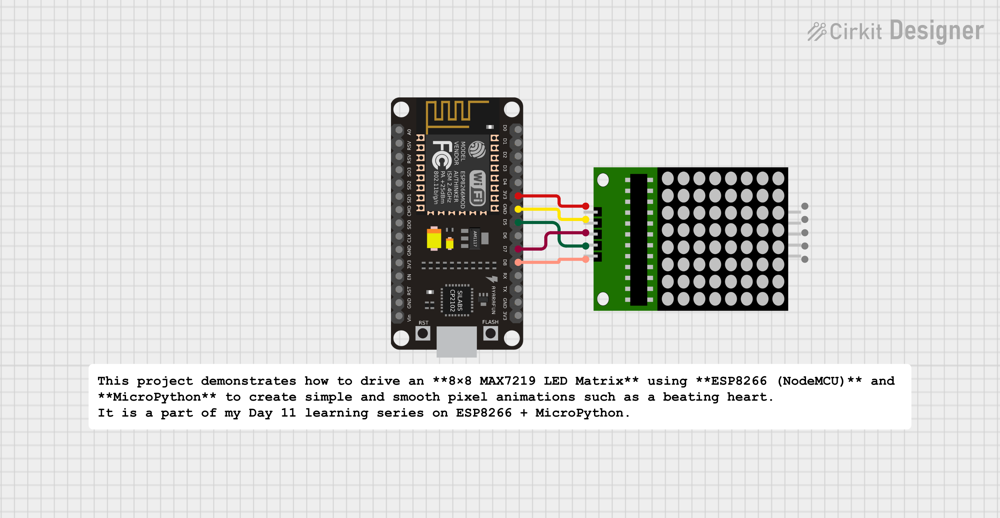

# MicroPython-Based 8×8 LED Matrix Animation Display using ESP8266

This project demonstrates how to drive an **8×8 MAX7219 LED Matrix** using **ESP8266 (NodeMCU)** and **MicroPython** to create simple and smooth pixel animations such as a beating heart.  
It is a part of my Day 11 learning series on ESP8266 + MicroPython.

---

## 🚀 Features

- Control an **8×8 LED matrix** using the MAX7219 driver.
- Animation support using **multiple custom frames**.
- Smooth frame switching using MicroPython.
- Adjustable brightness (0–15 levels).
- Beginner-friendly and IoT-ready codebase.
- Clean and reusable MicroPython functions.

---

## 🧰 Components Used

| Component | Quantity |
|----------|----------|
| ESP8266 (NodeMCU) | 1 |
| MAX7219 8×8 LED Matrix Module | 1 |
| Jumper Wires | As needed |
| USB Cable | 1 |

---

## 🔌 Circuit Connections

| MAX7219 Pin | ESP8266 Pin |
|-------------|-------------|
| VCC         | 3V3         |
| GND         | GND         |
| DIN         | D7 (GPIO13) |
| CS          | D8 (GPIO15) |
| CLK         | D5 (GPIO14) |

---

## 📦 Library Used

This project requires the following MicroPython library:

- `DIYables_MicroPython_LED_Matrix.py`

### How to Upload the Library
1. Open **Thonny IDE**.
2. Go to **Files → Upload to /**.
3. Select and upload the file `DIYables_MicroPython_LED_Matrix.py` to your ESP8266 board.

Make sure this library is in the ESP8266 root directory.

## 🛠 How to Run

Follow these steps to run the project:

1. **Flash MicroPython** to your ESP8266 (if not already flashed).
2. Open **Thonny IDE** or **uPyCraft IDE**.
3. Connect your ESP8266 to your PC.
4. Upload the following files:
   - `main.py`
   - `DIYables_MicroPython_LED_Matrix.py`
5. Verify wiring between ESP8266 and MAX7219.
6. Press the **Reset** button on ESP8266 or restart via Thonny.
7. The LED Matrix will automatically start showing the animation.

That's it — your 8×8 LED Matrix animation is now running!

## 🚀 Future Improvements

Here are some enhancements that can be added to this project:

- Add more animation frames for smoother motion.
- Implement a **scrolling text** feature.
- Use **multiple MAX7219 matrices** for long messages.
- Create a **real-time digital clock** using ESP8266 + NTP.
- Add **web-based control panel** to change brightness or animations.
- Add **custom pattern editor** (draw on web UI → display on matrix).
- Implement **sensor-based displays** (temperature, gas level, etc.).

## 🧑‍💻 Author

**Kritish Mohapatra**  
MicroPython | ESP32 | Embedded Systems | IoT Projects 
- GitHub: [https://github.com/kritishmohapatra]
