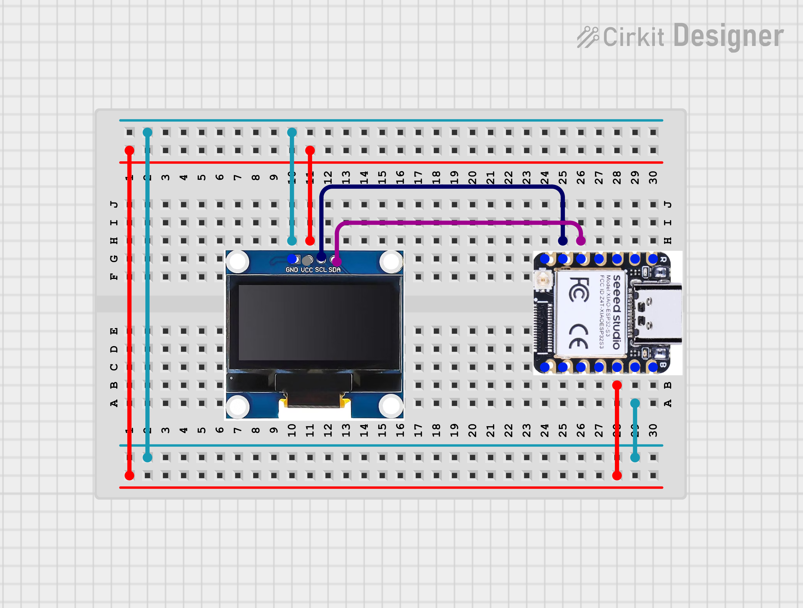
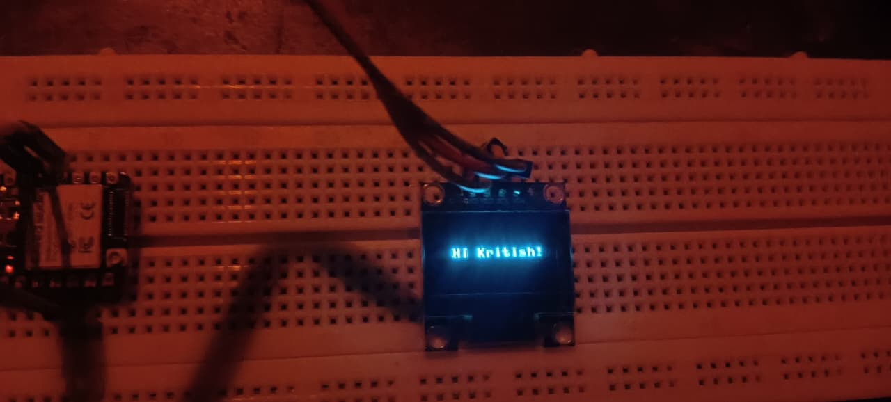
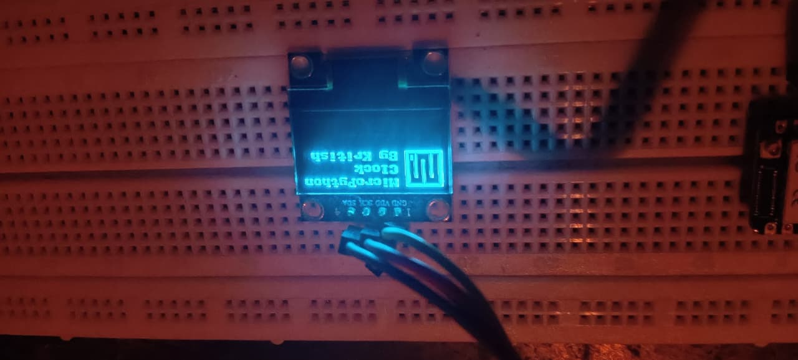
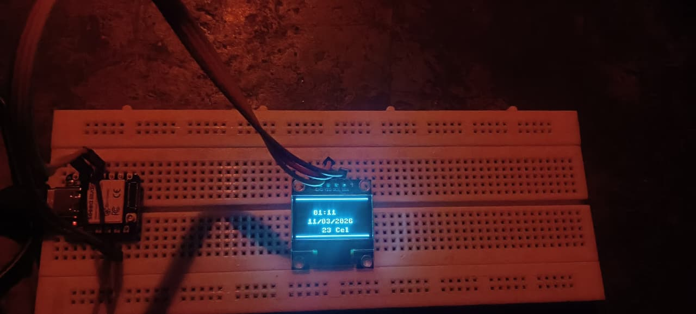

#  MicroPython Watch

> Xiao ESP32-S3 + SSD1306 OLED + NTP + OpenWeatherMap + MicroPython

A retro-style digital watch that syncs time from the internet, shows live weather from Bhubaneswar, and greets you with a MicroPython boot sequence — all on a tiny 0.96" OLED display.

---
##  Features

-  **WiFi Auto-Connect** — connects and shows IP on boot
-  **NTP Time Sync** — accurate IST time (UTC+5:30) from internet
-  **Live Weather** — real-time temperature from OpenWeatherMap API
-  **MicroPython Logo** — pixel art boot screen
-  **Personalized Greeting** — "Hi Kritish!" on startup
-  **Auto Refresh** — weather updates every 10 minutes

---

##  Hardware Required

| Component | Specification |
|-----------|--------------|
| Microcontroller | Seeed Xiao ESP32-S3 |
| Display | SSD1306 OLED 0.96" 128x64 I2C |
| Jumper Wires |  |

---

##  Wiring

### OLED SSD1306
| OLED Pin | Xiao ESP32-S3 |
|----------|--------------|
| VCC | 3.3V |
| GND | GND |
| SDA | GPIO 5 |
| SCL | GPIO 6 |

---

##  Setup

### 1. Flash MicroPython on Xiao ESP32-S3
```bash
pip install esptool
esptool.py --port COM3 erase_flash
esptool.py --chip esp32s3 --port COM3 write_flash -z 0x0 esp32s3.bin
```
Download firmware from: [micropython.org/download/ESP32_GENERIC_S3](https://micropython.org/download/ESP32_GENERIC_S3)

### 2. Install Thonny IDE
- Download from [thonny.org](https://thonny.org)
- Tools → Options → Interpreter → **MicroPython (ESP32)**
- Select your COM port

### 3. Install SSD1306 Library
- Thonny → Tools → Manage Packages → search `ssd1306` → Install

### 4. Get OpenWeatherMap API Key
1. Sign up free at [openweathermap.org](https://openweathermap.org)
2. Go to **API Keys** section
3. Copy your key

### 5. Upload Code
- Open `main.py` in Thonny
- Fill in your credentials:
```python
ssid     = "YourWiFiName"
password = "YourWiFiPassword"
API_KEY  = "your_openweathermap_key"
```
- File → Save As → **MicroPython device** → save as `main.py`

---

##  Boot Sequence

```
WiFi Connecting... → IP Address → Hi Kritish! → MicroPython Logo → Watch Face
```




---

##  Watch Face

| Section | Info |
|---------|------|
| Top | Current time (HH:MM) |
| Middle | Date (DD/MM/YYYY) |
| Bottom | Live temperature (°C) |

---


##  Future Improvements

- [ ] Bigger pixel font for time
- [ ] Button to cycle multiple screens
- [ ] Weather icon (pixel art)
- [ ] Analog clock face
- [ ] Deep sleep to save power

---

##  What I Learned

- SoftI2C vs hardware I2C on ESP32-S3
- NTP time sync with IST timezone offset
- Calling REST APIs from MicroPython using `urequests`
- OLED display layout and pixel coordinates
- Scanning I2C devices to find correct pins

---

##  Author

**Kritish Mohapatra**
B.Tech Electrical Engineering (3rd Year)
IoT | Embedded Systems | MicroPython | ESP32

---

## ⭐ Support

If you like this project, give it a ⭐ on GitHub and feel free to fork it!


Happy hacking 🚀