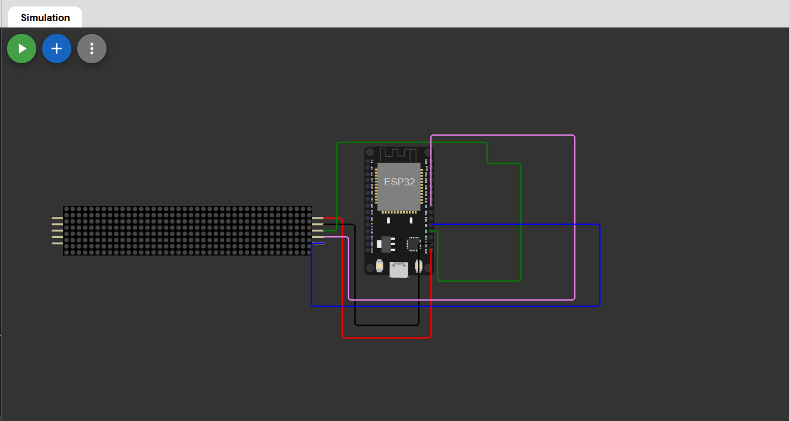

## NTP Synchronized Digital Clock using ESP32 & MAX7219

A WiFi-based digital clock that synchronizes real-time from an NTP server and displays the current time on a chained MAX7219 LED matrix display using MicroPython.

This project demonstrates SPI communication, real-time clock synchronization, and LED matrix display control on ESP32.

---

## Features

- Real-time clock using Internet NTP servers  
- Timezone correction for India (UTC +5:30)  
- Displays time in HH:MM digital clock format  
- Custom colon rendering using pixels  
- Serial monitor time logging  
- Adjustable brightness  
- Works on ESP32 and Wokwi simulator  

---

## Wokwi Simulation

You can run this project online using Wokwi simulator: 

https://wokwi.com/projects/456739800024792065
---

## Hardware Required

- ESP32 Development Board  
- MAX7219 8x8 LED Matrix Modules (5 chained)  
- Jumper wires  
- USB cable  
- WiFi connection  

---

## Wiring (ESP32 to MAX7219)

| MAX7219 Pin | ESP32 Pin |
|-------------|------------|
| VCC         | 5V / 3.3V  |
| GND         | GND        |
| DIN         | D2 (MOSI)  |
| CLK         | D3 (SCK)   |
| CS          | D5         |

---

## Software Requirements

- MicroPython firmware for ESP32  
- `max7219.py` MicroPython driver  
- Internet connection for NTP sync  

---

## Installation

1. Flash MicroPython firmware to ESP32  
2. Upload `max7219.py` driver to the board  
3. Upload the main script (e.g., `main.py`)  
4. Update WiFi credentials in the code  
5. Run the script  

---

## Code Overview

- Connects to WiFi  
- Synchronizes time using NTP  
- Applies timezone offset (UTC +5:30)  
- Displays time on MAX7219 LED matrix  
- Prints time on serial monitor  

---

## Output Format

The display shows:

HH:MM

Example:

12:34

---

## Notes

- NTP provides UTC time, so timezone offset is manually added.  
- MAX7219 has no built-in colon, so colon is drawn using pixel mapping.  
- Time resets on power loss if WiFi is unavailable (no RTC backup).  
- Wokwi may mirror display depending on matrix orientation; hardware works normally.  

---

## Future Improvements

- Add seconds display (HH:MM:SS)  
- Blinking colon animation  
- 12/24 hour mode toggle  
- Add DS3231 RTC for offline backup  
- Web dashboard for time settings  
- MQTT / Telegram time API  

---

## Author
**Kritish Mohapatra**  
B.Tech Electrical Engineering (3rd Year)  
IoT | Embedded Systems | MicroPython | ESP32  

---

## ⭐ Support

If you like this project, give it a ⭐ on GitHub and feel free to fork it!

Happy hacking 🚀

