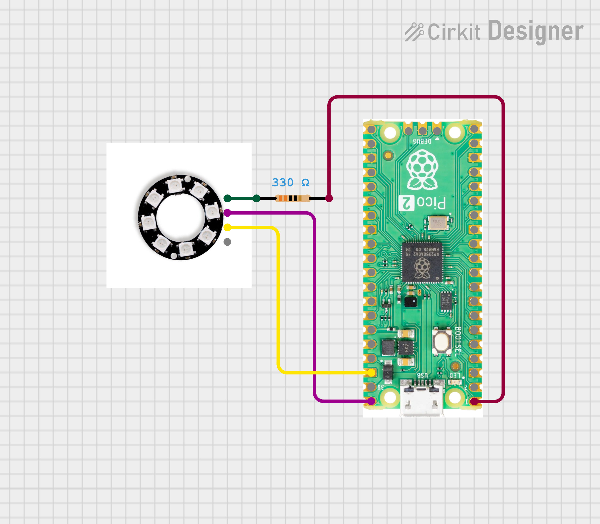
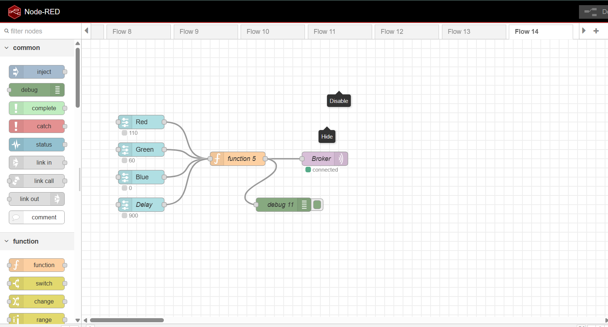
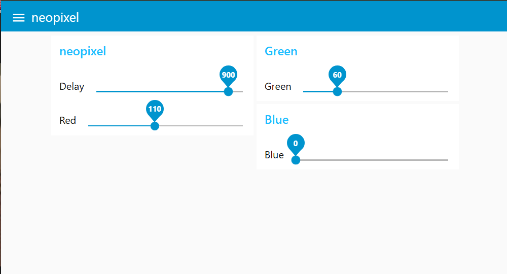

# NeoPixel Control via Node-RED & MQTT

Control a WS2812 NeoPixel ring on a Raspberry Pi Pico 2W remotely using a Node-RED dashboard sliders over MQTT.

---

## Hardware Required

- Raspberry Pi Pico 2W
- WS2812 NeoPixel ring (8 LEDs) connected to **GP0**
- PC running **Node-RED** with **Mosquitto MQTT broker**

---

### Wiring



---

## Setup

### 1. MQTT Broker (Mosquitto)

Make sure Mosquitto is running on your PC with authentication enabled.

In `mosquitto.conf`:
```
allow_anonymous false
password_file /etc/mosquitto/passwd
listener 1883
```

### 2. Pico 2W — `main.py`

Update these variables before flashing:

```python
SSID      = 'your_wifi_ssid'
WPASSWORD = 'your_wifi_password'
SERVER    = '192.168.x.x'   # Your PC's local IP
USER      = b'user'
PASSWORD  = b'your_mqtt_password'
```

Flash the code using **Thonny** or `mpremote`.

### 3. Node-RED Flow

Import or build this flow:

```
[Red Slider] ──┐
[Green Slider] ─┤→ [Function Node] → [MQTT Out Node]
[Blue Slider] ──┤
[Delay Slider] ─┘
```

- **Slider nodes**: Dashboard sliders (0–255 for RGB, 0–2000 for delay)
- **Function node**: Builds JSON payload from all slider values
- **MQTT Out node**:
  - Server: `your_pc_ip:1883`
  - Topic: `RGB_LED_Control`
  - Username & Password: same as Mosquitto config

### 4. Node-RED Function Node

```javascript
var colors = context.get('colors') || { red: 0, green: 0, blue: 0, delay: 0 };

if (msg.topic === 'red')   colors.red   = parseInt(msg.payload);
if (msg.topic === 'green') colors.green = parseInt(msg.payload);
if (msg.topic === 'blue')  colors.blue  = parseInt(msg.payload);
if (msg.topic === 'delay') colors.delay = parseInt(msg.payload);

context.set('colors', colors);
msg.topic   = 'RGB_LED_Control';
msg.payload = JSON.stringify(colors);
return msg;
```

---

## How It Works

```
Node-RED Dashboard Sliders (R, G, B, Delay)
        ↓  (MQTT publish)
  Mosquitto Broker
        ↓  (subscribe)
   Raspberry Pi Pico 2W
        ↓
  NeoPixel Blink (GP0)
```

1. Adjust RGB and delay sliders in Node-RED dashboard (`http://localhost:1880/ui`)
2. Function node publishes JSON payload to topic `RGB_LED_Control`
3. Pico 2W receives the message, sets NeoPixel color and blinks with given delay

### Payload Format

```json
{"red": 255, "green": 0, "blue": 0, "delay": 500}
```

---

## Notes

- NeoPixel data pin on **GP0**
- Uses `check_msg()` (non-blocking) with `sleep(1)` loop
- `keepalive=3600` keeps the MQTT connection alive without frequent reconnects
- `eval()` on Pico parses the incoming JSON string into a Python dictionary

---

## Dependencies

- [`umqttsimple`](https://github.com/micropython/micropython-lib/tree/master/micropython/umqtt.simple) — lightweight MQTT client for MicroPython

---

## Demo

### Flow



### UI



---


##  Author

**Kritish Mohapatra**  
B.Tech Electrical Engineering (3rd Year)  
IoT | Embedded Systems | MicroPython | ESP32  

---

## ⭐ Support

If you like this project, give it a ⭐ on GitHub and feel free to fork it!

Happy hacking 🚀

