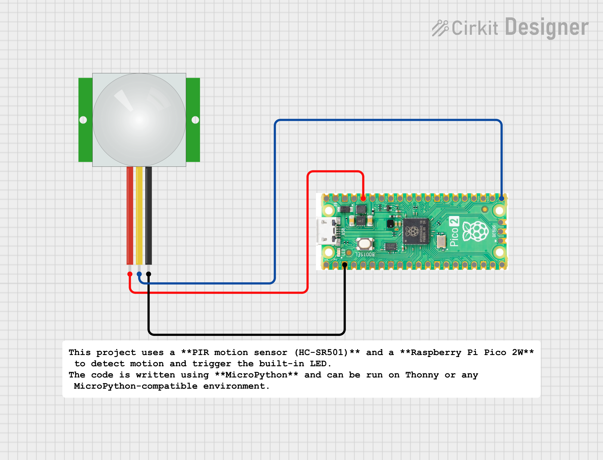

# PIR Motion Detector using Raspberry Pi Pico 2W & MicroPython

This project uses a **PIR motion sensor (HC-SR501)** and a **Raspberry Pi Pico 2W** to detect motion and trigger the built-in LED.  
The code is written using **MicroPython** and can be run on Thonny or any MicroPython-compatible environment.

---

## 📌 Features
- Detects human motion using PIR sensor  
- Uses Raspberry Pi **Pico 2W built-in LED** for indication  
- Simple and beginner-friendly MicroPython code  
- Real-time status printed on serial monitor  
- Can be easily upgraded to WiFi alerts (Telegram/email/webpage)

---

## 🧰 Components Required
- Raspberry Pi **Pico 2W**
- PIR Sensor **HC-SR501**
- Jumper wires
- Breadboard (optional)

---
## 🔌 Wiring Connections



| PIR Sensor | Pico 2W |
|-----------|----------|
| VCC       | 3.3V     |
| OUT       | GP16     |
| GND       | GND      |

Pico 2W built-in LED is used.  
No external LED required.

---

### ⚙ PIR Sensor Notes
- Left knob → Sensitivity  
- Right knob → Time delay  
- Warm-up time: 20–30 seconds (initial false triggers are normal)

---


## ▶️ Running the Project

1. Open **Thonny IDE**
2. Connect your **Raspberry Pi Pico 2W**
3. Go to: `Tools → Options → Interpreter`
4. Select **MicroPython (Raspberry Pi Pico)**
5. Copy the MicroPython code into a new file
6. Save the file as `main.py` directly onto the Pico
7. Press the **RESET** button on the board  
8. The motion detector will start automatically

---

## 📸 Output

When you run the project, you will observe:

### ✔ **Built-in LED Behavior**
- **LED ON** → Motion Detected  
- **LED OFF** → No Motion  

### ✔ **Serial Monitor Output**
- Example output:
```
PIR Motion Detector Started...
No motion
No motion
Motion Detected!
Motion Detected!
No motion
```


The PIR sensor may show random HIGH signals for the first **20–30 seconds** — this is normal warm-up behavior.

---

## 🚀 Future Improvements

You can enhance this project with additional features:

### 🔗 **1. WiFi-Based Notifications**
- Send alerts via **Telegram Bot**
- Send **Email notification**
- Send **HTTP request** to server or API
- Create a live **web dashboard** on Pico 2W

### 🔊 **2. Buzzer Alarm System**
- Add a piezo buzzer for audible alerts
- Trigger buzzer only on first detection or continuous detection

### 🖥 **3. OLED or LCD Display**
- Show "Motion Detected" / "No Motion"
- Show PIR status in real time

### ☁️ **4. Cloud Logging**
- Log motion events to **Firebase Realtime Database**
- Store timestamps in **Google Sheets** (via API)
- Send data to **ThingSpeak** IoT platform

### 🔐 **5. Home Security Mode**
- Activate/Deactivate system using a push button
- Add password protection
- Add a small keypad for arming/disarming

### 🎦 **6. Camera Integration**
- Use ESP32-CAM for capturing an image when motion is detected
- Send the captured image to Telegram/Email

---
## 🧑‍💻 Author

**Kritish Mohapatra**  
MicroPython | ESP32 | Embedded Systems | IoT Projects  
GitHub: [https://github.com/kritishmohapatra]
