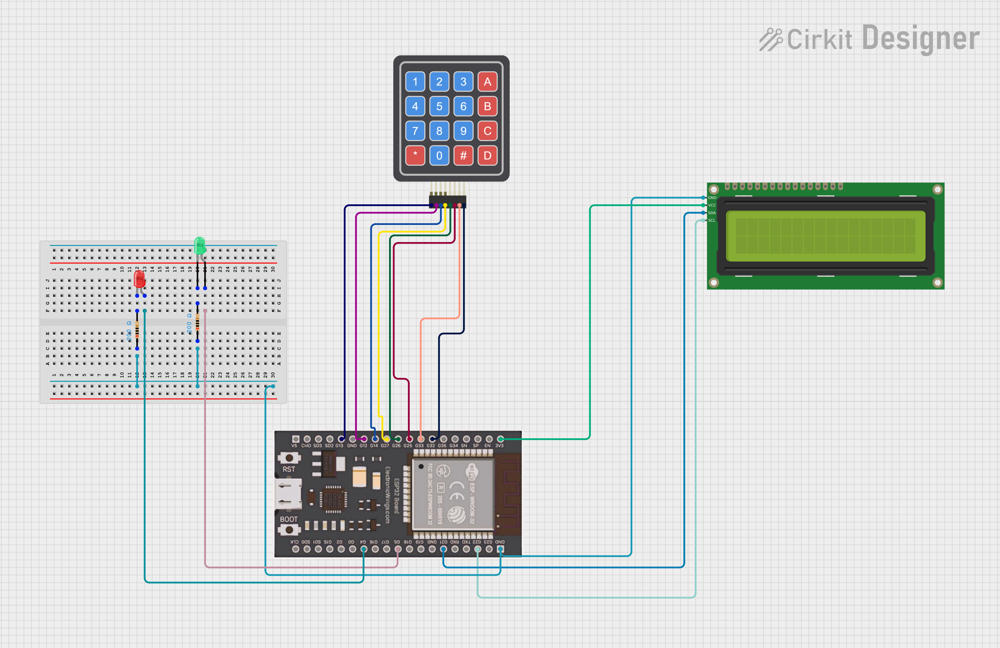

# 🔐 Password Lock System using ESP32 (MicroPython)

A simple password-based security system using **ESP32**, **4x4 Keypad**, **16x2 I2C LCD**, and **Red & Green LEDs**.  
The system verifies a user-entered password and provides visual feedback using LEDs and LCD messages.

---

## 📌 Features
- Password input using 4x4 matrix keypad
- LCD displays system status
- Green LED for correct password
- Red LED for wrong password
- `#` key to submit password
- `*` key to clear input
- Built using **MicroPython**

---

## 🧰 Components Required
- ESP32 Development Board
- 4x4 Matrix Keypad
- 16x2 LCD with I2C module
- Green LED + 220Ω resistor
- Red LED + 220Ω resistor
- Jumper wires

---

## 🔌 Pin Connections

### 📟 LCD (I2C)
| LCD Pin | ESP32 Pin |
|------|----------|
| VCC | 5V |
| GND | GND |
| SDA | GPIO 21 |
| SCL | GPIO 22 |

> I2C Address: `0x27` (commonly used)

---

### ⌨️ Keypad
| Keypad Pin | ESP32 GPIO |
|----------|-----------|
| R1 | 13 |
| R2 | 12 |
| R3 | 14 |
| R4 | 27 |
| C1 | 26 |
| C2 | 25 |
| C3 | 33 |
| C4 | 32 |

---

### 💡 LEDs
| LED | ESP32 GPIO |
|----|-----------|
| Green LED | GPIO 5 |
| Red LED | GPIO 4 |

---

## 🧠 Working Principle
1. LCD prompts user to enter password
2. User enters password via keypad
3. Enter key `#` submits password
4. If password matches:
   - LCD shows **Access Granted**
   - Green LED turns ON
5. If password is incorrect:
   - LCD shows **Access Denied**
   - Red LED turns ON
6. `*` key clears the entered password

---

## 🎓 Applications
- Door lock systems
- Digital lockers
- Lab access control
- Embedded systems learning project
---

## ⭐ Future Improvements
- Password change option
- EEPROM password storage
- Attempt limit security

---
## 🧑‍💻 Author

**Kritish Mohapatra**  
Third Year B.Tech, Electrical Engineering  
📡 Focused on IoT, Embedded Systems, and MicroPython Projects  

---

⭐ If you like this project, give it a **star** on GitHub and follow for more IoT projects!
