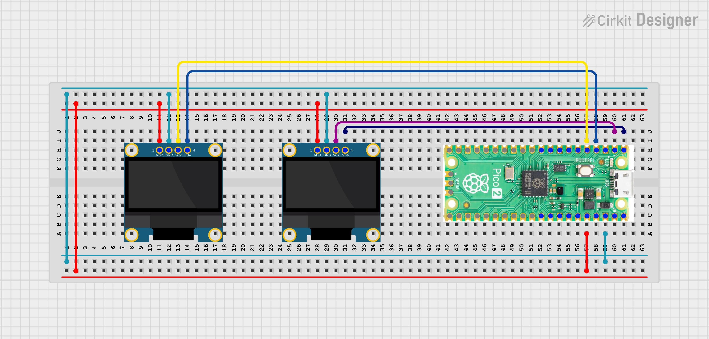

#  PicoDesk

A retro terminal style desktop companion station built with Raspberry Pi Pico 2W and two SSD1306 OLED displays. Shows live time, date, weather on one screen  and animated eyes, heart rain, and a mobile controlled todo list on the other!


---

##  Features

-  **Live Clock** — NTP synced time with blinking cursor
-  **Weather** — Real-time temp, humidity & condition via OpenWeatherMap API
-  **Eye Animation** — Blinking, looking left/right/up — randomly animated
-  **Heart Rain** — Falling hearts animation every 2 minutes
-  **Todo List** — Add, tick, delete tasks from your phone browser
-  **Mobile Web App** — Retro terminal UI, no app install needed
-  **Mode Toggle** — Switch between Animation and Todo mode from phone
-  **Persistent Todos** — Tasks saved to `todos.json` on Pico

---

##  Hardware Required

| Component | Quantity |
|---|---|
| Raspberry Pi Pico 2W | 1 |
| SSD1306 OLED 128x64 (I2C) | 2 |
| Breadboard + Jumper Wires | - |
| Micro USB Cable | 1 |

---

##  Wiring


### OLED 1 — Time / Date / Weather (I2C0)

| OLED Pin | Pico Pin |
|---|---|
| SDA | GP0 (Pin 1) |
| SCL | GP1 (Pin 2) |
| VCC | 3.3V (Pin 36) |
| GND | GND (Pin 38) |

### OLED 2 — Eyes / Todo (I2C1)

| OLED Pin | Pico Pin |
|---|---|
| SDA | GP2 (Pin 4) |
| SCL | GP3 (Pin 5) |
| VCC | 3.3V (Pin 36) |
| GND | GND (Pin 38) |

---

##  File Structure

```
picodesk/
├── Circuit_Diagram/
│   └── wiring.png        
├── PicoDesk/
│   ├── config.py
│   ├── main.py
│   ├── ssd1306.py
│   ├── todo.html
├── LICENSE
└── README.md
```

---

##  Setup

### 1. Install MicroPython
Flash the latest MicroPython firmware on your Pico 2W from [micropython.org](https://micropython.org/download/RPI_PICO2_W/)

### 2. Install Dependencies
Download `ssd1306.py` from [MicroPython-lib](https://github.com/micropython/micropython-lib/blob/master/micropython/drivers/display/ssd1306/ssd1306.py) and copy it to your Pico.

### 3. Get OpenWeatherMap API Key
- Sign up free at [openweathermap.org](https://openweathermap.org/api)
- Go to API Keys section and copy your key
- Free tier is enough!

### 4. Edit config.py
```python
WIFI_SSID      = "YourWiFiName"
WIFI_PASSWORD  = "YourWiFiPassword"
OWM_API_KEY    = "your_openweathermap_api_key"
OWM_CITY       = "YourCity"
UTC_OFFSET_SEC = 19800  # IST = 19800 | UTC = 0 | EST = -18000
```

### 5. Copy Files to Pico
Using [Thonny IDE](https://thonny.org/), copy these files to your Pico:
- `main.py`
- `todo.html`
- `config.py`
- `ssd1306.py`

### 6. Run!
Reboot your Pico. OLED 1 will show the IP address — open it in your phone browser (same WiFi)!

---

##  Using the Mobile App

1. Connect your phone to the **same WiFi** as Pico
2. Open your phone browser and type the **IP shown on OLED 1**
3. You'll see the PicoDesk web app!

| Action | How |
|---|---|
| Switch to Todo mode | Tap `[TODO LIST]` button |
| Switch to Animation | Tap `[ANIMATION]` button |
| Add task | Type in input box → tap ADD or press Enter |
| Complete task | Tap the task row |
| Delete task | Tap `x` on the right |

---

##  Timezone Reference

| Timezone | UTC_OFFSET_SEC |
|---|---|
| IST (India) | 19800 |
| UTC | 0 |
| EST (USA) | -18000 |
| PST (USA) | -28800 |
| CET (Europe) | 3600 |
| JST (Japan) | 32400 |

---


##  Built With

- [MicroPython](https://micropython.org/)
- [Raspberry Pi Pico 2W](https://www.raspberrypi.com/products/raspberry-pi-pico-2/)
- [SSD1306 OLED](https://github.com/micropython/micropython-lib/blob/master/micropython/drivers/display/ssd1306/ssd1306.py)
- [OpenWeatherMap API](https://openweathermap.org/api)

---


## 🙌 Author

Made with ❤️ by [Kritish Mohapatra](https://github.com/kritishmohapatra)


If you build this, tag me on X / Reddit / LinkedIn — would love to see it! 🔥