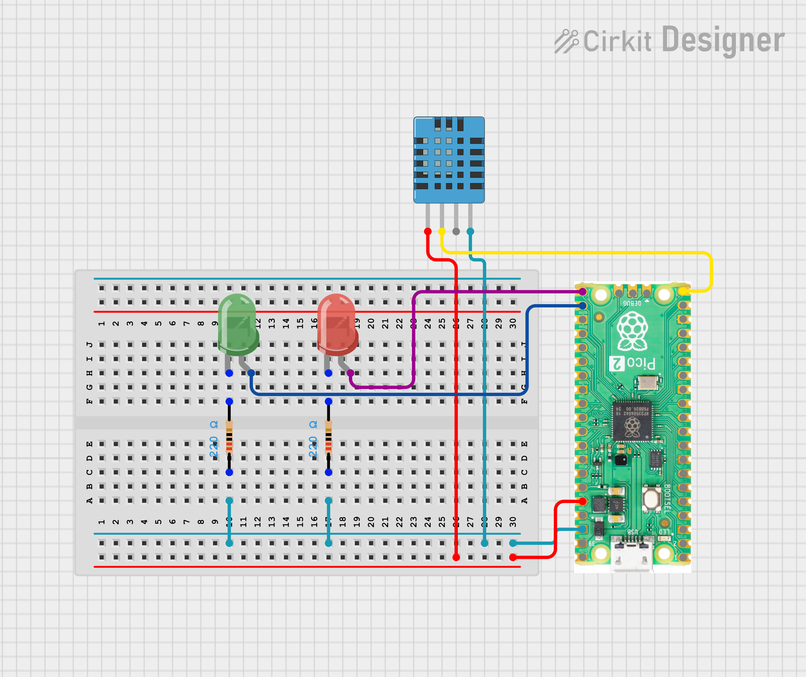
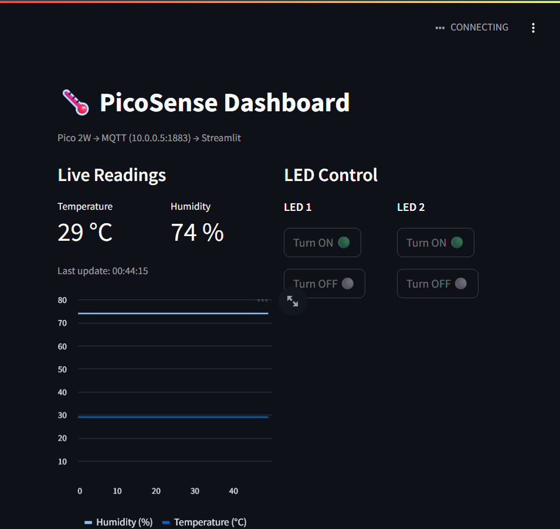

# PicoSense Dashboard

Real-time IoT monitoring and control system using a Raspberry Pi Pico 2W, MicroPython, MQTT, and a Streamlit dashboard. The Pico reads temperature and humidity from a DHT11 sensor and publishes it over MQTT. A Streamlit dashboard subscribes to this data for live display and sends ON/OFF commands back to control two LEDs.

## Architecture

```
Pico 2W (MicroPython)
   DHT11 -> GP15
   LED1  -> GP16
   LED2  -> GP17
        |
        v
Mosquitto MQTT Broker (laptop, port 1883)
        |
        v
Streamlit Dashboard (laptop, browser)
   - Live temp/humidity + chart
   - LED1/LED2 ON/OFF buttons
```

## MQTT Topics

| Topic | Published By | Subscribed By | Payload |
|---|---|---|---|
| pico/sensor/dht11 | Pico 2W | Streamlit | JSON, e.g. {"temp": 28, "humidity": 76} |
| pico/led1/cmd | Streamlit | Pico 2W | ON or OFF |
| pico/led2/cmd | Streamlit | Pico 2W | ON or OFF |

## Hardware Required

- Raspberry Pi Pico 2W
- DHT11 sensor
- 2 LEDs + 2 resistors (220-330 ohm)
- Breadboard, jumper wires
- Micro USB cable

## Wiring

| Component | Pico 2W Pin |
|---|---|
| DHT11 Data (VCC->3.3V, GND->GND) | GP15 |
| LED1 (through resistor to GND) | GP16 |
| LED2 (through resistor to GND) | GP17 |



## Software Required

Laptop: Python 3.9+, Mosquitto, `pip install streamlit paho-mqtt`
Pico 2W: MicroPython firmware (Pico W/2W build), umqttsimple.py

## Setup Steps

**1. Flash MicroPython** on the Pico 2W (via Thonny).

**2. Install Mosquitto** on the laptop. Skip "install as service".

**3. Edit mosquitto.conf** (in the Mosquitto install folder):
```
listener 1883
allow_anonymous true
```

**4. Start the broker:**
```
mosquitto -v -c "path-to-mosquitto-folder\mosquitto.conf"
```
Keep this terminal open.

**5. Find laptop's IP:**
```
ipconfig
```
Note the IPv4 address under the WiFi adapter (e.g. 10.0.0.5).

**6. Edit main.py** — set `WIFI_SSID`, `WIFI_PASSWORD`, and `MQTT_BROKER` (laptop IP from step 5).

**7. Upload to Pico** — `main.py` and `umqttsimple.py` via Thonny. Keep the filename `main.py` so it runs on boot.

**8. Install dependencies on laptop:**
```
pip install streamlit paho-mqtt
```

**9. Edit app.py** — set `MQTT_BROKER` to the same laptop IP.

**10. Run the dashboard:**
```
streamlit run app.py
```
Opens at http://localhost:8501. Sensor readings appear within a few seconds; LED buttons control the physical LEDs.





## Troubleshooting

- Dashboard stuck on "Waiting for data" -> check broker terminal is running with the config file (not local-only mode), check Pico serial output is publishing, check IP hasn't changed, fully close old Streamlit terminals before restarting.
- LEDs not responding -> recheck wiring and resistor/LED orientation.

## Future Improvements

- Migrate broker to HiveMQ Cloud for public Streamlit Cloud deployment
- Add soil moisture / PIR sensors
- Log historical data to file or database
- Add automatic threshold-based control


##  Author

**Kritish Mohapatra**  
B.Tech Electrical Engineering (3rd Year)  
IoT | Embedded Systems | MicroPython | ESP32  

---

## ⭐ Support

If you like this project, give it a ⭐ on GitHub and feel free to fork it!

Happy hacking 🚀

